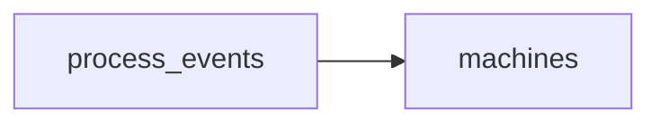

# The Shape of a Run
_Two log lines bracket every process. Pair them and the fleet's rhythm appears._

- **Domain:** data_modeling
- **Difficulty:** Medium
- **Est. time:** ? min
- **URL:** https://datadriven.io/problems/the_shape_of_a_run

## Problem

Every machine in our fleet emits one log line when a process starts and a separate line when it stops, and each line records the machine, a process id the machine assigns locally, which kind of event it was, and a timestamp in float seconds. The warehouse has to keep every line exactly as it arrived so analysts can reconcile a start with its matching stop themselves, computing the average elapsed time per process, drawing per-machine timelines of every process in order, and flagging starts that never got a stop. Design the data model behind this log and describe how the daily files load in through an ETL.

**Concepts tested:** `dmCompositeKeys`, `dmConstraints`, `dmDataTypes`, `dmDimensionTables`, `dmEntities`, `dmEventSourcing`, `dmFactTables`, `dmFirstNormalForm`, `dmForeignKeys`, `dmGrainDefinition`, `dmImmutableLogs`, `dmKeyGeneration`, `dmOneToMany`, `dmPrimaryKeys`, `dmSecondNormalForm`, `dmStarSchema`, `dmSurrogateKeys`, `dmThirdNormalForm`

## Solution walkthrough


### What this is really about

Strip the fleet-monitoring costume and this is a question about event grain: store the raw log exactly as it lands, or fold each start/stop pair into one tidy row? Folding feels cleaner, and that is the trap. Collapse two log lines into a single row with `started_at` and `ended_at` and you can no longer represent a start that never stopped, yet flagging those unpaired starts is exactly what they asked for. The quieter trap is `process_id`: it is numbered per machine, so any key built on `process_id` alone collides the first time two machines reuse the same local counter, and every metric turns to noise.

> **Keep the grain, scope the key**
>
> When a prompt lists start/stop events plus a per-machine `process_id`, keep one row per log line and recognize that uniqueness is `(machine_id, process_id, event_type, event_ts)`, never `process_id` alone. Pair start to stop at query time so a missing stop stays visible instead of being imputed away at ingest.

### Break down the requirements

**Step 1: Declare the event grain**

One row in `process_events` equals one log line: a single lifecycle event of one process on one machine at one timestamp. Two log lines stay two rows, distinguished by `event_type`.

**Step 2: Fix the composite key**

`process_id` is local to a machine, so give `process_events` a surrogate `event_id` PK. The natural key is `(machine_id, process_id, event_type, event_ts)`; `process_id` is never a global PK and never an FK to a process dimension.

**Step 3: Dimensionalize machines**

`machines` is the dimension keyed by `machine_id`, carrying region and hardware class. Every fact row points to it through a `machine_id` FK, so fleet rollups are a single `GROUP BY`.

**Step 4: Pair events at query time**

Duration is a self-join over start and stop rows. Persisting an `elapsed_seconds` on the fact hides unpaired starts, which defeats the anomaly query the analysts need.

### The reference model

One event per row, start and stop separated by `event_type`, and `process_id` kept as a plain attribute because its uniqueness is scoped to the machine. The `loaded_at` column audits each daily file so a reload stays idempotent.


**machines**

| column | type | key |
|---|---|---|
| machine_id | TEXT | PK |
| region | TEXT |  |
| hardware_class | TEXT |  |
| provisioned_at | TIMESTAMP |  |

**process_events**

| column | type | key |
|---|---|---|
| event_id | BIGINT | PK |
| machine_id | TEXT | FK |
| process_id | TEXT |  |
| event_type | TEXT |  |
| event_ts | FLOAT |  |
| loaded_at | TIMESTAMP |  |


> **Naming the uniqueness scope of `process_id`**
>
> A strong candidate asks whether `process_id` is unique across the fleet, refuses to make it a PK, and refuses to collapse start and stop into one row. They also raise event time versus ingestion time, which is exactly what `loaded_at` captures when the load lags `event_ts`.

> **The fold that erases every unpaired start**
>
> Folding start and stop into a single row with two timestamps hides every process that never emitted a stop; declaring `process_id` a PK across machines silently collides the moment two machines reuse the same local counter. Both quietly corrupt the metrics.

### Pairing at query time

Because the fact keeps raw events, duration comes from self-joining a `start` row to its earliest later `stop` on the same `(machine_id, process_id)`. `MIN(e.event_ts)` picks the matching stop, and the `machines` join rolls the average up by region.

**Average process duration by machine region**

```sql
WITH paired AS (
    SELECT
        s.machine_id,
        s.process_id,
        s.event_ts AS started_at,
        MIN(e.event_ts) AS ended_at
    FROM process_events s
    JOIN process_events e
      ON e.machine_id = s.machine_id
     AND e.process_id = s.process_id
     AND e.event_type = 'stop'
     AND e.event_ts > s.event_ts
    WHERE s.event_type = 'start'
    GROUP BY s.machine_id, s.process_id, s.event_ts
)
SELECT
    m.region,
    AVG(p.ended_at - p.started_at) AS avg_duration_sec
FROM paired p
JOIN machines m ON m.machine_id = p.machine_id
GROUP BY m.region
```

| Append-only events | Pre-paired runs table |
|---|---|
| `process_events` keeps separate start and stop rows.

* Ingest is an O(1) append
* Unpaired starts stay visible
* Duration queries pay a self-join | ETL folds each pair into one `process_runs` row with `started_at` and `ended_at`.

* Duration queries are trivial
* A late `stop` becomes a mutating update
* Unpaired starts are hard to surface |

- **How do you detect processes that never emitted a stop?**
  - _Tests reaching for a `LEFT JOIN` or anti-join over the raw events rather than a persisted flag._
- **At 10M events per hour, what changes about this schema?**
  - _Tests partitioning by `event_ts` and whether pairing moves into a streaming job._
- **Some stop events arrive hours late because of buffering. How do you guard against it?**
  - _Tests the event-time versus `loaded_at` distinction and watermark thinking._
- **How would you add CPU and memory measures per process without breaking the grain?**
  - _Tests whether the candidate attaches them to the stop event or adds a separate measurement fact._
