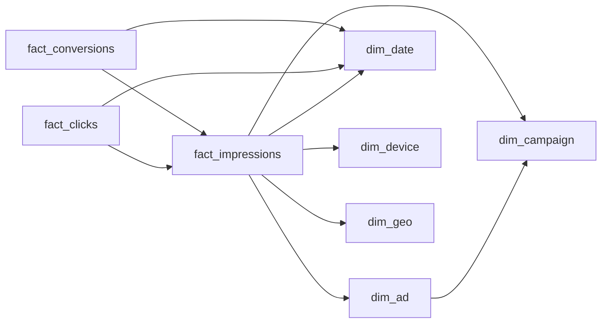

# The Slow Yes

- **Domain:** data_modeling
- **Difficulty:** Hard
- **Est. time:** 30 min
- **URL:** https://datadriven.io/problems/the_slow_yes

## Problem

A digital advertising platform needs an analytics warehouse for campaign reporting, where analysts slice impressions, clicks, and conversions by campaign, ad, device, geography, and day. Conversions can land days after the impression that drove them and must trace back to that exact impression so credit is never reassigned or double-counted, while every dashboard query scans wide date ranges on a columnar engine billed by bytes read. Design the schema.

**Concepts tested:** `dmCardinalityRequired`, `dmColumnarStorage`, `dmConstraints`, `dmDenormalization`, `dmDimensionTables`, `dmFactTables`, `dmForeignKeys`, `dmGrainDefinition`, `dmImmutableLogs`, `dmIndexing`, `dmLateArriving`, `dmMetricAdditivity`, `dmOneToMany`, `dmPrimaryKeys`, `dmStarSchema`, `dmSurrogateKeys`

## Solution walkthrough


### The trap

This is grain separation with a late-arriving twist, dressed up as campaign reporting. Impressions, clicks and conversions all feel like 'ad events', so most candidates draw one wide `ad_events` table with nullable click and conversion columns. Anyone can list the five dimensions. What separates candidates is **three facts at three grains**, with `impression_id` carried down to `fact_clicks` and `fact_conversions`. Miss that and a conversion landing twelve days late has two bad homes. It can rewrite a closed impression partition, or it can be credited by fuzzy match to whichever impression looks close. Either way your conversion rate counts some yeses twice and some never.

### Building it

**Step 1: Declare three grains before drawing a table**

One row per impression served, one per click, one per conversion. `cost_micros` sums at impression grain and `conversion_value` sums at conversion grain. Put both on one row and every sum needs a filter to undo the conflation, and an impression with two conversions fans out.

**Step 2: Carry `impression_id` down to both downstream facts**

It is the spine. A click and a conversion each hold the FK to the exact impression that earned them, so attribution is a key join, never a match on campaign plus time. Every other attribute (campaign, ad, device, geo) is reachable through that one hop.

**Step 3: Give every fact its own `date_key`**

`fact_conversions.date_key` is the day the conversion landed, not the day of the impression. Partition on it and late yeses append into fresh partitions; October's impression partition stays immutable after the month closes.

**Step 4: Denormalize one key, not the dimensions**

`campaign_key` sits on `fact_impressions` even though `dim_ad` already implies it. That single redundant key lets the most common dashboard group by campaign without touching `dim_ad`. The dimensions stay narrow and conformed; flattening their text columns onto billions of fact rows is what the bytes-read bill punishes.


**dim_date**

| column | type | key |
|---|---|---|
| date_key | INT | PK |
| full_date | DATE |  |
| week | INT |  |
| month | INT |  |

**dim_campaign**

| column | type | key |
|---|---|---|
| campaign_key | INT | PK |
| campaign_id | BIGINT |  |
| advertiser | TEXT |  |
| objective | TEXT |  |

**dim_ad**

| column | type | key |
|---|---|---|
| ad_key | INT | PK |
| ad_id | BIGINT |  |
| campaign_key | INT | FK |
| format | TEXT |  |

**dim_device**

| column | type | key |
|---|---|---|
| device_key | INT | PK |
| device_type | TEXT |  |
| os | TEXT |  |

**dim_geo**

| column | type | key |
|---|---|---|
| geo_key | INT | PK |
| country | TEXT |  |
| region | TEXT |  |

**fact_impressions**

| column | type | key |
|---|---|---|
| impression_id | BIGINT | PK |
| date_key | INT | FK |
| campaign_key | INT | FK |
| ad_key | INT | FK |
| device_key | INT | FK |
| geo_key | INT | FK |
| served_at | TIMESTAMP |  |
| cost_micros | BIGINT |  |

**fact_clicks**

| column | type | key |
|---|---|---|
| click_id | BIGINT | PK |
| impression_id | BIGINT | FK |
| date_key | INT | FK |
| clicked_at | TIMESTAMP |  |

**fact_conversions**

| column | type | key |
|---|---|---|
| conversion_id | BIGINT | PK |
| impression_id | BIGINT | FK |
| date_key | INT | FK |
| converted_at | TIMESTAMP |  |
| conversion_value | DECIMAL |  |


> **Split grains without the spine attribute nothing**
>
> The most common near-miss: three clean facts, each carrying its own `campaign_key` and `ad_key`, and no `impression_id` on `fact_conversions`. Campaign totals still add up, so it looks right. But you can never say which impression earned a conversion, so impression-level attribution, dedup and last-touch rules have nothing to join on.

> **Grain first, tables second**
>
> The senior tell is saying the three grains out loud before drawing, then raising the late-conversion window unprompted and explaining why `date_key` on `fact_conversions` keeps closed partitions untouched. A candidate who draws `ad_events` first spends the next ten minutes explaining how to un-double-count it.

### Reading it back

**Campaign conversion rate over a window**

```sql
SELECT
    c.advertiser,
    SUM(i.imps)        AS impressions,
    SUM(cv.conversions) AS conversions,
    SUM(cv.conversions) * 1.0 / NULLIF(SUM(i.imps), 0) AS cvr
FROM (
    SELECT campaign_key, COUNT(*) AS imps
    FROM fact_impressions
    WHERE date_key BETWEEN 20251001 AND 20251031
    GROUP BY campaign_key
) i
LEFT JOIN (
    SELECT f.campaign_key, COUNT(*) AS conversions
    FROM fact_conversions cv
    JOIN fact_impressions f ON f.impression_id = cv.impression_id
    WHERE cv.date_key BETWEEN 20251001 AND 20251130
    GROUP BY f.campaign_key
) cv ON cv.campaign_key = i.campaign_key
JOIN dim_campaign c ON c.campaign_key = i.campaign_key
ORDER BY cvr DESC
```

> **Aggregate each fact before any join**
>
> Each subquery collapses its fact to one row per `campaign_key` before meeting the other, so the final join is thousands of rows, not billions. On a columnar engine the impressions side reads two narrow columns, `date_key` and `campaign_key`, from one month of partitions. The conversions side widens to November so slow yeses still count, then hops to `fact_impressions` only for `campaign_key`.

| Three facts, conformed dimensions | One wide event table |
|---|---|
| Each measure additive at its own grain. Late conversions append to their own `date_key` partition. Cost: one join on `impression_id` to attribute. | Zero joins for the simplest chart. But a late conversion updates a closed impression row, a second conversion fans the row out, and most `clicked_at` and `conversion_value` cells are null bytes you still pay to scan. |

- **An advertiser renames a campaign mid-quarter. How does `dim_campaign` report before and after?**
  - _SCD Type 2 on a conformed dimension and why a surrogate `campaign_key` makes it cheap._
- **Conversions can now credit a click instead of an impression. What changes on `fact_conversions`?**
  - _Adding a nullable `click_id` FK versus a separate attribution fact._
- **A flaky upstream sends some impressions twice. Where do you dedupe, and on what key?**
  - _Ingest-time dedup on `impression_id` versus query-time, and the cost of each on an immutable log._
