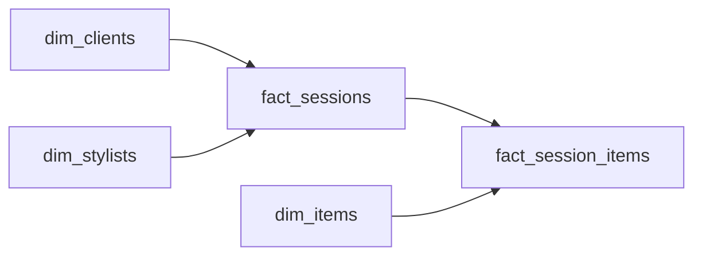

# The Table That Lies
_Every query comes out wrong. The data is all there._

- **Domain:** data_modeling
- **Difficulty:** Medium
- **Est. time:** 25 min
- **URL:** https://datadriven.io/problems/the_table_that_lies

## Problem

Our operational database has a single wide table with one row per stylist-client session. It contains client attributes, stylist attributes, session metadata, and item-level details all flattened together. Analysts struggle to write correct queries against it and frequently produce wrong aggregations. Design a normalized data model to replace it.

**Concepts tested:** `dmAttributes`, `dmCardinalityRequired`, `dmDenormalization`, `dmDimensionTables`, `dmEntities`, `dmFactTables`, `dmFirstNormalForm`, `dmForeignKeys`, `dmGrainDefinition`, `dmJunctionTables`, `dmManyToMany`, `dmMetricAdditivity`, `dmOneToMany`, `dmPrimaryKeys`, `dmSecondNormalForm`, `dmStarSchema`, `dmSurrogateKeys`, `dmThirdNormalForm`

## Solution walkthrough


### Why this problem exists in real interviews

This probes whether you can diagnose fan-out as the root cause of wrong aggregations. The signal is separating session-level measures from item-level measures into two facts at different grains so a count of sessions is not silently multiplied by the number of items per session.

> **Trick to Solving**
>
> Before drawing any tables, a strong candidate asks: "at what grain is each column additive?" Session duration is additive at the session grain. Item price is additive at the session-item grain. Mixing them in one table guarantees fan-out.
>
> 1. Spot the mixed-grain columns (session + item attributes on one row)
> 2. Split into `fact_sessions` and `fact_session_items`
> 3. Normalize clients, stylists, and items into dimensions
> 4. Offer a backward-compatible view over the new model

---

### Break down the requirements

**Step 1: Declare two distinct grains**

`fact_sessions` sits at one row per session. `fact_session_items` sits at one row per item per session. Any query that needs only session measures never joins the child fact.

**Step 2: Normalize clients, stylists, and items into dimensions**

Attributes that were repeating across sessions move to dimensions. This is where every textbook Kimball diagram lives, but the hiring signal is calling out why it matters: stable attributes do not belong on the fact.

**Step 3: Keep `booking_fee` on the session**

Session-level measures stay on `fact_sessions`. Item purchase revenue lives on `fact_session_items`. These never go on the same row.

**Step 4: Provide a compatibility view**

A view that mimics the old wide table can keep legacy reports alive during migration. Strong candidates volunteer this without being asked.

---

### The solution

Below is one defensible model. The conceptual anchor is grain separation: session-level measures never share a row with item-level measures.


**dim_clients**

| column | type | key |
|---|---|---|
| client_sk | BIGINT | PK |
| client_nk | TEXT |  |
| size_preference | TEXT |  |
| city | TEXT |  |

**dim_stylists**

| column | type | key |
|---|---|---|
| stylist_sk | BIGINT | PK |
| stylist_nk | TEXT |  |
| specialization | TEXT |  |
| tenure_months | INT |  |

**dim_items**

| column | type | key |
|---|---|---|
| item_sk | BIGINT | PK |
| sku | TEXT |  |
| brand | TEXT |  |
| category | TEXT |  |

**fact_sessions**

| column | type | key |
|---|---|---|
| session_sk | BIGINT | PK |
| client_sk | BIGINT | FK |
| stylist_sk | BIGINT | FK |
| session_ts | TIMESTAMP |  |
| session_duration_min | INT |  |
| booking_fee | DECIMAL |  |

**fact_session_items**

| column | type | key |
|---|---|---|
| session_item_sk | BIGINT | PK |
| session_sk | BIGINT | FK |
| item_sk | BIGINT | FK |
| price | DECIMAL |  |
| was_purchased | BOOLEAN |  |


> **Why this design holds up**
>
> Fan-out disappears the moment the child fact gets its own grain. Session counts and durations stop being multiplied by item count. A query that needs both uses an explicit aggregate subquery rather than a blind join.

> **What strong candidates do**
>
> They name fan-out as the root cause in one sentence. They propose a compatibility view for legacy reports. They resist normalizing for its own sake; they normalize because the grain demands it.

> **Red flags to avoid**
>
> Keeping one table and telling analysts to be careful with DISTINCT. Duplicating session-level measures on every item row and hoping aggregates handle it. Normalizing items without also splitting the fact leaves the fan-out bug intact.

---

### The analysis pattern

**Stylist revenue and session duration without fan-out**

```sql
SELECT
    st.stylist_nk,
    COUNT(DISTINCT s.session_sk) AS sessions,
    AVG(s.session_duration_min) AS avg_duration,
    SUM(CASE WHEN si.was_purchased THEN si.price ELSE 0 END) AS revenue
FROM fact_sessions s
JOIN dim_stylists st ON st.stylist_sk = s.stylist_sk
LEFT JOIN fact_session_items si ON si.session_sk = s.session_sk
GROUP BY st.stylist_nk
```

---

### Trade-offs and alternatives

| Grain-split two-fact star | Single fact with DISTINCT-aware reports |
|---|---|
| Correct aggregations by construction. Requires writers to maintain two facts. Legacy reports need a compatibility view during cutover. | No migration needed. Every downstream query must remember the fan-out. Silent errors are common and hard to detect at review time. |

---

- **How would you build the backwards-compatible view without reintroducing fan-out in analyst queries?**
  - _Tests whether the view aggregates items first or exposes them via a nested subquery._
- **If an item is added to a session a day later, which tables change?**
  - _Tests late-arriving fact handling on `fact_session_items`._
- **How would you detect fan-out bugs in existing reports before migration?**
  - _Tests row-count reconciliation between the wide table and the split facts._
- **What changes if a session can have two stylists?**
  - _Tests whether `stylist_sk` needs a bridge table._
