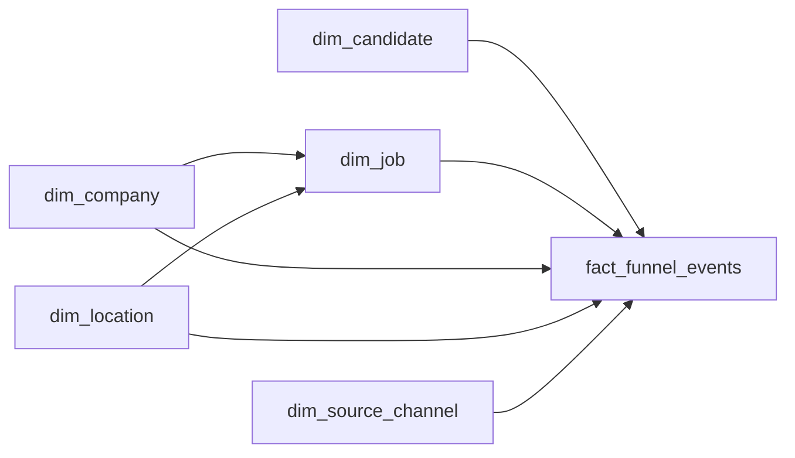

# The Talent Funnel
_Thousands applied. One accepted. Where did the rest go?_

- **Domain:** data_modeling
- **Difficulty:** Medium
- **Est. time:** 30 min
- **URL:** https://datadriven.io/problems/the_talent_funnel

## Problem

A job marketplace tracks candidate activity from the moment a job listing is viewed through to an accepted offer. The analytics team needs to measure funnel drop-off rates at each stage, compare conversion by job type and location, track time-to-hire by company, and attribute sourcing channel credit. Design a schema that supports all of this.

**Concepts tested:** `dmDimensionTables`, `dmFactTables`, `dmForeignKeys`, `dmGrainDefinition`, `dmMetricAdditivity`, `dmOneToMany`, `dmPreAggregation`, `dmStarSchema`, `dmSurrogateKeys`

## Solution walkthrough


### Why this problem exists in real interviews

This probes whether you model a multi-stage conversion workflow as an event log rather than a wide row with stage-named columns. The signal is picking one row per stage transition so new stages become data, not a schema migration, and time-to-hire becomes a window function instead of a subtraction across fixed columns.

> **Trick to Solving**
>
> Before drawing any tables, a strong candidate asks: "will the funnel add or rename stages, and do we need stage-to-stage timing?" If yes, the event log wins. The fact grain is one row per stage reached per candidate per job.
>
> 1. Reject the wide stage-column design
> 2. Declare `fact_funnel_events` grain = one row per stage event
> 3. Conform company, location, and source channel as dimensions
> 4. Derive funnel metrics via filtered aggregates

---

### Break down the requirements

**Step 1: Declare the event grain**

`fact_funnel_events` records one row per stage reached per candidate per job. New stages append rows; no schema change needed.

**Step 2: Conform company and location as dimensions**

Company size and industry belong on `dim_company`, not on the event. This lets conversion rates split cleanly by firmographic or geography.

**Step 3: Attribute sourcing via `dim_source_channel`**

The `source_channel_sk` on the first event for a (candidate, job) pair carries attribution. Last-touch attribution is a query choice, not a schema choice.

**Step 4: Compute time-to-hire from event timestamps**

Time-to-hire is `offer_accepted.event_ts - application_submitted.event_ts` per (candidate, job). Window functions over the event fact make this a few lines of SQL.

---

### The solution

Below is one defensible model. The conceptual anchor is event-log grain: new stages are rows, not columns.


**dim_job**

| column | type | key |
|---|---|---|
| job_sk | BIGINT | PK |
| job_nk | TEXT |  |
| job_type | TEXT |  |
| salary_bucket | TEXT |  |
| company_sk | BIGINT | FK |
| location_sk | BIGINT | FK |

**dim_candidate**

| column | type | key |
|---|---|---|
| candidate_sk | BIGINT | PK |
| candidate_nk | TEXT |  |
| signup_ts | TIMESTAMP |  |
| seniority | TEXT |  |

**dim_company**

| column | type | key |
|---|---|---|
| company_sk | BIGINT | PK |
| company_nk | TEXT |  |
| industry | TEXT |  |
| size_bucket | TEXT |  |

**dim_location**

| column | type | key |
|---|---|---|
| location_sk | BIGINT | PK |
| city | TEXT |  |
| country | TEXT |  |
| metro_area | TEXT |  |

**dim_source_channel**

| column | type | key |
|---|---|---|
| source_channel_sk | BIGINT | PK |
| channel_name | TEXT |  |
| channel_type | TEXT |  |

**fact_funnel_events**

| column | type | key |
|---|---|---|
| funnel_event_id | BIGINT | PK |
| candidate_sk | BIGINT | FK |
| job_sk | BIGINT | FK |
| company_sk | BIGINT | FK |
| location_sk | BIGINT | FK |
| source_channel_sk | BIGINT | FK |
| stage_name | TEXT |  |
| event_ts | TIMESTAMP |  |


> **Why this design holds up**
>
> An event log absorbs new stages without migration. Funnel drop-off is a filtered aggregate. Time-to-hire is a window function. Attribution becomes a first-event lookup instead of a dimension update.

> **What strong candidates do**
>
> They refuse the wide-column funnel design immediately. They keep sourcing attribution in the event stream, not in the candidate dimension. They explain why first-touch vs last-touch is a query decision.

> **Red flags to avoid**
>
> Storing one row per candidate with a column per stage forces a migration every time the product adds a stage. Putting source channel on `dim_candidate` freezes attribution and breaks multi-job candidates. Recording only the latest stage loses drop-off paths.

---

### The analysis pattern

**Funnel drop-off by job type**

```sql
WITH stages AS (
  SELECT candidate_sk, job_sk, stage_name, MIN(event_ts) AS first_ts
  FROM fact_funnel_events
  GROUP BY candidate_sk, job_sk, stage_name
)
SELECT
    j.job_type,
    COUNT(*) FILTER (WHERE s.stage_name = 'view') AS views,
    COUNT(*) FILTER (WHERE s.stage_name = 'apply') AS applies,
    COUNT(*) FILTER (WHERE s.stage_name = 'offer_accepted') AS hires
FROM stages s
JOIN dim_job j ON j.job_sk = s.job_sk
GROUP BY j.job_type
```

---

### Trade-offs and alternatives

| Event-log fact | Accumulating snapshot fact |
|---|---|
| Flexible schema, additive aggregation, easy stage additions. Reporting needs window functions and idempotent ingestion keys. Storage scales with stage count. | One row per candidate-job with timestamp columns per stage. Very fast stage-to-stage timing queries. Every new stage triggers a schema migration and an update to in-flight rows. |

---

- **How would you compute time-to-hire at the 50th and 90th percentile per company?**
  - _Tests window functions over the event fact and percentile aggregates._
- **A product decision renames a stage. How does the schema absorb the change?**
  - _Tests the flexibility of the event log vs an accumulating snapshot._
- **How would you enforce idempotency when the event source emits duplicates?**
  - _Tests a unique key on (`candidate_sk`, `job_sk`, `stage_name`, `event_ts`) or a dedupe layer._
- **What changes if you need multi-touch attribution across channels?**
  - _Tests whether `source_channel_sk` needs to be carried on every event or only the first._
- **How would you handle a candidate who re-applies to the same job three months later?**
  - _Tests whether a new application is a new (candidate, job) funnel or a continuation._
