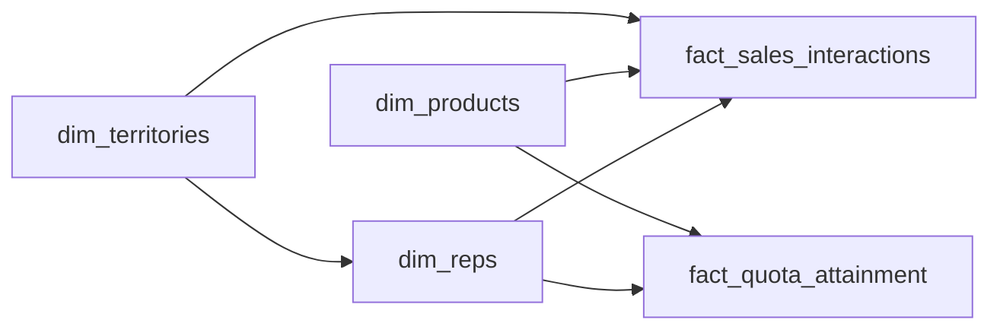

# The Territory That Keeps Moving
_Reps get reassigned. The receipts have to survive._

- **Domain:** data_modeling
- **Difficulty:** Hard
- **Est. time:** 30 min
- **URL:** https://datadriven.io/problems/the_territory_that_keeps_moving

## Problem

We are a pharmaceutical company that employs a field sales force selling prescription medications to healthcare providers. We need a data warehouse that tracks sales performance by rep, product, and territory, supports quota attainment reporting, and provides an auditable record of all sales interactions for compliance purposes. Design the data model.

**Concepts tested:** `dmAttributes`, `dmDenormalization`, `dmDimensionTables`, `dmFactTables`, `dmForeignKeys`, `dmGrainDefinition`, `dmKeyGeneration`, `dmMetricAdditivity`, `dmOneToMany`, `dmPreAggregation`, `dmPrimaryKeys`, `dmStarSchema`, `dmSurrogateKeys`

## Solution walkthrough


### Why this problem exists in real interviews

This probes whether you can model territories that realign mid-year without corrupting historical quota credit. The signal is Type 2 SCD on both `dim_territories` and `dim_reps` so every historical interaction resolves to the rep and territory that owned it at that moment, with an auditable trail for compliance.

> **Trick to Solving**
>
> Before drawing any tables, a strong candidate asks: "when a territory realigns, does historical credit travel with the rep or stay with the territory, and who needs an auditable trail?" In regulated domains, the answer is always preservation, which forces Type 2.
>
> 1. Recognize that territories and rep assignments are time-varying
> 2. Apply Type 2 SCD on `dim_territories` and `dim_reps`
> 3. Model quota as its own fact at rep-product-period grain
> 4. Keep interactions at interaction grain for compliance traceability

---

### Break down the requirements

**Step 1: Declare the interaction grain**

`fact_sales_interactions` sits at one row per rep-provider touch. That is also the grain the Sunshine Act expects for transfer-of-value reporting.

**Step 2: Apply Type 2 SCD to `dim_reps` and `dim_territories`**

Territory realignments happen at least once a year. Type 2 on both dimensions preserves the as-of assignment so past credit does not retroactively move.

**Step 3: Model quota as a separate fact**

`fact_quota_attainment` at rep-product-period grain is the cleanest place to store targets and actuals. Keeping it separate from interactions avoids conflating activity with outcomes.

**Step 4: Preserve provider identity for compliance**

`provider_id` on the interaction fact is the compliance hook. Every transfer of value is traceable to an NPI without a join hop.

---

### The solution

Below is one defensible model. The conceptual anchor is Type 2 SCD on territories and reps, which preserves attribution across realignments.


**dim_reps**

| column | type | key |
|---|---|---|
| rep_sk | BIGINT | PK |
| rep_nk | TEXT |  |
| territory_sk | BIGINT | FK |
| effective_from | TIMESTAMP |  |
| effective_to | TIMESTAMP |  |
| is_current | BOOLEAN |  |

**dim_products**

| column | type | key |
|---|---|---|
| product_sk | BIGINT | PK |
| product_nk | TEXT |  |
| therapeutic_area | TEXT |  |
| is_controlled | BOOLEAN |  |

**dim_territories**

| column | type | key |
|---|---|---|
| territory_sk | BIGINT | PK |
| territory_nk | TEXT |  |
| region | TEXT |  |
| effective_from | TIMESTAMP |  |
| effective_to | TIMESTAMP |  |
| is_current | BOOLEAN |  |

**fact_sales_interactions**

| column | type | key |
|---|---|---|
| interaction_id | BIGINT | PK |
| rep_sk | BIGINT | FK |
| product_sk | BIGINT | FK |
| territory_sk | BIGINT | FK |
| provider_id | TEXT |  |
| interaction_ts | TIMESTAMP |  |
| transfer_of_value | DECIMAL |  |

**fact_quota_attainment**

| column | type | key |
|---|---|---|
| attainment_id | BIGINT | PK |
| rep_sk | BIGINT | FK |
| product_sk | BIGINT | FK |
| period_start | DATE |  |
| quota_target | DECIMAL |  |
| actual_units | DECIMAL |  |


> **Why this design holds up**
>
> Historical quota credit never moves when a territory is redrawn. Every interaction still resolves to the rep and territory active at the time. Compliance audits trace any transfer of value to a provider via the interaction grain.

> **What strong candidates do**
>
> They call out Type 2 SCD before the interviewer has to ask. They justify separating quota from interactions. They mention Sunshine Act or equivalent compliance constraints unprompted in regulated domains.

> **Red flags to avoid**
>
> Type 1 SCD on `dim_territories` silently rewrites prior-year quota attainment. Storing quota inline on interactions forces fan-out. Aggregating interactions to rep-month in the warehouse removes the compliance traceability.

---

### The analysis pattern

**Rep attainment by therapeutic area with compliance transfer-of-value**

```sql
SELECT
    r.rep_nk,
    p.therapeutic_area,
    SUM(q.actual_units) / NULLIF(SUM(q.quota_target), 0) AS attainment_ratio,
    SUM(i.transfer_of_value) AS compliance_tov
FROM fact_quota_attainment q
JOIN dim_reps r ON r.rep_sk = q.rep_sk
JOIN dim_products p ON p.product_sk = q.product_sk
LEFT JOIN fact_sales_interactions i
  ON i.rep_sk = q.rep_sk
 AND i.product_sk = q.product_sk
 AND i.interaction_ts >= q.period_start
WHERE q.period_start = DATE '2025-01-01'
GROUP BY r.rep_nk, p.therapeutic_area
```

---

### Trade-offs and alternatives

| Type 2 SCD on territories and reps | Append-only assignment fact |
|---|---|
| Historical attribution is stable under realignment. Auditable by construction. Join complexity is higher and surrogate key management must be disciplined. | Rep-territory assignments live on their own event fact. Dimensions stay Type 1. Flexible for overlapping assignments. Every reporting query has to reconstruct the effective assignment via an as-of join. |

---

- **How would you report Q1 attainment under last year's territory map versus this year's map?**
  - _Tests the Type 2 dimension and the ability to pivot between valid territory states._
- **How would the schema support a Sunshine Act audit that asks for every transfer of value to a given provider?**
  - _Tests interaction grain, `provider_id`, and `transfer_of_value` columns._
- **What happens if a rep is reassigned mid-quarter and the old territory still owns the quota?**
  - _Tests Type 2 effective windows on `dim_reps` and the fact attribution rule._
- **Where does the medallion boundary live between bronze CRM exports and silver cleansed reps?**
  - _Tests the layered architecture and idempotent reprocessing._
- **How would you handle a retroactive quota adjustment that changes last month's target?**
  - _Tests whether `fact_quota_attainment` is append-only versus overwrite._
