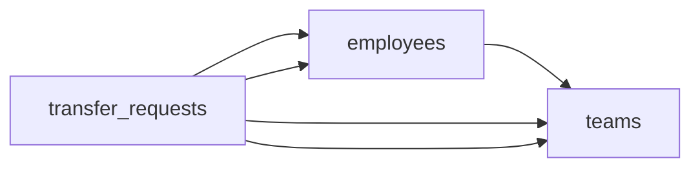

# The Transfer Request
_Apply, wait, get approved or denied. Track all of it._

- **Domain:** data_modeling
- **Difficulty:** Medium
- **Est. time:** 25 min
- **URL:** https://datadriven.io/problems/the_transfer_request

## Problem

Employees can apply for internal transfers between teams. HR reviews each application and either approves or denies it. The reporting team needs to know: how many transfer requests were approved vs denied per quarter, by originating team and destination team. Design the data model, then write the query.

**Concepts tested:** `dmAttributes`, `dmCardinalityRequired`, `dmConstraints`, `dmDataTypes`, `dmDimensionTables`, `dmEntities`, `dmFactTables`, `dmFirstNormalForm`, `dmForeignKeys`, `dmGrainDefinition`, `dmMetricAdditivity`, `dmOneToMany`, `dmPrimaryKeys`, `dmSecondNormalForm`, `dmStarSchema`, `dmSurrogateKeys`, `dmThirdNormalForm`

## Solution walkthrough


### What this really is

This is a fact table with two role-playing references to the same dimension, presented as an HR workflow. The real question is the grain: one row per submitted request. That row carries its own copy of where the employee came from and where they wanted to go. Anyone can draw `employees`, `teams` and a requests table. The trap is reading the origin team off `employees.current_team_id` at query time. **The moment a transfer is approved, that column changes**, so every approved request reports the destination as its origin. Your quarterly approvals collapse into rows where `from_team` equals `to_team`.


**employees**

| column | type | key |
|---|---|---|
| employee_id | BIGINT | PK |
| full_name | TEXT |  |
| current_team_id | BIGINT | FK |
| role | TEXT |  |
| hired_at | DATE |  |

**teams**

| column | type | key |
|---|---|---|
| team_id | BIGINT | PK |
| name | TEXT |  |
| org_unit | TEXT |  |

**transfer_requests**

| column | type | key |
|---|---|---|
| request_id | BIGINT | PK |
| applicant_id | BIGINT | FK |
| from_team_id | BIGINT | FK |
| to_team_id | BIGINT | FK |
| reviewer_id | BIGINT | FK |
| submitted_at | TIMESTAMP |  |
| decided_at | TIMESTAMP |  |
| status | TEXT |  |


### Building it

**Step 1: Declare the grain before any column**

Make it one row per submission, keyed by a surrogate `request_id`. A denied request that is resubmitted gets a new row. Otherwise the denial vanishes and the 'denied' count for that quarter silently drops.

**Step 2: Snapshot both teams on the request**

`from_team_id` and `to_team_id` are written when the request is submitted and never change. They are facts about the request, not attributes of the employee, so they belong on the request row and not behind a join through `employees`.

**Step 3: Point `applicant_id` and `reviewer_id` at `employees`**

A reviewer is an employee playing a role, so there is no `reviewers` table. `reviewer_id` and `decided_at` stay `NULL` while the `status` is 'pending'.

**Step 4: Count by status with `FILTER`**

Join `teams` twice under the aliases `ft` and `tt`, bucket by `DATE_TRUNC('quarter', submitted_at)`, and let `COUNT(*) FILTER (WHERE ...)` split approved from denied in a single pass.

**Approved vs denied per quarter, by team pair**

```sql
SELECT
    DATE_TRUNC('quarter', r.submitted_at) AS quarter,
    ft.name AS from_team,
    tt.name AS to_team,
    COUNT(*) FILTER (WHERE r.status = 'approved') AS approved,
    COUNT(*) FILTER (WHERE r.status = 'denied') AS denied
FROM transfer_requests r
JOIN teams ft ON ft.team_id = r.from_team_id
JOIN teams tt ON tt.team_id = r.to_team_id
GROUP BY 1, 2, 3
```

| Origin derived at query time | Origin snapshotted on the request |
|---|---|
| Join `transfer_requests` to `employees` and read `current_team_id`. It looks right until the first approval. After that the applicant's team is the destination, and history rewrites itself every time someone moves. | `from_team_id` is captured at submission. Last year's report returns the same numbers today, and the query needs no join to `employees` at all. |

> **`current_team_id` describes today, not then**
>
> Candidates normalize `from_team_id` away as 'redundant with the employee's team' and cite 3NF. It is not redundant: it depends on the request, not on the employee. Treating it as a derived value is the bug.

> **Two FKs to one table is a role, not a junction**
>
> Strong candidates draw `from_team_id` and `to_team_id` as two many-to-one edges into `teams` without hesitating. A `request_teams` bridge with a direction column turns a two-join report into a pivot.

> **The measure is a count, so it rolls up freely**
>
> `approved` and `denied` are fully additive. Quarters sum to years, and team pairs sum to an org-wide total. Contrast that with an approval rate, which you must recompute from the counts and never average.

- **Should a request count in the quarter it was submitted or the quarter it was decided?**
  - _Tests whether you notice that `submitted_at` vs `decided_at` changes which quarter a late decision lands in._
- **How do you block a second 'pending' request per applicant while still allowing resubmission after a denial?**
  - _A partial unique index on `applicant_id` where `status` = 'pending'._
- **If a team is renamed, which name should last year's report show?**
  - _Tests slowly changing dimensions on `teams.name`._
