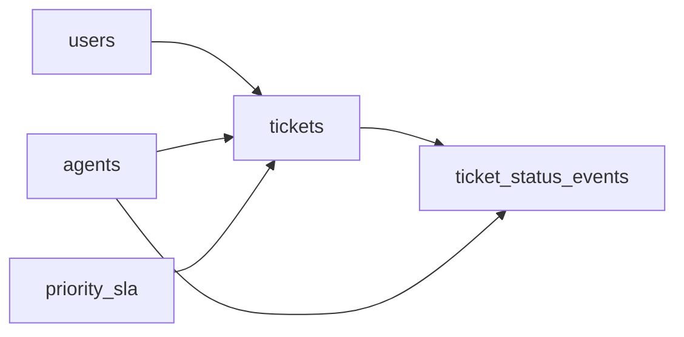

# The Vanishing State
_A status column forgets the moment it changes. Model the schema that remembers._

- **Domain:** data_modeling
- **Difficulty:** Easy
- **Est. time:** ? min
- **URL:** https://datadriven.io/problems/the_vanishing_state

## Problem

We run an IT helpdesk platform. Users submit support tickets, which are assigned to agents. Tickets go through multiple status changes before being resolved. SLA compliance is critical: P1 tickets must be resolved within 4 hours, P2 within 24 hours. Design the schema, and describe how you would load data from a JSON API feed into it.

**Concepts tested:** `dmAttributes`, `dmConstraints`, `dmDataTypes`, `dmDimensionTables`, `dmEntities`, `dmEventSourcing`, `dmFactTables`, `dmForeignKeys`, `dmGrainDefinition`, `dmImmutableLogs`, `dmIndexing`, `dmMetricAdditivity`, `dmOneToMany`, `dmPreAggregation`, `dmPrimaryKeys`, `dmStarSchema`

## Solution walkthrough


### Why this problem exists in real interviews

This is a per-ticket audit trail dressed up as a helpdesk schema. The skill being probed: can you tell that **SLA compliance is a history problem, not a current-state problem**? A status column on `tickets` is overwritten the minute the ticket transitions, so the answer lives in an immutable status event log paired with a priority dimension that encodes the SLA contract. Anyone can draw four tables; the tell is whether the status log and the priority dimension appear before you ask for them. Get it wrong and you can report a ticket's status today but can never answer 'how long did it sit in P1 before resolution' because that moment was already erased.

> **Trick to Solving**
>
> Before drawing tables, a strong candidate asks: do we need to measure time spent in each status, and does SLA depend on priority? The signal here is 'SLA breach for P1 vs P2,' which demands both a status history and priority modeled as a dimension with thresholds.
>
> 1. Keep `tickets` as the header with current status cached
> 2. Append status transitions to `ticket_status_events`
> 3. Make priority a dimension with SLA hours per tier
> 4. Compute SLA breach as a query over events

---

### Break down the requirements

**Step 1: Separate the header from the history**

`tickets` is the stable ticket identity. `ticket_status_events` is the append-only log of status changes. The current status on `tickets` is a cached convenience, not the source of truth.

**Step 2: Model priority as a dimension**

`priority_sla` carries `(priority, resolution_sla_hours, response_sla_hours)`. P1 and P2 are rows, not strings scattered across the ticket table, so changing the SLA thresholds is a single update. Keying it by the natural 'P1' code or by a surrogate `priority_id` are both defensible; what matters is that the SLA hours live here.

**Step 3: Append status changes**

Every status transition (new, assigned, in-progress, waiting, resolved) is a new row on `ticket_status_events`. SLA breach time can be derived from the first 'resolved' event compared with the create time plus the SLA hours from the priority dimension.

**Step 4: Keep agents and users as conformed dimensions**

Both are first-class dimensions. `tickets` carries the current assigned agent; historical reassignments live in the event log.

---

### The solution

Below is one defensible design: a stable ticket header, an append-only status event log, and a priority dimension that encodes the SLA contract. The graded canonical solution is the SLA-breach query further down, which reads directly off this shape.


**agents**

| column | type | key |
|---|---|---|
| agent_id | INT | PK |
| agent_name | TEXT |  |
| team | TEXT |  |
| timezone | TEXT |  |

**users**

| column | type | key |
|---|---|---|
| user_id | BIGINT | PK |
| email | TEXT |  |
| company | TEXT |  |
| plan_tier | TEXT |  |

**priority_sla**

| column | type | key |
|---|---|---|
| priority | TEXT | PK |
| response_sla_hours | INT |  |
| resolution_sla_hours | INT |  |

**tickets**

| column | type | key |
|---|---|---|
| ticket_id | BIGINT | PK |
| user_id | BIGINT | FK |
| agent_id | INT | FK |
| priority | TEXT | FK |
| subject | TEXT |  |
| created_at | TIMESTAMP |  |
| current_status | TEXT |  |

**ticket_status_events**

| column | type | key |
|---|---|---|
| event_id | BIGINT | PK |
| ticket_id | BIGINT | FK |
| from_status | TEXT |  |
| to_status | TEXT |  |
| event_ts | TIMESTAMP |  |
| actor_agent_id | INT | FK |


> **Why this works**
>
> SLA breach is computed, not stored. The first resolved event minus the create time, compared to the priority dimension's hours, yields the answer for any point in history. The trade-off is one extra join on the priority dimension in every SLA query.

> **Interviewers watch for**
>
> A strong candidate proposes the append-only history before being asked and names the priority dimension as the SLA contract. They also note that `tickets.current_status` is a denormalization for read speed. Weak candidates mutate `tickets.status` and then cannot measure time in each status without scanning an audit table that does not exist.

> **Common pitfall**
>
> Hardcoding SLA hours in a CASE expression. Business hours change, and every dashboard now carries stale constants that drift from the real SLA contract.

---

### The analysis pattern

This query is the payoff of the schema above: because status lives in an append-only log and the SLA hours live in `priority_sla`, breach rate falls out of a single grouped join. Note there are zero hardcoded thresholds; the contract comes from the dimension.

**SLA breach rate by priority for the last week**

```sql
WITH resolved AS (
    SELECT
        t.ticket_id,
        t.priority,
        t.created_at,
        MIN(e.event_ts) AS resolved_at
    FROM tickets t
    JOIN ticket_status_events e ON e.ticket_id = t.ticket_id
    WHERE e.to_status = 'resolved'
      AND t.created_at >= CURRENT_DATE - INTERVAL '7 days'
    GROUP BY t.ticket_id, t.priority, t.created_at
)
SELECT
    r.priority,
    COUNT(*) AS resolved_count,
    SUM(CASE WHEN r.resolved_at > r.created_at + MAKE_INTERVAL(hours => p.resolution_sla_hours) THEN 1 ELSE 0 END) AS breached
FROM resolved r
JOIN priority_sla p ON p.priority = r.priority
GROUP BY r.priority
```

---

### Trade-offs and alternatives

| Header plus append-only event log | Single tickets table with status history JSON |
|---|---|
| Clean relational queries, indexable events, easy SLA computation. Cost: every status change is two writes (event plus cached `current_status`). | One row per ticket, history nested inside a JSONB column. Cost: history queries rely on JSONB functions, window queries are awkward, and indexing the nested events is expensive. |

---

- **How do you handle business hours vs. calendar hours in the SLA calculation?**
  - _Tests whether the priority dimension carries a business calendar reference._
- **What if a ticket is reopened after being resolved?**
  - _Tests whether the SLA clock restarts or carries the cumulative in-status duration._
- **How would you detect agents who flip status fast to game SLA metrics?**
  - _Tests anomaly detection on status event velocity._
- **How do you compute average time in each status per agent?**
  - _Tests window functions over `ticket_status_events`._
