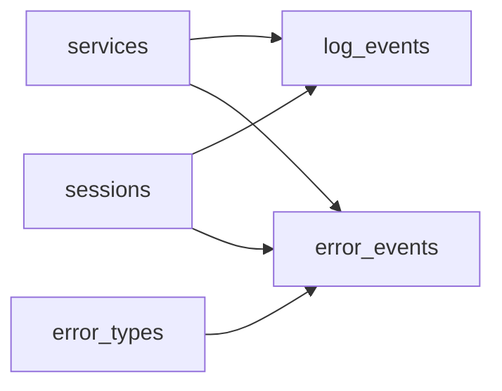

# The Vital Few
_Two terabytes a day, and the lines that matter are a rounding error in the noise._

- **Domain:** data_modeling
- **Difficulty:** Medium
- **Est. time:** ? min
- **URL:** https://datadriven.io/problems/the_vital_few

## Problem

We ingest about 2TB of raw application logs into S3 every day, where debug and info lines vastly outnumber the errors analysts actually care about, so the high-value error records need to live apart from the bulk firehose. Analysts follow a single request as it crosses services and stitch a user's activity together within a session, starting from either an ordinary log line or an error, so the request and session identifiers have to ride on both. Errors are grouped by a canonical category instead of raw message text, and error rates get sliced by the team that owns each service and its tier, so keep that ownership one hop away.

**Concepts tested:** `dmAttributes`, `dmConstraints`, `dmDimensionTables`, `dmEntities`, `dmFactTables`, `dmForeignKeys`, `dmGrainDefinition`, `dmOneToMany`, `dmPrimaryKeys`, `dmStarSchema`, `dmSurrogateKeys`

## Solution walkthrough


### Why this problem exists in real interviews

This is cardinality skew hiding inside a schema design problem. The skill being probed: recognizing that a 1000:1 ratio between debug and error logs demands physical separation, and that `request_id` and `session_id` are the load-bearing correlation keys that let analysts jump between the two facts. A unified logs table scans the entire firehose on every error query. Get the correlation keys wrong and analysts cannot stitch a request across services or slice errors by the team that owns them.

> **Trick to Solving**
>
> When a prompt mixes '2TB per day' with 'query error patterns,' the trick is to split the hot path (errors) from the cold path (debug/info) and to invest in a correlation key. Before drawing tables, a strong candidate asks: what is the ratio of error to info logs, and what key ties events across services?
>
> 1. Split `error_events` from `log_events`
> 2. Pull services into a dimension with team and tier
> 3. Normalize `error_types` as a dimension
> 4. Keep `request_id` and `session_id` as first-class columns on both facts

---

### Break down the requirements

**Step 1: Split by cardinality**

`log_events` absorbs the firehose; `error_events` is a narrower, higher-value fact. Analysts who care about errors never pay the cost of scanning debug logs.

**Step 2: Dimensionalize services**

`services` is a conformed dimension with team, tier, and criticality. Every fact FK points to it so that ownership is one join away.

**Step 3: Classify errors via a dimension**

`error_types` maps raw message patterns to canonical categories. `error_events.error_type_id` is the FK, so taxonomy changes do not rewrite the fact.

**Step 4: Preserve correlation keys on both facts**

`request_id` and `session_id` live on BOTH fact rows. That is the load-bearing detail: a trace must reconstruct from either the bulk log line or the error, so neither fact can drop the keys.

---

### The solution

Below is one conceptually sound model. The split between `log_events` and `error_events` is the load-bearing decision: it is how a 2TB-per-day feed remains queryable. Each dimension sits on the one side of a one-to-many edge into the facts.


**services**

| column | type | key |
|---|---|---|
| service_id | INT | PK |
| name | TEXT |  |
| owning_team | TEXT |  |
| tier | TEXT |  |

**error_types**

| column | type | key |
|---|---|---|
| error_type_id | INT | PK |
| category | TEXT |  |
| canonical_message | TEXT |  |
| severity | TEXT |  |

**sessions**

| column | type | key |
|---|---|---|
| session_id | TEXT | PK |
| user_id | BIGINT |  |
| started_at | TIMESTAMP |  |
| ended_at | TIMESTAMP |  |

**log_events**

| column | type | key |
|---|---|---|
| log_event_id | BIGINT | PK |
| service_id | INT | FK |
| session_id | TEXT | FK |
| request_id | TEXT |  |
| level | TEXT |  |
| event_ts | TIMESTAMP |  |
| raw_message | TEXT |  |

**error_events**

| column | type | key |
|---|---|---|
| error_event_id | BIGINT | PK |
| service_id | INT | FK |
| error_type_id | INT | FK |
| session_id | TEXT | FK |
| request_id | TEXT |  |
| event_ts | TIMESTAMP |  |
| stack_trace | TEXT |  |


> **Why this works**
>
> Two facts keyed by the same correlation columns let analysts slice errors cheaply and still join back to the firehose when they need full context. The `error_types` dimension turns taxonomy changes into a one-row UPDATE.

> **Interviewers watch for**
>
> A strong candidate raises the cardinality ratio early and reaches for a correlation key before schema specifics. They also name a retention policy: errors kept longer than info.

> **Common pitfall**
>
> A single `logs` table with a `level` column. Error queries scan the entire firehose and the partition strategy has to accommodate two very different access patterns. At 2TB per day this is the difference between seconds and minutes on every hot query. The quieter version of this mistake: splitting the facts but dropping `request_id` from `error_events`, which silently breaks tracing the moment an analyst starts from an error.

---

### The analysis pattern

**Top error categories by service last hour**

```sql
SELECT
    s.name AS service,
    et.category,
    COUNT(*) AS error_count
FROM error_events e
JOIN services s ON s.service_id = e.service_id
JOIN error_types et ON et.error_type_id = e.error_type_id
WHERE e.event_ts >= NOW() - INTERVAL '1 hour'
GROUP BY s.name, et.category
ORDER BY error_count DESC
LIMIT 20
```

---

### Trade-offs and alternatives

| Split fact tables | Single logs table with level column |
|---|---|
| Hot error path separate from firehose.

* Error queries are fast and narrow
* Retention can differ per fact
* Producers must classify at write time | Unified logs table filtered by level.

* One ingest path
* Every error query scans everything
* Retention is one-size-fits-all |

---

- **How would you enforce `request_id` propagation across 40 services?**
  - _Tests whether the candidate names a tracing context standard and upstream instrumentation._
- **Debug logs must be kept 3 days, errors 90 days, audit 7 years. How is that enforced?**
  - _Tests per-fact partitioning and TTL policies._
- **How do you detect a new error type the classifier has never seen?**
  - _Tests whether `error_type_id` is nullable with an unclassified bucket and a backfill path._
- **At 2TB per day, where does the ingest bottleneck move, and how do you shard?**
  - _Tests scale awareness: batch vs streaming, partition keys, and hot-shard mitigation._
