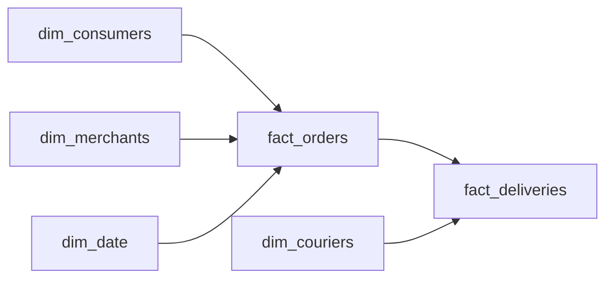

# Three-Sided Marketplace Delivery Schema
_One order. Two deliveries. Revenue counted twice. Where is the bug in your schema?_

- **Domain:** data_modeling
- **Difficulty:** Hard
- **Est. time:** 25 min
- **URL:** https://datadriven.io/problems/three_sided_marketplace_delivery_schema

## Problem

We run a three-sided marketplace: consumers place orders from merchants, and couriers deliver them. Finance needs accurate revenue reporting. Operations needs delivery latency metrics. One order can be reassigned to a different courier if the first one cancels. Design the data model.

**Concepts tested:** `dmAttributes`, `dmDenormalization`, `dmDimensionTables`, `dmFactTables`, `dmForeignKeys`, `dmGrainDefinition`, `dmMetricAdditivity`, `dmOneToMany`, `dmPrimaryKeys`, `dmStarSchema`, `dmSurrogateKeys`

## Solution walkthrough


### Why this problem exists in real interviews

This is grain separation dressed up as a marketplace schema. The real skill: keeping two related but differently-grained processes from corrupting each other, so a reassigned courier cannot double-count GMV and a cancelled attempt cannot null out revenue. Anyone can draw six tables. The tell is putting `fact_orders` (one row per order, owns revenue) and `fact_deliveries` (one row per delivery attempt, owns latency) at two separate grains. Get it wrong and one join fans out revenue on every 4% of orders that got reassigned.

> **Two grains, or the join fans out**
>
> Before drawing any tables, a strong candidate asks: "can one order have more than one delivery attempt, and which measures belong to which entity?" The moment the answer is "yes, couriers get reassigned," revenue and latency must live in different facts at different grains.
>
> 1. Spot the one-to-many between order and delivery
> 2. Declare two fact tables at two grains
> 3. Put revenue on orders only, latency on deliveries only
> 4. Filter cancelled delivery attempts out of latency averages

---

### Break down the requirements

**Step 1: Declare two grains**

`fact_orders` sits at one row per order. `fact_deliveries` sits at one row per delivery attempt per order. Revenue questions join neither; latency questions filter to completed deliveries.

**Step 2: Revenue lives only on `fact_orders`**

`subtotal`, `tip`, `delivery_fee`, and `platform_commission` all live here. Never on deliveries. A reassignment duplicates a delivery row, not a revenue row.

**Step 3: Latency lives only on `fact_deliveries`**

`assigned_ts`, `pickup_ts`, and `dropoff_ts` belong to the attempt. Orders hold only `order_placed_ts`.

**Step 4: Filter cancelled attempts out of averages**

A cancelled attempt has a null `dropoff_ts`. Any latency query filters `WHERE delivery_status = 'completed'` to avoid contaminating averages.

---

### The solution

Below is one defensible model. The conceptual anchor is grain separation: revenue is order-level, latency is delivery-level, and the two facts never trade places.


**dim_consumers**

| column | type | key |
|---|---|---|
| consumer_sk | BIGINT | PK |
| consumer_nk | TEXT |  |
| city | TEXT |  |
| signup_ts | TIMESTAMP |  |

**dim_merchants**

| column | type | key |
|---|---|---|
| merchant_sk | BIGINT | PK |
| merchant_nk | TEXT |  |
| category | TEXT |  |
| city | TEXT |  |

**dim_couriers**

| column | type | key |
|---|---|---|
| courier_sk | BIGINT | PK |
| courier_nk | TEXT |  |
| vehicle_type | TEXT |  |

**dim_date**

| column | type | key |
|---|---|---|
| date_key | INT | PK |
| calendar_date | DATE |  |
| day_of_week | TEXT |  |

**fact_orders**

| column | type | key |
|---|---|---|
| order_sk | BIGINT | PK |
| order_nk | TEXT |  |
| consumer_sk | BIGINT | FK |
| merchant_sk | BIGINT | FK |
| date_key | INT | FK |
| order_placed_ts | TIMESTAMP |  |
| subtotal | FLOAT |  |
| tip | FLOAT |  |
| delivery_fee | FLOAT |  |
| platform_commission | FLOAT |  |

**fact_deliveries**

| column | type | key |
|---|---|---|
| delivery_sk | BIGINT | PK |
| order_sk | BIGINT | FK |
| courier_sk | BIGINT | FK |
| attempt_number | INT |  |
| assigned_ts | TIMESTAMP |  |
| pickup_ts | TIMESTAMP |  |
| dropoff_ts | TIMESTAMP |  |
| delivery_status | TEXT |  |


> **The key outlives the attribute**
>
> Putting revenue and latency on separate facts eliminates the whole class of double-count bugs that reassigned couriers cause. Finance joins `fact_orders` alone. Operations joins `fact_deliveries` alone. The two meet only when a dashboard needs both, and they meet via a filtered join.

> **Naming the grain before drawing**
>
> They name the grain for both facts in the first two minutes. They explicitly refuse to put revenue columns on `fact_deliveries` and justify it with the reassignment case. They point out that cancelled attempts must be filtered from latency aggregates.

> **One fact means one fan-out bug**
>
> One fact with both revenue and latency columns guarantees double-counted revenue on reassigned orders and null revenue on cancelled attempts. A naive `JOIN` on `order_sk` between the two facts produces fan-out whenever a reassignment happened. Including cancelled attempts in latency averages understates pickup and dropoff speed.

---

### The analysis pattern

**GMV and completed-delivery latency by merchant category**

```sql
SELECT
    m.category,
    SUM(o.subtotal + o.delivery_fee + o.tip) AS gmv,
    AVG(EXTRACT(EPOCH FROM (d.dropoff_ts - o.order_placed_ts)) / 60.0)
      FILTER (WHERE d.delivery_status = 'completed') AS avg_minutes
FROM fact_orders o
JOIN dim_merchants m ON m.merchant_sk = o.merchant_sk
LEFT JOIN fact_deliveries d
  ON d.order_sk = o.order_sk
 AND d.delivery_status = 'completed'
GROUP BY m.category
```

---

### Trade-offs and alternatives

| Two facts at different grains | Accumulating snapshot on order |
|---|---|
| Revenue and latency are independently queryable. No double-count risk. Cross-fact queries need an explicit filter to completed deliveries. | One row per order with the latest delivery timestamps upserted in place. Reporting is a single table scan. Reassignment history is lost unless stored on a child audit table. |

---

- **How would you report courier utilization without double-counting reassigned orders?**
  - _Tests aggregation on `fact_deliveries` alone, filtered by status._
- **Finance wants GMV by merchant. Which fact do they query and why?**
  - _Tests whether revenue ownership is clear on `fact_orders` only._
- **A cancelled delivery attempt still triggered a small courier fee. Where does that fee live?**
  - _Tests whether courier-level fees need a third fact or a column on `fact_deliveries`._
- **How would you partition both facts at 20M orders per day across 40 cities?**
  - _Tests partition key choice (`order_placed_ts` and city) and its impact on late events._
- **How would you handle an order that is refunded a week after delivery?**
  - _Tests whether refunds are an update on `fact_orders` or an append-only `fact_refunds`._
