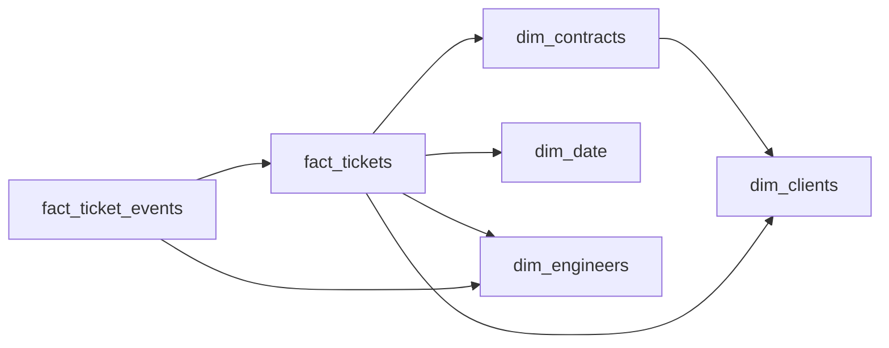

# Time in Force

- **Domain:** data_modeling
- **Difficulty:** Medium
- **Est. time:** 25 min
- **URL:** https://datadriven.io/problems/time_in_force

## Problem

We run a managed IT services business handling support tickets under client contracts whose SLA targets get renegotiated over the life of a contract. Design a warehouse model for monthly SLA compliance per client, where every ticket is judged against the SLA that was in force the day it was opened, alongside mean time to resolve per engineering team.

**Concepts tested:** `dmDenormalization`, `dmDimensionTables`, `dmFactTables`, `dmForeignKeys`, `dmGrainDefinition`, `dmMetricAdditivity`, `dmOneToMany`, `dmPrimaryKeys`, `dmScdStrategy`, `dmScdType2`, `dmStarSchema`, `dmSurrogateKeys`

## Solution walkthrough


### What this problem really is

This is a point-in-time attribution problem dressed up as a support desk. The real question: can you grade a fact against a policy that changes, pinning each ticket to the SLA that was in force the day it opened? Anyone can draw a tickets table with an FK to contracts. The trap is joining tickets to the **current** contract row. Renegotiate one client to a tighter SLA and every closed ticket from last year flips to breached overnight. Your compliance dashboard has rewritten its own history.

> **The ticket must remember its rule**
>
> "Renegotiated over the life of the contract" means a slowly changing dimension. Version the contract as Type 2 behind a surrogate `contract_sk`, bind each ticket to the version live at `opened_at`, and snapshot the threshold onto the ticket as `sla_resolution_mins_at_open`. Resolve the rule once at load time, never at read time.

### Build it in four decisions

**Step 1: Declare the ticket grain**

One row in `fact_tickets` is one support ticket, keyed by `ticket_key` with the source `ticket_id` alongside. Every SLA measure hangs off that grain, so a ticket is counted exactly once in any compliance rate.

**Step 2: Version `dim_contracts` as Type 2**

Surrogate `contract_sk`, natural `contract_id`, the SLA thresholds, and `valid_from` / `valid_to`. A renegotiation closes the old row and opens a new one. The natural key groups the versions; the surrogate points at exactly one.

**Step 3: Bind the ticket to the version in force**

At load, find the version whose interval contains `opened_at`, store its `contract_sk`, and compute `is_breached` from `business_mins_to_resolve` against `sla_resolution_mins_at_open`. A later renegotiation now has nothing to touch.

**Step 4: Keep the assignment trail separate**

Reassignments go into append-only `fact_ticket_events`, one row per transition, linked by `ticket_key`. `current_engineer_key` is a projection of the latest event, not an overwrite that erases who held the ticket before.

### The reference model


**dim_clients**

| column | type | key |
|---|---|---|
| client_key | INT | PK |
| client_name | TEXT |  |
| industry | TEXT |  |
| timezone | TEXT |  |

**dim_contracts**

| column | type | key |
|---|---|---|
| contract_sk | BIGINT | PK |
| contract_id | BIGINT |  |
| client_key | INT | FK |
| tier | TEXT |  |
| sla_response_mins | INT |  |
| sla_resolution_mins | INT |  |
| valid_from | TIMESTAMP |  |
| valid_to | TIMESTAMP |  |

**dim_engineers**

| column | type | key |
|---|---|---|
| engineer_key | INT | PK |
| full_name | TEXT |  |
| team | TEXT |  |
| hired_at | DATE |  |

**dim_date**

| column | type | key |
|---|---|---|
| date_key | INT | PK |
| full_date | DATE |  |
| month | INT |  |
| is_business_day | BOOLEAN |  |

**fact_tickets**

| column | type | key |
|---|---|---|
| ticket_key | BIGINT | PK |
| ticket_id | BIGINT |  |
| client_key | INT | FK |
| contract_sk | BIGINT | FK |
| opened_date_key | INT | FK |
| current_engineer_key | INT | FK |
| opened_at | TIMESTAMP |  |
| resolved_at | TIMESTAMP |  |
| sla_resolution_mins_at_open | INT |  |
| business_mins_to_resolve | INT |  |
| is_breached | BOOLEAN |  |

**fact_ticket_events**

| column | type | key |
|---|---|---|
| event_id | BIGINT | PK |
| ticket_key | BIGINT | FK |
| event_type | TEXT |  |
| engineer_key | INT | FK |
| occurred_at | TIMESTAMP |  |


> **Say Type 2 before you draw**
>
> Strong candidates ask whether old tickets keep the old SLA before touching the canvas. They store additive ingredients (`business_mins_to_resolve`, `is_breached`) and let the query divide. Mean time to resolve per team is `SUM` over `COUNT` grouped by `team`, never an average of stored averages.

> **A plain `contract_id` FK re-grades the past**
>
> Joining `fact_tickets` to a current-state contracts table on `contract_id` looks right until the first renegotiation, when last quarter's number silently moves. Storing a precomputed `breach_pct` is the sibling mistake: a ratio cannot roll up from client to month to team.

> **Surrogate joins stay cheap at scale**
>
> At 5 million tickets a year, `contract_sk` is an integer join into a few thousand contract versions. Partition `fact_tickets` by `opened_date_key` so a monthly report scans one month, and cluster `fact_ticket_events` by `ticket_key` for fast history reconstruction.

### The analysis it enables

**Monthly SLA compliance per client**

```sql
SELECT
    cl.client_name,
    d.month,
    COUNT(*) AS tickets,
    SUM(CASE WHEN t.is_breached THEN 0 ELSE 1 END)::NUMERIC
        / NULLIF(COUNT(*), 0) AS compliance_rate
FROM fact_tickets t
JOIN dim_clients cl ON cl.client_key = t.client_key
JOIN dim_date d ON d.date_key = t.opened_date_key
WHERE t.resolved_at IS NOT NULL
GROUP BY cl.client_name, d.month
ORDER BY cl.client_name, d.month
```

| Type 2 dimension plus snapshot | Current-state contract, SLA joined live |
|---|---|
| The ticket points at `contract_sk` and carries `sla_resolution_mins_at_open`. History is immutable by construction and compliance is a plain `GROUP BY`. The cost: the threshold lives in two places, so the load must keep them consistent. | The ticket carries only `contract_id` and the threshold is read at query time. One contract row, nothing to version. The cost: every renegotiation rewrites past compliance, and fixing it later needs a range join on `valid_from` / `valid_to` you never modeled. |

- **The SLA clock should count only business hours in the client's `timezone` and pause while waiting on the client. Where does that logic live?**
  - _Tests whether `business_mins_to_resolve` is derived at load from `fact_ticket_events` plus a business calendar, not wall-clock subtraction._
- **A ticket is reassigned across three teams before it closes. Which team owns the breach?**
  - _Tests reasoning from `fact_ticket_events` to a defensible attribution rule: opening team, closing team, or holder at breach._
- **How would you answer which SLA applied to a contract on any given date?**
  - _Tests point-in-time lookup against the Type 2 `valid_from` / `valid_to` interval._
