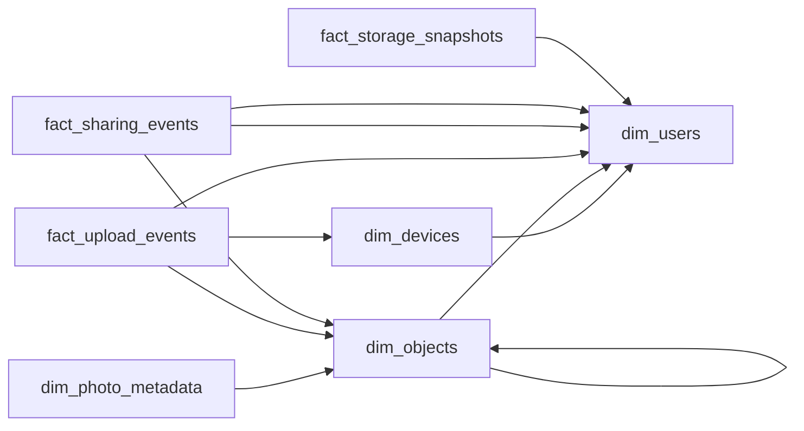

# Trees Within Trees
_A file is also a folder. A folder is also a file._

- **Domain:** data_modeling
- **Difficulty:** Hard
- **Est. time:** 30 min
- **URL:** https://datadriven.io/problems/trees_within_trees

## Problem

We run a cloud file storage platform where people upload files from their phones and laptops, nest them into folders, and share them with other users. Photos carry camera and location metadata held under stricter retention rules than ordinary files, and each user's storage is capped by a quota we track as it moves day to day. Design the data model.

**Concepts tested:** `dmDimensionTables`, `dmFactTables`, `dmForeignKeys`, `dmGrainDefinition`, `dmMetricAdditivity`, `dmOneToMany`, `dmPreAggregation`, `dmPrimaryKeys`, `dmStarSchema`, `dmSurrogateKeys`

## Solution walkthrough


### What this really is

Strip off the file-storage costume and this is three modeling patterns wearing one problem: a **self-referential hierarchy** (a folder is just a file that has children), a semi-additive measure (quota is a state you sample, never a running sum), and a polymorphic subtype (EXIF exists for photos and nothing else). Anyone can list some dimensions and facts. The trap is estimating storage as `SUM(bytes_transferred)` over the upload log: that double-counts every re-upload, ignores deletes entirely, and quietly mis-bills every user. Storage is a state, not a pile of events.

> **A folder is a file with children**
>
> Collapse files and folders into one `dim_objects` with an `object_type` flag and a `parent_folder_id` that points back to `object_id` in the same table. Quota becomes one row per user per day in `fact_storage_snapshots`, not a total you compute on the fly. EXIF lands in its own `dim_photo_metadata` keyed by `object_id`, joined only when you need camera or GPS fields.

### Building the model

**Step 1: Unify files and folders into `dim_objects`**

Both are nodes in the same tree, so give them one dimension with `parent_folder_id` self-referencing `object_id` and `object_type` telling them apart. Two separate tables force a cross-table recursion for anything that spans folders and files, like sizing a folder.

**Step 2: Subtype EXIF into `dim_photo_metadata`**

Camera model, `taken_at`, and GPS exist only for photos. Hang them on `dim_objects` and you get a wide, mostly-`NULL` table under stricter retention than the files beside it. A subtype whose `object_id` is an FK to `dim_objects` isolates that retention boundary and stays lean.

**Step 3: Snapshot the quota, don't sum it**

Quota usage is semi-additive: you can sum `total_bytes` across users on a given day, but never across days for one user. A daily grain in `fact_storage_snapshots` (one row per user per day, natural key `snapshot_date` plus `user_key`) gives analysts a stable as-of number instead of a fragile SUM-over-mutable-events query.

**Step 4: Keep trashed bytes billable**

A file in the trash still occupies quota until it is purged, so carry `trashed_bytes` on the snapshot and count `is_deleted = TRUE` rows in `total_bytes`. Filter those out at the snapshot boundary and you under-bill every user who ever deleted a file.


**dim_users**

| column | type | key |
|---|---|---|
| user_key | BIGINT | PK |
| email | TEXT |  |
| plan_tier | TEXT |  |
| quota_bytes | BIGINT |  |

**dim_devices**

| column | type | key |
|---|---|---|
| device_key | BIGINT | PK |
| user_key | BIGINT | FK |
| platform | TEXT |  |
| os_version | TEXT |  |

**dim_objects**

| column | type | key |
|---|---|---|
| object_id | BIGINT | PK |
| owner_user_key | BIGINT | FK |
| parent_folder_id | BIGINT | FK |
| object_type | TEXT |  |
| size_bytes | BIGINT |  |
| is_deleted | BOOLEAN |  |
| created_at | TIMESTAMP |  |

**dim_photo_metadata**

| column | type | key |
|---|---|---|
| object_id | BIGINT | FK |
| camera_model | TEXT |  |
| taken_at | TIMESTAMP |  |
| gps_lat | DECIMAL |  |
| gps_lon | DECIMAL |  |

**fact_upload_events**

| column | type | key |
|---|---|---|
| upload_id | BIGINT | PK |
| object_id | BIGINT | FK |
| user_key | BIGINT | FK |
| device_key | BIGINT | FK |
| uploaded_at | TIMESTAMP |  |
| bytes_transferred | BIGINT |  |

**fact_sharing_events**

| column | type | key |
|---|---|---|
| share_id | BIGINT | PK |
| object_id | BIGINT | FK |
| grantor_user_key | BIGINT | FK |
| grantee_user_key | BIGINT | FK |
| permission | TEXT |  |
| shared_at | TIMESTAMP |  |

**fact_storage_snapshots**

| column | type | key |
|---|---|---|
| snapshot_date | DATE | PK |
| user_key | BIGINT | FK |
| total_bytes | BIGINT |  |
| file_count | INT |  |
| trashed_bytes | BIGINT |  |


> **The tell is the words `periodic snapshot`**
>
> Strong candidates name the snapshot grain and the phrase `semi-additive` before you ask, and they catch the `trashed_bytes` trap themselves. Weak ones split folders and files into two tables, then burn five minutes explaining how to recurse across both to size a folder.

> **Treating storage as a sum of uploads**
>
> The reflex is `SUM(bytes_transferred)` from `fact_upload_events` to get current storage. That double-counts a re-upload of the same `object_id` and never sees a delete. Usage is the state of the objects that exist right now, which is exactly what `fact_storage_snapshots` records.

### The query it unlocks

Because quota lives at a clean daily grain, the highest-value question, who is about to blow past their cap, is a single join against today's snapshot with no aggregation over the event log at all.

**Users approaching quota**

```sql
SELECT
    u.email,
    u.quota_bytes,
    s.total_bytes,
    ROUND(100.0 * s.total_bytes / NULLIF(u.quota_bytes, 0), 1) AS pct_used,
    s.trashed_bytes
FROM fact_storage_snapshots s
JOIN dim_users u ON u.user_key = s.user_key
WHERE s.snapshot_date = CURRENT_DATE
  AND s.total_bytes > u.quota_bytes * 0.9
ORDER BY pct_used DESC
```

| Unified objects plus snapshot | Separate files/folders, event-only |
|---|---|
| One tree in `dim_objects`, one `dim_users` join, and `fact_storage_snapshots` keeps quota correct and cheap. Cost: recursive queries for deep folder ancestry and a nightly snapshot job. | Simpler-looking per-table schema, no snapshot job. Cost: folder size needs a join across two tables, and quota must be re-derived by summing mutable `fact_upload_events`, which is slow and silently wrong on deletes. |

- **How would you return an object's full folder path without recursing to the root at query time?**
  - _Tests materialized-path or closure-table alternatives to the self-referential `parent_folder_id`._
- **What if a file is shared into another user's namespace and both should see it in their own tree?**
  - _Tests whether sharing needs a junction distinct from `owner_user_key` ownership._
- **At 10B objects, how do you partition `dim_objects` and `fact_storage_snapshots`?**
  - _Tests partitioning by owner hash versus by `snapshot_date`._
