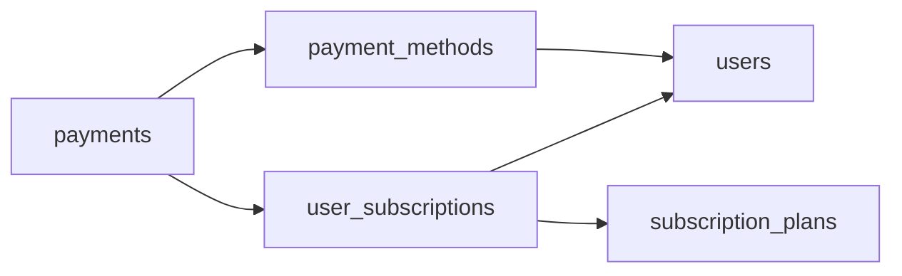

# Two Wallets
_Two user types. Multiple payment methods. One messy billing table._

- **Domain:** data_modeling
- **Difficulty:** Medium
- **Est. time:** 35 min
- **URL:** https://datadriven.io/problems/two_wallets

## Problem

We run an online education marketplace with two user types: students paying for access, and instructors paying for listing and promotion features. Both subscribe to different plan tiers and keep several payment methods on file, each stored as an opaque gateway token plus the card brand and last four digits for display, never full card numbers. Finance also needs to reconstruct how many subscribers we had in any past month, so design the data model behind billing.

**Concepts tested:** `dmConstraints`, `dmDataTypes`, `dmDimensionTables`, `dmEntities`, `dmFactTables`, `dmFirstNormalForm`, `dmForeignKeys`, `dmGrainDefinition`, `dmImmutableLogs`, `dmKeyGeneration`, `dmOneToMany`, `dmPrimaryKeys`, `dmSecondNormalForm`, `dmStarSchema`, `dmSurrogateKeys`, `dmThirdNormalForm`

## Solution walkthrough


### What this really is

This is a temporal history problem dressed up as a billing page. The live product only ever shows today's plan and today's card, so the design that passes every screen is one `users` row with `current_plan`, `gateway_token`, `card_brand` and `card_last4`. That is the trap. Every upgrade overwrites the old plan, so the `started_at` Finance needs to count March's subscribers never exists. A second saved card either fails or clobbers the first. The real skill is to **close rows instead of overwriting them**: subscriptions become dated periods, and cards become a one-to-many child of the user.

> **Two words in the prompt decide the shape**
>
> "Several payment methods" means `payment_methods` is a child table. "Any past month" means a subscription is a period with `started_at` and `ended_at`, not a field on the user. Model those two as rows and the other three tables follow.

### Building it

**Step 1: Keep one `users` table with a `user_type` discriminator**

Students and instructors share identity, email and login. Only their plans differ. A `user_type` of 'student' or 'instructor' carries the split. Two forked tables would double every join for no gain.

**Step 2: Put tier and price on `subscription_plans`**

Plans are a small reference table. A price change inserts a new plan row. Existing subscriptions keep their `plan_id`, so what someone paid in March stays true.

**Step 3: Make `user_subscriptions` a history, not a slot**

Store one row per subscription period, with `started_at`, `ended_at` and `status`. An upgrade sets `ended_at` on the old row and inserts a new one. A month's subscribers are the rows open during that month: `started_at` falls before the month ends, and `ended_at` is `NULL` or falls after the month starts.

**Step 4: Give cards and charges their own grains**

`payment_methods` holds one row per saved card, keyed to `user_id`, with `token`, `brand` and `last_four`, never the card number. `payments` holds one row per charge and points at the `subscription_id` it funded and the `payment_method_id` it hit. That makes retries and refunds new rows, not edits.

### The reference design


**users**

| column | type | key |
|---|---|---|
| user_id | BIGINT | PK |
| user_type | TEXT |  |
| email | TEXT |  |
| signup_at | TIMESTAMP |  |
| country | TEXT |  |

**subscription_plans**

| column | type | key |
|---|---|---|
| plan_id | BIGINT | PK |
| plan_name | TEXT |  |
| tier | TEXT |  |
| billing_interval | TEXT |  |
| price | DECIMAL |  |
| features | TEXT |  |

**user_subscriptions**

| column | type | key |
|---|---|---|
| subscription_id | BIGINT | PK |
| user_id | BIGINT | FK |
| plan_id | BIGINT | FK |
| started_at | TIMESTAMP |  |
| ended_at | TIMESTAMP |  |
| status | TEXT |  |

**payment_methods**

| column | type | key |
|---|---|---|
| payment_method_id | BIGINT | PK |
| user_id | BIGINT | FK |
| method_type | TEXT |  |
| brand | TEXT |  |
| last_four | TEXT |  |
| token | TEXT |  |
| is_default | BOOLEAN |  |

**payments**

| column | type | key |
|---|---|---|
| payment_id | BIGINT | PK |
| subscription_id | BIGINT | FK |
| payment_method_id | BIGINT | FK |
| amount | DECIMAL |  |
| paid_at | TIMESTAMP |  |
| status | TEXT |  |


> **One card slot cannot say yes to a second card**
>
> A flat `users` row with `card_brand` and `card_last4` demos fine until someone adds a backup card. Then you either reject the card or overwrite the first one, and old `payments` lose track of which card they charged.

> **Name which rows never get rewritten**
>
> Strong candidates say it out loud: `user_subscriptions` and `payments` are append-mostly. The only permitted updates are setting `ended_at` to close a period and moving a charge's `status`. That sentence shows you know the history is what Finance is buying.

### Proving it with Finance's question

The query is the proof, not the deliverable. Each period carries its own `started_at`, so bucketing by month and reading the prior month with `LAG()` takes one pass over `user_subscriptions`. On the flat design there is nothing to bucket.

**Month-over-month new subscriptions**

```sql
WITH monthly_new AS (
    SELECT
        strftime('%Y-%m', started_at) AS month,
        COUNT(*) AS new_subscriptions
    FROM user_subscriptions
    GROUP BY strftime('%Y-%m', started_at)
)
SELECT
    month,
    new_subscriptions,
    new_subscriptions - LAG(new_subscriptions) OVER (ORDER BY month) AS mom_change,
    ROUND(
        100.0 * (new_subscriptions - LAG(new_subscriptions) OVER (ORDER BY month))
        / LAG(new_subscriptions) OVER (ORDER BY month),
        1
    ) AS mom_growth_pct
FROM monthly_new
ORDER BY month
```

| Dated subscription rows | Current-state columns on users |
|---|---|
| An upgrade closes one row and opens another, and `started_at` and `ended_at` answer any past month. Cards live in `payment_methods`, as many as the user saves. The cost is a join or two per report. | One `current_plan` field, overwritten on every change. Last March is gone the moment someone upgrades. One `gateway_token` per user, so a second card clobbers the first. It reads fast and reports nothing. |

- **How do you count active subscribers, not new ones, for each past month?**
  - _Tests the overlap predicate on `started_at` and `ended_at` against a month calendar._
- **A user upgrades mid-cycle with a prorated charge. Which rows change?**
  - _Tests closing the old period, opening a new one and booking the proration as a `payments` row._
- **How do you guarantee a user never has two open subscriptions at once?**
  - _Tests a constraint or partial unique index on `user_id` where `ended_at IS NULL`._
