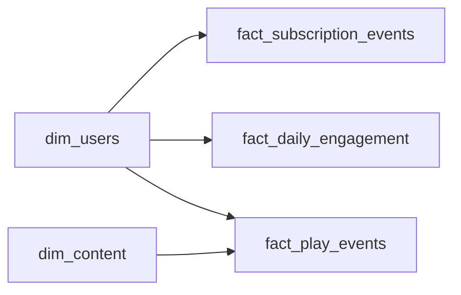

# When the Music Stops
_Subscribers are leaving. The data knows why._

- **Domain:** data_modeling
- **Difficulty:** Medium
- **Est. time:** 25 min
- **URL:** https://datadriven.io/problems/when_the_music_stops

## Problem

We run a music streaming service and our premium subscribers are cancelling at 8% a month. Design a data model that lets the retention team compare how listening habits, playlist activity, and subscription history differ between members who churned and those who stayed in the weeks before a cancellation.

**Concepts tested:** `dmAttributes`, `dmCardinalityRequired`, `dmConstraints`, `dmDataTypes`, `dmDimensionTables`, `dmFactTables`, `dmForeignKeys`, `dmGrainDefinition`, `dmOneToMany`, `dmPreAggregation`, `dmPrimaryKeys`, `dmStarSchema`, `dmSurrogateKeys`

## Solution walkthrough


### Why this problem exists in real interviews

Churn modeling probes whether a candidate can coexist three different grains cleanly: a lifecycle event log, a pre-aggregated daily snapshot, and an atomic play-event fact. The signal is whether the candidate understands when to pay the storage cost of pre-aggregation versus reconstructing daily engagement on every query.

> **Trick to Solving**
>
> The tell is "churn analysis". Churn is inherently a lifecycle question joined to an engagement signal. Before drawing any tables, a strong candidate asks: at what grain do analysts need engagement, and how far back? If the answer is "daily, two years", the pre-aggregated daily fact earns its keep.
>
> 1. Separate lifecycle events from engagement events
> 2. Pre-aggregate daily engagement (listening AND playlist activity) for BI speed
> 3. Keep `fact_play_events` atomic for ad-hoc analysis
> 4. Use `event_type` on `fact_subscription_events` to cover signup, upgrade, cancel

---

### Break down the requirements

**Step 1: Lifecycle as an event log**

`fact_subscription_events` captures signup, upgrade, downgrade, pause, cancel, reactivate. Append-only, one row per state change, `event_type` as a discriminator.

**Step 2: Daily engagement pre-aggregated**

`fact_daily_engagement` is one row per user per day with rolled-up sessions, minutes, distinct tracks, and playlist activity (playlists created, social shares). This is the table most dashboards hit; it pays for itself the first time a cohort analysis runs, and it is the only table that carries the playlist signal the churn analysis asks for. The specific columns are a choice, not a mandate: any sensible mix of daily listening volume and playlist measures works.

**Step 3: Atomic play events for deep dives**

`fact_play_events` is the raw source. It feeds the listening columns of `fact_daily_engagement` and stays available for content-level analytics, A/B tests, and anomaly investigations.

**Step 4: Conform `dim_users` and `dim_content`**

Both dimensions are shared across all three facts. Conformity makes "did users who cancelled last month listen less and stop building playlists in week 3" a single query.

---

### The solution

Below is one defensible approach. The coexistence of three grains is the anchor: lifecycle, daily, and atomic each serve different query patterns without collapsing into one table.


**dim_users**

| column | type | key |
|---|---|---|
| user_sk | BIGINT | PK |
| user_id | TEXT |  |
| signup_date | DATE |  |
| country | TEXT |  |
| plan_tier | TEXT |  |

**dim_content**

| column | type | key |
|---|---|---|
| content_sk | BIGINT | PK |
| content_id | TEXT |  |
| title | TEXT |  |
| genre | TEXT |  |
| release_date | DATE |  |

**fact_subscription_events**

| column | type | key |
|---|---|---|
| event_id | BIGINT | PK |
| user_sk | BIGINT | FK |
| event_type | TEXT |  |
| event_timestamp | TIMESTAMP |  |
| plan_tier | TEXT |  |

**fact_daily_engagement**

| column | type | key |
|---|---|---|
| engagement_date | DATE |  |
| user_sk | BIGINT | FK |
| sessions | INT |  |
| minutes_played | INT |  |
| distinct_tracks | INT |  |
| playlists_created | INT |  |
| social_shares | INT |  |

**fact_play_events**

| column | type | key |
|---|---|---|
| play_event_id | BIGINT | PK |
| user_sk | BIGINT | FK |
| content_sk | BIGINT | FK |
| started_at | TIMESTAMP |  |
| play_seconds | INT |  |
| skip | BOOLEAN |  |


> **Why This Design Works**
>
> Pre-aggregation is a deliberate storage-for-speed trade. The daily fact is 1/100th the size of the play-event fact and serves the 90% of queries that only need daily granularity. The atomic fact stays available for the 10% that need content-level detail. This is the classic pattern for retention and churn analytics at scale.

> **Interviewers Watch For**
>
> Strong candidates explicitly name the three grains and justify the daily pre-aggregation with a query frequency argument. They also note that playlist and social signals belong on the daily fact (not reconstructable from play events alone) and that the listening columns must be idempotently rebuildable from `fact_play_events` for late-arriving data. Weaker candidates build only the atomic fact, drop the playlist signal entirely, and watch dashboards time out.

> **Common Pitfall**
>
> Mutating `fact_daily_engagement` in place when a late play event arrives. The listening columns should be rebuilt for affected days from `fact_play_events`, not patched, otherwise drift between the two is inevitable.

---

### The analysis pattern

**Seven-day engagement before cancellation**

```sql
WITH cancels AS (
    SELECT user_sk, event_timestamp::date AS cancel_date
    FROM fact_subscription_events
    WHERE event_type = 'cancel'
      AND event_timestamp >= '2025-01-01'
)
SELECT
    u.plan_tier,
    u.country,
    AVG(e.minutes_played) AS avg_daily_minutes,
    AVG(e.distinct_tracks) AS avg_daily_tracks,
    AVG(e.playlists_created) AS avg_daily_playlists,
    COUNT(DISTINCT c.user_sk) AS cancelled_users
FROM cancels c
JOIN dim_users u ON u.user_sk = c.user_sk
JOIN fact_daily_engagement e
    ON e.user_sk = c.user_sk
   AND e.engagement_date BETWEEN c.cancel_date - INTERVAL '7 days' AND c.cancel_date - INTERVAL '1 day'
GROUP BY u.plan_tier, u.country
ORDER BY avg_daily_minutes
```

---

### Trade-offs and alternatives

| Three-grain layered model | Atomic fact only |
|---|---|
| Fast dashboards, atomic detail when needed, idempotent rebuilds of the daily listening columns, and a home for playlist/social signals that play events cannot reconstruct. Cost: ETL must handle backfills correctly and storage footprint is roughly 1.01x the atomic fact alone. | Single source of truth, no derivation pipeline. Cost: every daily roll-up query scans the full play-event fact, dashboards slow proportionally with listen volume, and playlist/social activity has nowhere to live. |

---

- **A two-week-late batch of play events arrives. How do you update `fact_daily_engagement` without drift?**
  - _Tests idempotent rebuild of affected daily partitions from `fact_play_events`._
- **Product asks for content-level retention curves. Is `fact_daily_engagement` enough?**
  - _Tests whether the candidate recognizes that content-level questions need `fact_play_events`._
- **The platform grows to 500M users with 2B play events per day. How does the model partition?**
  - _Tests partitioning by `engagement_date` and `started_at` with clustering on `user_sk`._
- **A paused subscription counts as neither active nor cancelled. How does churn math handle it?**
  - _Tests `event_type` vocabulary and the definition of churn as a function of lifecycle states._
- **Content is delisted mid-year. Does `dim_content` need Type 2 SCD?**
  - _Tests whether historical play events should still resolve to the original genre classification._
