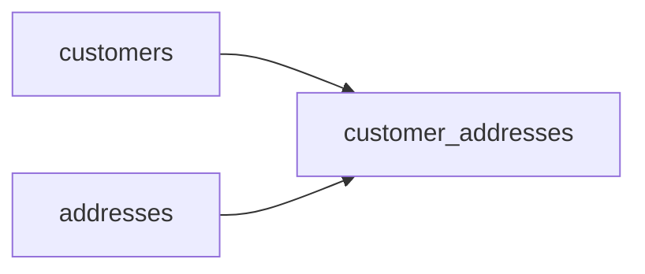

# Where Everyone Was
_People move. Sometimes twice in a month. How do you remember where everyone was, and when?_

- **Domain:** data_modeling
- **Difficulty:** Easy
- **Est. time:** 20 min
- **URL:** https://datadriven.io/problems/where_everyone_was

## Problem

Our customer support team needs to see a customer's current address and their full address history for regional sales analysis. How would you design a schema that handles address changes?

**Concepts tested:** `dmAttributes`, `dmEntities`, `dmForeignKeys`, `dmJunctionTables`, `dmManyToMany`, `dmOneToMany`, `dmPrimaryKeys`, `dmScdStrategy`, `dmScdType2`, `dmSurrogateKeys`

## Solution walkthrough


### Why this problem exists in real interviews

This is a tight probe of **SCD Type 2 modeling**. The moment a prompt asks for historical values and current values, the candidate must reach for effective-dated rows rather than mutating the dimension in place.

> **Trick to Solving**
>
> Before drawing tables, a strong candidate asks: do we need to see the address that was active at the time of a past order, or only the current one? The signal here is 'full address history,' which maps directly to Type 2.
>
> 1. Spot the history-plus-current pattern
> 2. Use a bridge table with `effective_from` and `effective_to`
> 3. NULL on `effective_to` marks the current row
> 4. Enforce one-current-row with a partial unique index

---

### Break down the requirements

**Step 1: Separate customers from addresses**

Customer identity is stable; addresses change. Keep `customers` as the identity table and model addresses as their own dimension so several customers can share an address or reuse one after a move.

**Step 2: Introduce a bridge with effective dates**

`customer_addresses` carries `(customer_id, address_id, effective_from, effective_to)`. This is a textbook Type 2 bridge: one row per period a customer lived at an address.

**Step 3: Use NULL as sentinel for current**

NULL on `effective_to` marks the current row. Query for current address with `WHERE effective_to IS NULL`; query for as-of with `WHERE ts BETWEEN effective_from AND COALESCE(effective_to, 'infinity')`.

**Step 4: Enforce one current row per customer**

A partial unique index on `(customer_id) WHERE effective_to IS NULL` prevents two simultaneously active addresses per customer, which is the correctness guarantee the support team actually relies on.

---

### The solution

Below is one conceptually sound approach: a Type 2 bridge between `customers` and `addresses`. The composite key `(customer_id, address_id, effective_from)` uniquely identifies each time-slice, and the NULL sentinel on `effective_to` anchors the current-row queries.


**customers**

| column | type | key |
|---|---|---|
| customer_id | BIGINT | PK |
| full_name | TEXT |  |
| email | TEXT |  |
| created_at | TIMESTAMP |  |

**addresses**

| column | type | key |
|---|---|---|
| address_id | BIGINT | PK |
| street | TEXT |  |
| city | TEXT |  |
| state | TEXT |  |
| postal_code | TEXT |  |
| country | TEXT |  |

**customer_addresses**

| column | type | key |
|---|---|---|
| customer_id | BIGINT | PK |
| address_id | BIGINT | PK |
| effective_from | TIMESTAMP | PK |
| effective_to | TIMESTAMP |  |
| address_type | TEXT |  |


> **Why this works**
>
> The history table never mutates. A move closes the old row (sets `effective_to`) and inserts a new one. The trade-off is slightly harder `current address` queries versus perfect auditability.

> **Interviewers watch for**
>
> A strong candidate names the constraint that enforces one current row. They also distinguish address-as-dimension from address-as-attribute. Weak candidates add address columns directly to `customers` and then explain how they will back up the old value into a history log.

> **Common pitfall**
>
> Using `effective_to = '9999-12-31'` instead of NULL. This looks clever but breaks the partial unique index and makes 'is current' a string comparison rather than a cheap NULL check.

---

### The analysis pattern

**Customer address as-of a given date**

```sql
SELECT
    c.full_name,
    a.street,
    a.city,
    a.state
FROM customers c
JOIN customer_addresses ca ON ca.customer_id = c.customer_id
JOIN addresses a ON a.address_id = ca.address_id
WHERE ca.effective_from <= '2024-01-15'
  AND (ca.effective_to IS NULL OR ca.effective_to > '2024-01-15')
  AND c.customer_id = 42
```

---

### Trade-offs and alternatives

| Type 2 SCD bridge | Type 1 plus separate audit log |
|---|---|
| One join path, perfect as-of queries, clean constraints. Cost: slightly more complex writes and a close-then-insert transaction. | Current address on `customers`, moves appended to a separate audit table. Cost: as-of queries require a union across two tables and drift between the two is silent. |

---

- **How would you model a customer who has both a billing and a shipping address at the same time?**
  - _Tests whether `address_type` on the bridge is enough to allow multiple concurrent addresses of different types._
- **What if GDPR requires a customer's history to be erased?**
  - _Tests whether the candidate introduces a tombstone versus hard delete on the bridge._
- **How would you detect data entry errors where the `effective_from` is accidentally backdated?**
  - _Tests range constraint thinking and whether a CHECK constraint enforces `effective_from` < `effective_to`._
