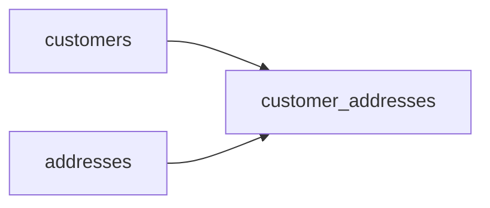

# Where They Used to Live
_They moved. The data stayed behind._

- **Domain:** data_modeling
- **Difficulty:** Medium
- **Est. time:** 20 min
- **URL:** https://datadriven.io/problems/where_they_used_to_live

## Problem

Customers move. We need to know their current address and their full address history, including when they moved in and moved out of each one. Design the schema.

**Concepts tested:** `dmConstraints`, `dmEntities`, `dmForeignKeys`, `dmJunctionTables`, `dmManyToMany`, `dmOneToMany`, `dmPrimaryKeys`, `dmScdType2`, `dmSurrogateKeys`, `dmThirdNormalForm`

## Solution walkthrough


### Why this problem exists in real interviews

Strip the costume and this is a temporal many-to-many: a customer and an address are joined by an interval, not by a value. The whole problem is deciding where `move_in_date` and `move_out_date` live. Put them on customers and you can store exactly one address per person and you lose every prior home the moment they move. Put them on addresses and two roommates overwrite each other's dates. The dates belong to the relationship, so they belong on the bridge row that ties one customer to one address for one span of time. Miss that and you either flatten the history into a single mutable column or duplicate the entire street/city/state/zip block on every customer who ever lived there.

---

### The three-table design

**Step 1: customers**

`customer_id` PK, `name`, `email`, `created_at`. This is the dimension. No address columns here.

**Step 2: addresses**

`address_id` PK, `street`, `city`, `state`, `zip_code`, `country`. This is the physical location, reusable across customers.

**Step 3: `customer_addresses` (bridge)**

`customer_address_id` PK, `customer_id` FK, `address_id` FK, `move_in_date` DATE NOT NULL, `move_out_date` DATE NULL. The temporal relationship lives here.


**customers**

| column | type | key |
|---|---|---|
| customer_id | BIGINT | PK |
| name | TEXT |  |
| email | TEXT |  |
| created_at | TIMESTAMP |  |

**addresses**

| column | type | key |
|---|---|---|
| address_id | BIGINT | PK |
| street | TEXT |  |
| city | TEXT |  |
| state | TEXT |  |
| zip_code | TEXT |  |
| country | TEXT |  |

**customer_addresses**

| column | type | key |
|---|---|---|
| customer_address_id | BIGINT | PK |
| customer_id | BIGINT | FK |
| address_id | BIGINT | FK |
| move_in_date | DATE |  |
| move_out_date | DATE |  |


---

### Key query patterns

****

```sql
/* Current address */
SELECT c.name, a.*
FROM customers c
JOIN customer_addresses ca ON c.customer_id = ca.customer_id
JOIN addresses a ON ca.address_id = a.address_id
WHERE ca.move_out_date IS NULL;

/* Address at a specific date */
SELECT c.name, a.*
FROM customers c
JOIN customer_addresses ca ON c.customer_id = ca.customer_id
JOIN addresses a ON ca.address_id = a.address_id
WHERE '2024-06-15' BETWEEN ca.move_in_date
  AND COALESCE(ca.move_out_date, CURRENT_DATE);
```
