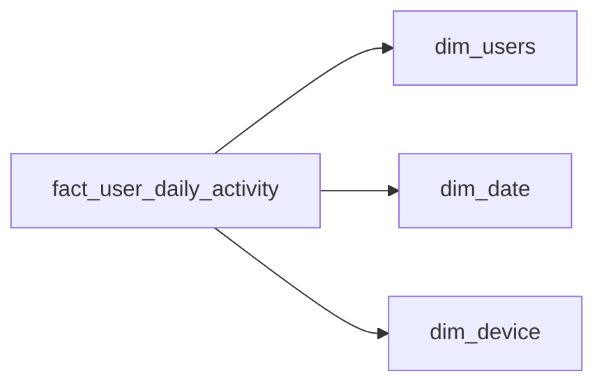

# Who Comes Back

- **Domain:** data_modeling
- **Difficulty:** Medium
- **Est. time:** 25 min
- **URL:** https://datadriven.io/problems/who_comes_back

## Problem

We run a short-video social platform and the growth team wants to track how many new users come back on each day after they sign up, broken down by signup cohort and acquisition channel, along with how heavily those returners engage on each day they show up (sessions, videos watched, watch time). Design the warehouse model that lets analysts compute day-N return rates for any offset they ask for later, plus that per-day engagement, without rescanning the raw event stream. Activity is high-volume, so the model has to keep these queries cheap even as the daily activity table grows into the billions of rows.

**Concepts tested:** `dmDimensionTables`, `dmFactTables`, `dmForeignKeys`, `dmGrainDefinition`, `dmMetricAdditivity`, `dmOneToMany`, `dmPreAggregation`, `dmPrimaryKeys`, `dmStarSchema`, `dmSurrogateKeys`

## Solution walkthrough


### What this really is

This is a cohort set-membership question in a retention costume. The real skill: can you pick a grain that turns 'did this user come back on day N' into a date subtraction over a join, instead of a self-join that rediscovers each user's signup day from a raw event stream? Anyone names a fact and a few dimensions. The trap is that retention is a moving target (day 1, day 7, day 30, whatever the dashboard asks next), so the moment you collapse it to one fixed flag on the fact, the model answers exactly one question and nothing else.

> **Two dates, two tables**
>
> Recognize the two distinct dates. Signup is an attribute of the user (the cohort anchor) and belongs on `dim_users`; the activity date is an attribute of the day the user showed up and belongs on the fact. Day-N return is then `activity_date` minus `signup_date`, and retention becomes a plain aggregation.

**Step 1: Declare the activity grain**

One row per user per active day: a periodic snapshot, not an event log. A user with five Tuesday sessions produces one Tuesday row with additive counts. Per-session rows force a `COUNT(DISTINCT user_key)` with dedup on every retention query, and one chatty user inflates the cohort's return rate.

**Step 2: Carry additive engagement measures**

The team wants how heavily returners engage per active day, so `sessions`, `videos_watched`, and `watch_seconds` ride the daily row. At one row per user per day, each measure sums cleanly across users, cohorts, and offsets with no double counting.

**Step 3: Anchor the cohort, keep day-N open**

Put `signup_date` on `dim_users` beside `acquisition_channel` and `signup_country`; a user's cohort never changes, so it is a stable attribute, not a measure. The offset is `activity_date` minus `signup_date`, computed on demand. A hard-coded `is_day7_retained` flag locks you to offsets you imagined on day one; a per-row `days_since_signup` column is a defensible denormalization since it still supports any offset.

**Step 4: Decide star vs snowflake deliberately**

Keep it a star with conformed `dim_date` and `dim_users`. Acquisition channel is stable and low cardinality, so it stays on `dim_users`. Platform and OS version repeat across hundreds of millions of rows and churn on their own cadence, so a separate `dim_device` earns its join. Snowflaking every attribute by reflex just adds joins to every slice.


**dim_date**

| column | type | key |
|---|---|---|
| date_key | INT | PK |
| full_date | DATE |  |
| day_of_week | INT |  |
| is_weekend | BOOLEAN |  |

**dim_users**

| column | type | key |
|---|---|---|
| user_key | BIGINT | PK |
| user_id | BIGINT |  |
| signup_date | DATE |  |
| acquisition_channel | TEXT |  |
| signup_country | TEXT |  |

**dim_device**

| column | type | key |
|---|---|---|
| device_key | INT | PK |
| platform | TEXT |  |
| os_version | TEXT |  |

**fact_user_daily_activity**

| column | type | key |
|---|---|---|
| activity_key | BIGINT | PK |
| user_key | BIGINT | FK |
| date_key | INT | FK |
| device_key | INT | FK |
| sessions | INT |  |
| videos_watched | INT |  |
| watch_seconds | BIGINT |  |


**The reference warehouse model**

```sql
CREATE TABLE dim_date (
    date_key    INT PRIMARY KEY,
    full_date   DATE,
    day_of_week INT,
    is_weekend  BOOLEAN
);

CREATE TABLE dim_users (
    user_key            BIGINT PRIMARY KEY,
    user_id             BIGINT,
    signup_date         DATE,
    acquisition_channel TEXT,
    signup_country      TEXT
);

CREATE TABLE dim_device (
    device_key INT PRIMARY KEY,
    platform   TEXT,
    os_version TEXT
);

CREATE TABLE fact_user_daily_activity (
    activity_key   BIGINT PRIMARY KEY,
    user_key       BIGINT REFERENCES dim_users(user_key),
    date_key       INT    REFERENCES dim_date(date_key),
    device_key     INT    REFERENCES dim_device(device_key),
    sessions       INT,
    videos_watched INT,
    watch_seconds  BIGINT
);
```

> **Interviewers watch the grain**
>
> A strong candidate states the grain out loud, names `signup_date` as a dimension attribute, carries additive measures on the daily row, and refuses to collapse retention into a fixed flag. They justify the `dim_device` snowflake with cardinality and churn, not because the prompt said 'device'.

> **The self-join trap**
>
> Keeping the raw per-session log and computing retention with a self-join that re-derives each user's first-active date, then matches rows N days later. It double counts multi-session days without dedup and explodes at hundreds of millions of rows. The subtler miss: duplicating `signup_date` onto every fact row as the source of truth; it drifts if a backfill touches only some rows, so the anchor stays on `dim_users`.

> **Partitioning keeps the scan bounded**
>
> At 300M daily actives the fact grows ~300M rows a day. Partition by `date_key` so a 90-day retention window prunes to 90 partitions instead of a full scan. Because each active day is already one additive row, the cohort aggregation is a single pass with no distinct-count on the hot path.

**Day-N return rate by cohort and channel**

```sql
SELECT
    u.signup_date,
    u.acquisition_channel,
    (d.full_date - u.signup_date) AS days_since_signup,
    COUNT(DISTINCT a.user_key) AS returning_users
FROM fact_user_daily_activity a
JOIN dim_users u ON u.user_key = a.user_key
JOIN dim_date  d ON d.date_key = a.date_key
WHERE u.signup_date >= DATE '2026-01-01'
  AND d.full_date BETWEEN u.signup_date AND u.signup_date + 90
GROUP BY u.signup_date, u.acquisition_channel, (d.full_date - u.signup_date)
ORDER BY u.signup_date, days_since_signup
```

| Daily snapshot fact | Raw event log only |
|---|---|
| One additive row per user per active day. Retention is a join plus a date diff, no dedup on the hot path, and partitions prune to the window. Costs a little more storage than nothing. | Every session or view kept as a row. Nothing is lost, but retention needs a self-join to find day N, multi-session days must be deduped, and scans blow up at 300M actives per day. |

- **The team now wants resurrection: users dormant for 28 days who then returned. Does your model already support it?**
  - _Tests whether absence of rows plus a row at offset N answers resurrection without a schema change._
- **Acquisition channel turns out to be re-attributed weeks after signup for some users. How does that change `dim_users`?**
  - _Tests SCD reasoning and whether a re-attributed cohort key should version or stay fixed._
- **How would you partition and cluster `fact_user_daily_activity` so both 7-day and 90-day cohort scans stay cheap?**
  - _Tests partition-by-`date_key` plus clustering on `user_key` or cohort for pruning at scale._
