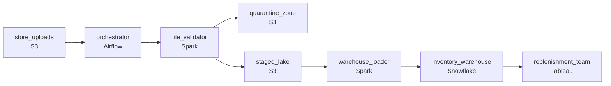

# 4,500 Stores Before Sunrise
_The shelves open at 7. The data better be there._

- **Domain:** pipeline_architecture
- **Difficulty:** Medium
- **Est. time:** 25 min
- **URL:** https://datadriven.io/problems/4_500_stores_before_sunrise

## Problem

Every night, 4,500 stores each upload a CSV of current inventory to S3. The replenishment team needs clean, validated data in the warehouse by 7 AM. Some files arrive late, some are malformed, and re-runs have been producing duplicates. Design the pipeline.

**Concepts tested:** `paBackfill`, `paBatchProcessing`, `paDataLake`, `paDataQuality`, `paDeadLetterQueue`, `paDeduplication`, `paFileIngestion`, `paIdempotency`, `paLateData`, `paMedallion`, `paMonitoring`, `paPartitioning`, `paRetryHandling`, `paSmallFiles`, `paTableFormats`

## Requirements

- Replenishment opens dashboards at 7am every day; clean validated inventory across all stores has to be in the warehouse by then.
- The pipeline has been re-run multiple times this month and each rerun has been creating duplicates in the warehouse.
- A few stores send malformed or oversized files; one bad file can't take down the load for the other 4,500.

## Must-have components

- Thousands of files have to be received, validated, and loaded by 7am with retries, late-file handling, and rerun safety. Without an orchestration layer there's nothing to coordinate that. Add Airflow, Dagster, Prefect, or Composer.
- Replenishment opens dashboards at 7am from the warehouse. Without a warehouse tier the validated inventory has nowhere to land. Add Snowflake, BigQuery, Redshift, or Databricks.

**Expected stages:** `nightly_load_orchestrator` → `raw_store_inventory_files` → `validated_store_inventory` → `store_inventory_current` → `data_quality_exceptions`

## Solution walkthrough

### Why this problem exists in real interviews

Many small files, a hard morning deadline, reruns that have been producing duplicates, and bad files that have been taking the whole load down. Each property has a clean answer; the trap is fitting them together so the orchestrator owns the deadline, the writes are idempotent on a deterministic key, and the bad files quarantine without halting the rest.

The default reach is one job that lists the S3 prefix at midnight, parses every file, and appends to a warehouse table. The first malformed file crashes the parser and the load halts; the on-call engineer reruns and the rows from the first run get appended again, doubling inventory for the stores that succeeded the first time. Late files arriving after midnight miss the load entirely until the next night.

> **Trick to Solving**
>
> Per-store validation with quarantine, partition-overwrite by night so reruns are deterministic, an arrival sensor so late files still join the same night.
>
> 1. Each file lands in a per-night staging area; an arrival sensor watches the prefix and triggers per-file validation as files appear, so late files still slot into the same night's load.
> 2. Validation routes malformed and oversized files to a quarantine; the rest continue to the warehouse load. The orchestrator alerts on quarantine count.
> 3. The warehouse load uses partition-overwrite keyed on (`load_date`, `store_id`) so a rerun replaces the night's rows rather than appending.
> 4. An orchestrator gates the 7am deadline with sensors and alerts before the window if any stage is at risk.

---

### Walk the requirements

**Step 1: Land validated inventory by 7am with per-stage alerting**

An orchestrator runs the nightly DAG: file-arrival sensors watch the S3 prefix, validation runs as files land, the warehouse load runs once enough files have arrived (with a deadline-driven cutoff for late files), and the publish step runs ahead of 7am. Each stage has its own SLA and its own alert; on-call sees a delayed stage with hours to act, not minutes after replenishment opens an empty dashboard. Without orchestration there's nothing watching the deadline.

**Step 2: Reruns don't duplicate, by construction**

The warehouse load writes via partition-overwrite keyed on (`load_date`, `store_id`). A rerun for the same night replaces those store-rows in the partition rather than appending. Whatever stage failed in the prior run, restarting the DAG produces the same warehouse state. An append-style load is what's been creating the duplicates this month; the partition-overwrite key is the contract that stops it.

**Step 3: One bad file doesn't take down the load**

Validation runs per file: schema check, size check, parse check. Files that fail route to a quarantine location with the rejection reason; the rest continue to the warehouse load. The orchestrator alerts when quarantine count exceeds an expected baseline so somebody notices a systemic issue (a region of stores all sending malformed files at once) without alerting on the steady drip of one or two bad files. A 'fail the entire load on the first bad file' design is what's been taking the load down; per-file validation with quarantine isolates the failure.

---

### The shape that fits

| node | type | tech | details |
|---|---|---|---|
| store_uploads | source | S3 |  |
| orchestrator | transform | Airflow | errorAction: alert; monitorAlert: Stage at risk vs 7am SLA or quarantine count above baseline |
| file_validator | transform | Spark | errorAction: dlq |
| quarantine_zone | storage | S3 | monitorAlert: Quarantine count above expected baseline |
| staged_lake | storage | S3 | backfillStrategy: partition_overwrite |
| warehouse_loader | transform | Spark | backfillStrategy: partition_overwrite; idempotencyStrategy: staging_table |
| inventory_warehouse | storage | Snowflake | slaFreshness: < 24h; backfillStrategy: partition_overwrite |
| replenishment_team | consumer | Tableau | slaFreshness: < 24h |

> **What this design gives up**
>
> Per-file validation with quarantine adds a triage workflow somebody has to actually run. Partition-overwrite is more expensive than appending. File-arrival sensors mean the load runs in stages rather than as one big batch. Implementation cost is the price; the win is the morning load lands by 7am, reruns don't duplicate, and a bad file from one store doesn't take the rest down.

> **What reviewers check**
>
> A reviewer looks at the canvas for these properties:
> - An orchestrator schedules the nightly DAG with file-arrival sensors and alerts before the 7am deadline.
> - Validation routes malformed files to a quarantine; the rest of the load continues.
> - The warehouse load uses partition-overwrite keyed on (`load_date`, `store_id`) so reruns produce the same warehouse state.

> **The mistake that ships**
>
> What gets shipped runs one nightly job that lists the prefix, parses every file, and appends to the warehouse. The first malformed file crashes the parser; the on-call engineer reruns and the rows from the first partial run get appended again. Late uploads after midnight miss the load. Replenishment opens an empty dashboard at 7am for a chunk of stores. The team rebuilds with arrival sensors, per-file validation with quarantine, and partition-overwrite by night and store; each was a property the original cut decided to defer.

---

- **A handful of stores routinely upload at 6:50am, just before the deadline. What in this design lets their data still land by 7am, and what doesn't?**
  - _Tests whether the candidate sees the file-arrival sensor as continuous: late files validate and load as they arrive, with the orchestrator's deadline cutoff defining the published view. If the deadline cutoff is strict, those stores don't make 7am; if the cutoff is flexible, they may. The candidate should name the trade._
- **A store sends a corrected file the next day for the prior night's data. How does this design replace the prior night's row for that store?**
  - _Tests whether the candidate sees that the partition-overwrite key is (`load_date`, `store_id`), so loading the corrected file under `last_night`'s `load_date` for that store replaces the affected row. The other stores' rows for that night don't change._
