# 45 Minutes Turned Into 3.5 Hours
_Spark jobs are running. Just not fast enough._

- **Domain:** pipeline_architecture
- **Difficulty:** Medium
- **Est. time:** 20 min
- **URL:** https://datadriven.io/problems/45_minutes_turned_into_3_5_hours

## Problem

We run a Databricks platform for bank transaction analytics, where a daily aggregation must land before the 6am risk dashboard. That job should take 45 minutes but now runs 3.5 hours and misses the deadline, and weeks of adding compute have not helped. Design the scheduled pipeline and remediation plan that gets the run back under SLA, alerts on-call before 6am if the run is at risk, and keeps the queryable output feeding the dashboard.

**Concepts tested:** `paBatchProcessing`, `paBroadcastJoin`, `paDagOrchestration`, `paDataSkew`, `paMemoryManagement`, `paMonitoring`, `paPartitioning`, `paSaltingStrategy`, `paShuffleOptimization`, `paSparkCaching`, `paSparkExecutionModel`, `paSparkUiDiagnosis`

## Requirements

- The team has been adding compute for weeks with no improvement; the fix has to reshape the job, not just run the same job on a bigger cluster.
- If the daily run is going to miss 6am, on-call has to be paged before the deadline, not after the dashboard is already stale.
- BI queries on this output have gotten slower as the table has grown; the output has to be laid out so a lookup reads a small slice.

## Must-have components

- The morning risk dashboard reads from the warehouse and BI queries downstream are getting slower as the table grows. Without a warehouse tier the optimisation has nowhere to land or be queried. Add a warehouse (Snowflake, BigQuery, Redshift, Databricks).
- The daily aggregation has to land before the 6am risk dashboard, with alerting before the deadline. Without an orchestration layer there's nothing to enforce the schedule or alert on a missed SLA. Add Airflow, Dagster, Prefect, or Composer.

**Expected stages:** `daily_orchestrator` → `spark_job_profiler` → `shuffle_broadcast_layer` → `partition_rebalancer` → `risk_warehouse`

## Solution walkthrough

### Why this problem exists in real interviews

This is a performance problem dressed as a design problem. The trap is the architectural-redesign answer (rebuild in streaming, switch warehouses, add caching) when the actual question is 'why is the existing job slow.' The team has already proven that throwing compute doesn't help, which is the strongest hint that the bottleneck isn't compute. It's data layout, partition skew, or join shape, and the fix is at that layer.

The default move is to scale the cluster up, add more executors, and let Spark figure it out. The job goes from too slow to slightly less too slow, the bill goes up, and the 6am SLA still slips. The team adds more compute. Same result. The actual problem is upstream: a wide skewed join, files too small, or partitioning that doesn't match the query. None of those get faster with more workers.

> **Trick to Solving**
>
> If more compute didn't help, more compute isn't the answer; profile the bottleneck, fix the layout, then size the cluster.
>
> 1. Profile before changing anything. The Spark UI tells you whether time is in shuffle, in skew on a single key, in many small files, or in a join strategy that's wrong. Each has a different fix.
> 2. Layout is usually the answer. Right partitioning, right number of files (not millions of tiny ones, not a few huge ones), right join key colocation. None of these need a bigger cluster.
> 3. The output table feeds BI. Bin it the way the BI queries read it (date plus the most common dimension), so downstream queries scan a slice, not the whole table.

---

### Walk the requirements

**Step 1: Land the daily aggregation before 6am, by fixing what's slow**

The orchestrator owns the schedule and the SLA: the daily job has to land before 6am with margin, and a sensor fires before 6am if the run is at risk. The current run takes too long; making it faster is the requirement. The fix is at the layer where Spark is actually losing time, not at the cluster size. Without an orchestration layer there's nothing watching the deadline; without a warehouse tier the BI dashboards have nowhere to read.

**Step 2: Profile first; let the running job tell you the bottleneck**

More compute hasn't helped. That rules out 'we're CPU-bound on the right amount of work.' The Spark UI on the existing run shows where time goes: shuffle volume, stage skew, task count vs partition count, file count. Common patterns: a join where one side has hot keys and most tasks finish quickly while one runs for an hour, a stage reading millions of small files, a partition column that doesn't match the join key forcing a full shuffle. The next change is the one the profile points at, not the one that sounded right in standup.

**Step 3: Lay out the output so BI scans a slice, not the world**

BI queries on the output have gotten slower as the table grew. That's a layout signal: queries are scanning the whole table because the partition column doesn't match what BI filters on. Repartition the output by date and the most common BI filter (region, product family), with file sizes large enough to be efficient and small enough that a slice query reads few files. The fix that makes the daily run faster shouldn't make the BI queries slower; right layout helps both.

---

### The shape that fits

```mermaid
flowchart LR
    transaction_source["transaction_source<br/>Kafka"]
    orchestrator["orchestrator<br/>Airflow"]
    profiled_aggregation["profiled_aggregation<br/>Spark"]
    staged_output["staged_output<br/>Delta Lake"]
    quality_check["quality_check<br/>Great Expectations"]
    risk_warehouse["risk_warehouse<br/>Databricks"]
    risk_dashboard["risk_dashboard<br/>Tableau"]
    transaction_source --> orchestrator
    orchestrator --> profiled_aggregation
    profiled_aggregation --> staged_output
    staged_output --> quality_check
    quality_check --> risk_warehouse
    risk_warehouse --> risk_dashboard
```

| node | type | tech | details |
|---|---|---|---|
| transaction_source | source | Kafka |  |
| orchestrator | transform | Airflow | errorAction: alert; monitorAlert: Daily aggregation at risk vs 6am SLA |
| profiled_aggregation | transform | Spark | parallelism: 200 shuffle; idempotencyStrategy: staging_table |
| staged_output | storage | Delta Lake | backfillStrategy: partition_overwrite |
| quality_check | quality_gate | Great Expectations | errorAction: alert |
| risk_warehouse | storage | Databricks | slaFreshness: < 24h; backfillStrategy: partition_overwrite |
| risk_dashboard | consumer | Tableau | slaFreshness: < 24h |

> **What this design gives up**
>
> Profiling and layout work doesn't ship a feature; for a few weeks the team produces a slow pipeline plus charts of where the slowness is. Repartitioning the output adds a shuffle to the daily job that might not have been there. The visible-progress feeling of 'we doubled the cluster' is what gets sacrificed; what arrives is a fix that holds next quarter when the data doubles, instead of doubling the cluster again.

> **What reviewers check**
>
> A reviewer looks at the canvas for these properties:
> - An orchestrator gates the daily aggregation against the 6am SLA with alerting before the deadline.
> - Output is partitioned and clustered to match how BI queries read, so downstream queries scan a slice.

> **The mistake that ships**
>
> What gets built first scales the cluster repeatedly because it's the easiest change to defend in standup. The job runs slightly faster the first time, then plateaus; the bill grows linearly; the 6am SLA still slips. Six months later somebody finally opens the Spark UI, sees one stage with one hot key taking most of the runtime, fixes the join with a salt or a broadcast, and the job drops to its target time on the original cluster. The team learns that 'more compute' hides a layout problem until the layout problem is bigger than any cluster.

---

- **The profile shows one join key has a few hot values that take most of the runtime. What are the layout choices, and which would you reach for first?**
  - _Tests whether the candidate names skew remediation patterns: salting the hot keys to spread work, broadcasting the smaller side if it fits, or pre-aggregating the hot keys separately. The candidate should also say which signal in the profile would lead them to one over the others._
- **After you fix the layout, the BI dashboard still feels slow at 6am for the first few queries. Where does that time go, and what would you change?**
  - _Tests whether the candidate sees that the warehouse may be cold-starting or that the BI tool is rebuilding extracts; the fix is on the consumer side (warehouse warm-up, materialised aggregates, query caching) rather than in the daily job that already lands on time._
