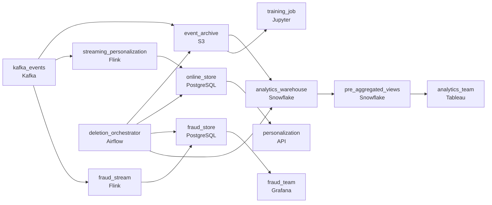

# 600 Million Events a Day
_600 million events a day. Two years of retention._

- **Domain:** pipeline_architecture
- **Difficulty:** Hard
- **Est. time:** 10 min
- **URL:** https://datadriven.io/problems/600_million_events_a_day

## Problem

A Kafka stream carries 600 million e-commerce interaction events a day, kept for two years, and four readers want them on different clocks: personalization needs a user's latest activity within seconds, fraud reads purchases within minutes, analytics dashboards accept 15 minutes of lag, and model training runs on next-day data. The storage and serving architecture has to stop date-filtered analytics queries from scanning the entire two-year history, and a right-to-erasure request has to flow from a deletion stage into every store in the design that holds user-level events.

**Concepts tested:** `paBatchProcessing`, `paBatchVsStreaming`, `paCompression`, `paDataLake`, `paDataQuality`, `paDeduplication`, `paEltVsEtl`, `paFullVsIncremental`, `paIdempotency`, `paLambdaArch`, `paMedallion`, `paMonitoring`, `paPartitioning`, `paRetryHandling`, `paSmallFiles`, `paStreamProcessing`, `paTableFormats`

## Requirements

- Personalization needs a user's latest activity within seconds, fraud reads purchases within minutes, analytics dashboards accept 15 minutes of lag, and model training runs on next-day data.
- Date-filtered analytics queries currently scan the entire two-year history and have to stop doing so.
- A right-to-erasure request has to flow from a deletion stage into every store that holds that user's events.

## Must-have components

- 600M events per day at multi-year retention can't live entirely on hot storage at the cost the business will accept. Add a cold-storage / data-lake tier (S3, GCS, ADLS, or a lakehouse format).
- Personalization needs its data within seconds, fraud within minutes, dashboards within 15 minutes, and training is fine with next-day data. One serving path can't satisfy all four. Show at least one streaming path and at least one batch path.

**Expected stages:** `kafka_consumer_layer` → `raw_event_store` → `sessionized_events` → `user_profile_aggregates` → `analytics_mart`

## Solution walkthrough

### The trap

This is a storage-tiering-by-access-pattern problem wearing an e-commerce costume. Four consumers want the same 600M daily events on four different clocks: personalization in seconds, fraud in minutes, analytics in a quarter-hour, training overnight, plus two-year retention and GDPR erasure. The trap is one warehouse for everything. The query bill climbs because every date-filtered query scans two years, personalization can't hit its budget reading the warehouse, and when a right-to-erasure request lands the user sits in five undocumented places. Treat 'one store for two years' as a cost decision that has to be justified and it falls apart.

> **Tier by access pattern, route by clock**
>
> Cold object storage (`event_archive`) holds most history, date-partitioned so a 'last week' query scans a slice, not two years. A low-latency `online_store` feeds personalization; a `fraud_store` off a streaming consumer feeds fraud; a serverless warehouse plus `pre_aggregated_views` feed analytics; the lake feeds training. Deletion is an event on the same fan-out the data took in. New fields arrive as nullable columns defaulting null on old rows, so a quarterly field add never rewrites history.

---

### Walk the requirements

**Step 1: Match four consumers to four budgets**

Personalization reads features from `online_store` in seconds; fraud reads `fraud_store` in minutes; analytics queries the warehouse through a serverless engine on a 15-minute view; training reads partitioned files from `event_archive`. All are fed from the same events; the budgets diverge after ingest. One shared store makes at least three of the four consumers miss their clock.

**Step 2: Lay the lake out for the bill**

Most data lives in cold storage, date-partitioned and clustered by the common BI filter (segment, country, product family). A 'last week' query scans a few partitions, not two years. Repeated dashboards read `pre_aggregated_views` so the same scan doesn't run twice. The bill drops because the layout matches the access pattern, not because the engine got cheaper.

**Step 3: Propagate deletion with confirmation**

GDPR erasure must reach `event_archive`, `online_store`, `fraud_store`, and `pre_aggregated_views`. The request rides the same fan-out the events did; each store deletes and writes a confirmation; `deletion_orchestrator` collects them to prove the regulatory window. Without it, deletion is a manual hunt and the audit answer is a promise, not a record.

**Step 4: Evolve the schema additively**

New event fields arrive each quarter as nullable columns defaulting null on historical rows. Queries that ignore the field are unaffected; queries that use it filter to the rows that have it. The alternative, rewriting history on every field add, takes the warehouse offline for hours each quarter. Additive evolution is what keeps the layer stable as columns accumulate over years.

---

### The shape that fits

| node | type | tech | details |
|---|---|---|---|
| kafka_events | source | Kafka |  |
| event_archive | storage | S3 |  |
| streaming_personalization | transform | Flink |  |
| online_store | storage | PostgreSQL |  |
| fraud_stream | transform | Flink |  |
| fraud_store | storage | PostgreSQL |  |
| analytics_warehouse | storage | Snowflake |  |
| pre_aggregated_views | storage | Snowflake |  |
| deletion_orchestrator | transform | Airflow |  |
| personalization | consumer | API |  |
| fraud_team | consumer | Grafana |  |
| analytics_team | consumer | Tableau |  |
| training_job | consumer | Jupyter |  |

> **Reviewers check the layer, not the box count**
>
> A reviewer scans the canvas for four things: most history in cold storage with consumers reading paths matched to their clock; date-partitioned layout plus `pre_aggregated_views` so common queries scan a slice; a deletion control plane that confirms erasure per store; and additive schema where new fields default null on old rows and old queries keep working.

> **One warehouse looks simplest and costs the most**
>
> The version that ships puts everything in one warehouse for two years. The bill grows monthly because every date-filtered query scans the full table, personalization can't hit sub-second latency, erasure becomes a five-store manual hunt, and each quarterly field add rewrites history and takes the warehouse offline. Every fix was reachable if 'one store for two years' had been challenged as a cost choice up front.

---

- **Analytics wants a new sub-second dashboard. What accommodates it without putting `analytics_warehouse` on the hot path?**
  - _Tests whether the candidate reaches for a new `pre_aggregated_views` materialization off the warehouse, indexed for the dashboard's query pattern, rather than a fresh path from the source. The warehouse stays the slow path._
- **A deletion confirmation from `pre_aggregated_views` is overdue because its recompute hasn't run. What does `deletion_orchestrator` surface, and how does the audit answer read?**
  - _Tests whether the candidate holds the request open per store with a recompute trigger and reports honest per-store status: confirmed where done, pending where the view hasn't recomputed._
