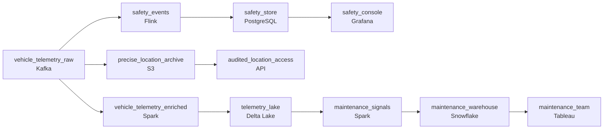

# A Million Cars Phoning Home
_Every vehicle is a sensor. Deploy the pipeline to catch it all._

- **Domain:** pipeline_architecture
- **Difficulty:** Hard
- **Est. time:** 10 min
- **URL:** https://datadriven.io/problems/a_million_cars_phoning_home

## Problem

We collect telemetry from millions of connected vehicles, including speed, braking events, OBD sensor readings, and ADAS alerts, and have to serve two teams from the same feed: safety analytics must react to an event the moment it happens, while predictive maintenance can wait minutes for aggregated trends. Vehicle location counts as personal data under European law, so raw coordinates can be retained only for the regulatory window while analytics reads a coarsened location. Design the pipeline that feeds both teams and keeps the location data compliant.

**Concepts tested:** `paApiIngestion`, `paBatchVsStreaming`, `paCompression`, `paDataLake`, `paDataQuality`, `paDeadLetterQueue`, `paDeduplication`, `paEltVsEtl`, `paEventDriven`, `paEventPlatforms`, `paFullVsIncremental`, `paIdempotency`, `paKappaArch`, `paLateData`, `paMedallion`, `paMicroBatchVsTrue`, `paMonitoring`, `paPartitioning`, `paRetryHandling`, `paSchemaEvolution`, `paStreamProcessing`, `paTableFormats`

## Requirements

- Safety analytics needs to see an event the moment it happens; predictive maintenance can wait minutes.
- Vehicle location is personal data under European law; we can't fail a GDPR audit.

## Must-have components

- Safety events from the fleet have to propagate as they happen; predictive maintenance can wait minutes. Without a streaming / sub-minute path, safety analytics is too late. Add a streaming technology or set SLA Freshness to real-time / < 1min on the safety path.
- Vehicle location is regulated under European law and the platform retains long histories per vehicle. Without a cold storage tier (S3, GCS, ADLS) there's nowhere to apply retention rules or hold the regulatory archive.

**Expected stages:** `vehicle_telemetry_raw` → `vehicle_telemetry_enriched` → `safety_events` → `maintenance_signals`

## Solution walkthrough

### What this really is

This is two latency budgets and one privacy boundary hiding in a single Kafka feed. Anyone can draw a stream processor. Interviewers are watching for two things. Do you split the feed by who needs it how fast? Do you decide **where precise coordinates are allowed to land**? Run everything through one hot path and maintenance pays real-time prices for trends it reads every few minutes. Land raw lat/long in the warehouse and every analyst query is a GDPR finding.

> **Location is a routing decision, not a column**
>
> Coarsen location before anything analytical stores it. Precise coordinates land in exactly one place, the retention-bound archive, and only an audited path reads them. Once the raw value reaches `vehicle_telemetry_enriched`, no access policy can make that table compliant again.

### Walk the requirements

**Step 1: Fan one ingest out by latency budget**

`vehicle_telemetry_raw` feeds two readers. `safety_events` is a narrow Flink job that filters safety-critical signals and pushes them to the console in seconds. Maintenance reads a Spark path on a minutes cadence. Keep the streaming path narrow. Its cost scales with what you put on it, so only safety events ride it.

**Step 2: Coarsen before the analytics tier**

`vehicle_telemetry_enriched` swaps raw coordinates for a coarse spatial cell, then lands in Delta Lake. `maintenance_signals` aggregates from there into Snowflake. Nothing downstream of enrichment ever holds the precise value, so the analyst who forgets to filter can't leak it.

**Step 3: Give precise location one home with a clock on it**

Raw events also land in `precise_location_archive` on S3, with a lifecycle rule that deletes them at the edge of the regulatory window. The only reader is `audited_location_access`, an API that logs every request. When an auditor asks, you answer with a retention policy and an access log.

| One streaming path for everyone | Split by latency and by sensitivity |
|---|---|
| Maintenance trends run on real-time compute they never asked for. Raw coordinates flow straight into the shared store, and the privacy boundary becomes a convention people are trusted to follow. | Safety pays for seconds and maintenance pays for minutes. Precise location has one retention-bound home and is coarsened before Delta Lake and Snowflake ever see it. |

### The reference design

| node | type | tech | details |
|---|---|---|---|
| vehicle_telemetry_raw | source | Kafka |  |
| safety_events | transform | Flink | errorAction: dlq; slaFreshness: real-time |
| safety_store | storage | PostgreSQL | slaFreshness: < 1min |
| safety_console | consumer | Grafana | slaFreshness: real-time |
| precise_location_archive | storage | S3 |  |
| audited_location_access | consumer | API |  |
| vehicle_telemetry_enriched | transform | Spark | slaFreshness: < 15min |
| telemetry_lake | storage | Delta Lake | backfillStrategy: partition_overwrite |
| maintenance_signals | transform | Spark | slaFreshness: < 1h; idempotencyStrategy: upsert |
| maintenance_warehouse | storage | Snowflake | slaFreshness: < 1h |
| maintenance_team | consumer | Tableau | slaFreshness: < 1h |

> **Coarsening at query time is not coarsening**
>
> Candidates often store raw coordinates in the lake and add a view that rounds them. The raw column is still there and still retained, and anyone with table access can still read it. The auditor reads the storage, not the view.

> **Name the deletion mechanism**
>
> Saying 'retention window' is table stakes. Seniority shows when you say where deletion happens: an S3 lifecycle rule on the archive. Then explain why that is enough, because no other store ever held the precise value.

- **The maintenance team wants vehicle-level location traces for failure analysis. What changes?**
  - _Do they route the request through `audited_location_access` instead of adding precise coordinates to `maintenance_warehouse`?_
- **Safety alerts need the exact crash location. Does that break the boundary?**
  - _Do they treat `safety_store` as a regulated store too, with its own short retention?_
