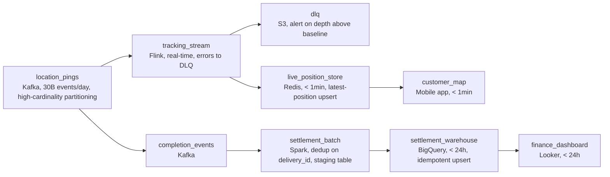

# A Million Moving Dots

- **Domain:** pipeline_architecture
- **Difficulty:** Medium
- **Est. time:** 30 min
- **URL:** https://datadriven.io/problems/a_million_moving_dots

## Problem

We run a delivery marketplace where every active courier streams a location ping every few seconds, tens of billions of events a day at peak. Customers need a live map and ETA that updates within seconds of each ping, while finance settles courier payouts and merchant fees once a day and cannot tolerate a double-counted or dropped delivery. Design the platform that serves both the live tracking and the exactly-once daily settlement off the same firehose.

**Concepts tested:** `paApiIngestion`, `paBatchProcessing`, `paBatchVsStreaming`, `paDataQuality`, `paDeadLetterQueue`, `paEventDriven`, `paEventPlatforms`, `paIdempotency`, `paMonitoring`, `paPartitioning`, `paRetryHandling`, `paStreamProcessing`

## Requirements

- As a customer I want to watch my courier move on the map and see an ETA that updates within seconds of where they actually are.
- As finance I need each completed delivery counted exactly once when we pay couriers and bill merchants; a duplicate or a dropped delivery is a real money error.
- As an on-call engineer I need the platform to survive dinner-rush spikes without losing events when a downstream consumer slows down.
- As a platform owner I cannot let one malformed or out-of-order ping from a buggy app version stall everyone else's tracking.

## Must-have components

- Tens of billions of pings a day arrive in bursts; put a durable, partitioned message queue at the front so the firehose is buffered and replayable instead of dropping events under load.
- The live map and ETA cannot wait for a batch run. Add a stream processor that consumes the ping firehose continuously.
- Customers expect the map to move within seconds of each ping. At least one node must carry a sub-minute freshness SLA on the tracking path.
- The customer app reads current courier position and ETA at high QPS. Add a low-latency serving store the app queries, fed by the stream.
- Wire the stream processor's output INTO the serving store so live positions actually reach the customer-facing map, not a stranded node.
- Daily payouts and merchant fees need exact, queryable totals. Land settled deliveries in a warehouse for finance to reconcile.
- This is a two-budget problem: sub-second live tracking and once-a-day exact settlement. The canvas should show distinct freshness tiers, not one path serving both.

**Expected stages:** `Location event ingestion buffer` → `Real-time stream processor` → `Live tracking serving store` → `Dead-letter queue` → `Batch settlement job` → `Settlement warehouse`

## Solution walkthrough

### Why this problem exists in real interviews

Behind the friendly phrase 'support a high number of deliveries' are two consumers reading the same firehose with opposite correctness budgets. The customer map wants the courier's position within seconds and is happy with approximate. Finance wants every completed delivery counted exactly once at end of day and a duplicate is real money. The trap is one pipeline that tries to serve both: aggregate hard enough to settle accurately and the map lags; optimize for the live map and settlement double-pays on the first consumer retry.

The other half of the trap is the firehose itself. Tens of billions of pings a day arrive in dinner-rush bursts. The whiteboard answer of 'app writes straight to a database' falls over the moment a downstream consumer slows down, and a single malformed ping from a bad app version stalls everyone if there is nowhere for poison events to go.

> **Trick to Solving**
>
> One durable buffer at the front, then split by correctness budget.
>
> 1. Buffer the firehose in a partitioned, replayable queue so bursts and backpressure never drop events.
> 2. Stream the live path: positions flow to a low-latency serving store on a sub-minute SLA. Approximate is fine; latest-position-wins handles out-of-order pings.
> 3. Settle on the batch path from the discrete delivery-completion event, deduped on `delivery_id` with idempotent writes. Exact is the budget.

---

### Break down the requirements

**Step 1: Buffer the firehose before anything reads it**

Producers (millions of phones) and consumers move at different speeds. A partitioned, durable message queue decouples them: bursts are absorbed, offsets are retained so a fixed consumer can replay, and no single slow sink drops events. Partition on a high-cardinality key (delivery or courier id) so one popular city does not create a hot partition.

**Step 2: Stream the live map; approximate is acceptable**

A stream processor consumes positions and upserts the latest into a low-latency serving store the customer app queries at high QPS. The SLA that matters is a few seconds end to end. Out-of-order pings resolve with latest-known-position wins; you are not reconstructing an exact path, you are answering 'where is my courier right now'.

**Step 3: Settle exactly once, off the completion event**

Do not settle off the raw pings; settle off the discrete delivery-completion event, which carries a stable `delivery_id`. Dedup on that id and write idempotently into the warehouse (upsert or partition-overwrite). Now a consumer retry or a replay re-produces the same row instead of paying a courier twice. This is the requirement finance and on-call care about from opposite directions: drop one and a courier is underpaid, double-count one and the payout is wrong.

**Step 4: Give poison events somewhere to go**

Validation lives on the stream processor. A ping that fails schema or parsing routes to a dead-letter queue and the main consumer acks and keeps draining. Without it, one buggy app version's malformed events stall the live map for every customer until someone patches the parser.

---

### The shape that fits

| node | type | tech | details |
|---|---|---|---|
| location_pings | source | Kafka, 30B events/day, high-cardinality partitioning |  |
| tracking_stream | transform | Flink, real-time, errors to DLQ |  |
| dlq | storage | S3, alert on depth above baseline |  |
| live_position_store | storage | Redis, < 1min, latest-position upsert |  |
| customer_map | consumer | Mobile app, < 1min |  |
| completion_events | queue | Kafka |  |
| settlement_batch | transform | Spark, dedup on delivery_id, staging table |  |
| settlement_warehouse | storage | BigQuery, < 24h, idempotent upsert |  |
| finance_dashboard | consumer | Looker, < 24h |  |

| One pipeline for both | Split by budget |
|---|---|
| Aggregate the firehose into one metrics table the map and finance both read. The map lags because it waits on the heavier settlement aggregation, and settlement double-counts on any consumer retry because nothing deduped on a stable id. | Stream the map off latest-position-wins for a few-second SLA; settle from the discrete completion event, deduped and idempotent, on a daily batch. Each consumer gets exactly the correctness and latency it needs. |

> **Scale + Cost**
>
> At 30B pings/day the live path is the expensive one, so keep it cheap per event: a thin stream job doing latest-position upserts into an in-memory store, not a stateful aggregation. The settlement path runs on the far smaller stream of completion events (one per delivery, not hundreds of pings), so exact computation there is affordable. Streaming everything, including settlement, would multiply compute for no business gain.

> **Interviewers Watch For**
>
> A candidate who justifies streaming vs batch per consumer instead of defaulting to 'stream everything'; who settles off the completion event rather than the raw pings; who names dedup-on-delivery-id plus idempotent writes as the exactly-once mechanism; and who has an answer for late, out-of-order, and malformed pings.

> **Common Pitfall**
>
> Building one real-time aggregation that both the map and finance read. It feels efficient and it satisfies neither: the map lags behind the heavier compute, and the first producer retry inflates the payout because nothing deduplicated on a stable id. The fix is two paths from one buffer, not one path stretched across two budgets.

---

- **Dinner rush in one metro spikes to 25x normal volume for that city. How does the platform absorb it without dropping pings or stalling other cities?**
  - _Tests partitioning strategy, consumer auto-scaling, and whether the durable buffer isolates a hot region from the rest._
- **A delivery's completion event arrives twice with the same `delivery_id` but a different final amount. What protects you and what does not?**
  - _Tests whether the candidate sees that dedup on id absorbs identical duplicates but a mutating duplicate needs a conflict policy, not just a unique key._
