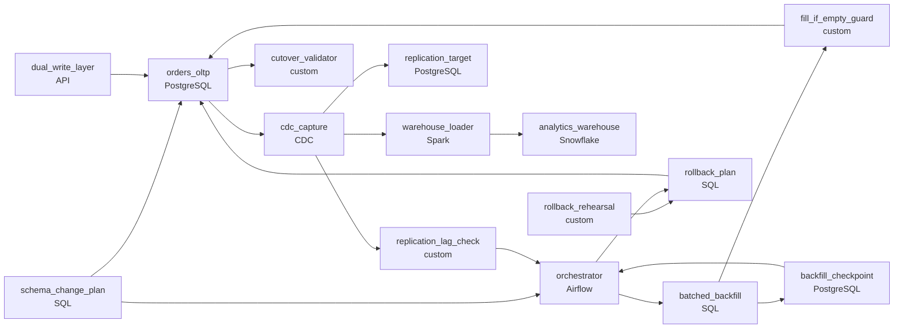

# A New Column on a Billion Rows
_Add and backfill a new column to a billion-row production table with zero downtime._

- **Domain:** pipeline_architecture
- **Difficulty:** Hard
- **Est. time:** 25 min
- **URL:** https://datadriven.io/problems/a_new_column_on_a_billion_rows

## Problem

Our orders table holds a billion rows and takes 50K writes a minute under a latency budget that cannot slip, and the analytics replicas and the change-data-capture feed that loads our warehouse break if they fall too far behind it, so the backfill has to slow down or pause on its own whenever their lag grows. Design how we add a new column and fill it for every existing row within a week, knowing the next app release starts setting the column on every write, so the backfill may only fill rows where the column is still empty. If the change is abandoned we must be able to drop the column cleanly, and that drop has to be rehearsed as its own run before the backfill starts.

**Concepts tested:** `paBackfill`, `paBatchProcessing`, `paCiCd`, `paDataQuality`, `paDependencyMgmt`, `paEnvironmentMgmt`, `paFullVsIncremental`, `paIdempotency`, `paLateData`, `paMonitoring`, `paPartitioning`, `paRetryHandling`, `paSchemaEvolution`

## Requirements

- The orders table is taking 50K writes a minute and the application's latency budget can't slip during this migration.
- Analytics replicas and the warehouse change feed depend on this database; backfill can't drive replication so far behind that those consumers break.
- Once the application starts writing the new column, the backfill may only fill rows where the column is still empty, never overwrite a value the application set.
- If the migration is abandoned, we have to be able to remove the column cleanly within a week, and that removal has to be rehearsed before the backfill starts.

## Must-have components

- Backfill on a billion rows runs in chunks with throttling, checkpointing, restartability, and a tested rollback. Without an orchestration layer there's nothing to schedule, throttle, or recover the chunked work. Add Airflow, Dagster, Prefect, or a job runner.
- The warehouse is loaded by a change-data-capture feed off the orders table, and that feed is one of the readers the backfill can push behind. The design has to draw that capture tier (a node labeled CDC, Debezium or similar) so its lag can be observed while the backfill runs.

**Expected stages:** `schema_change_plan` → `batched_backfill` → `dual_write_layer` → `cutover_validator` → `rollback_plan`

## Solution walkthrough

### The trap: it's the default value

This is a zero-downtime schema evolution problem wearing a "product wants a column" costume. The real skill is to split the shape change from the value change, so that neither one ever hits the write path at full weight. Anyone can type `ALTER TABLE orders ADD COLUMN`. The trap is the default. On many engines, `ADD COLUMN ... DEFAULT x` rewrites all billion rows under a lock while 50K writes a minute queue behind it. A full-speed backfill afterwards then floods replication for everything that reads this table. Get either one wrong and on-call kills your migration on day one.

The statement only says that availability can't slip. Before drawing anything, a senior turns that sentence into four questions. What replicates from this table? Will the app write the new column while the backfill runs? How far behind can replicas fall? How fast must we be able to back out? Here the answers are: analytics replicas and a warehouse CDC feed, yes, an agreed lag budget, and within a week. The design answers all four.

> **Nullable now, values later, only where empty**
>
> Add the column `NULL` with no default, which is a metadata change that takes seconds. Fill it in checkpointed chunks paced by replication lag. Write through `WHERE new_column IS NULL` so that a live write always wins. Rehearse the drop before you start.

---

### Six moves, in order

**Step 1: Add the column as `NULL`, with no default**

The `schema_change_plan` ships a nullable column. On modern engines that is a catalog edit, not a table rewrite, so the latency budget never notices it. Every value arrives later, through a path you control.

**Step 2: Turn on the dual write**

Next, the app starts setting `new_column` on every insert and update, through the `dual_write_layer`. From that moment the set of rows that need backfilling only shrinks. It also means that two writers now touch the same column, and the next two moves exist because of that.

**Step 3: Backfill in key ranges, paced by lag**

The `orchestrator` hands `batched_backfill` one primary-key range at a time. After each chunk it records the range's end in `backfill_checkpoint` and reads `replication_lag_check`. Over budget means pause; recovered means resume from the checkpoint. A crash means restart from the checkpoint, not from row one.

**Step 4: Write only where `new_column IS NULL`**

Every chunk passes through `fill_if_empty_guard`, which runs `UPDATE ... WHERE id BETWEEN :lo AND :hi AND new_column IS NULL`. If the app got to a row first, the backfill skips it. That one predicate is both the overwrite protection and the idempotency.

**Step 5: Validate before you cut over**

The `cutover_validator` checks three things: the count of rows where `new_column IS NULL` has reached zero, a sample of app-written values is unchanged, and the replicas have caught up. Only after that do you add `NOT NULL` or point readers at the column.

**Step 6: Rehearse the rollback first**

The `rollback_plan` drops the column (a metadata change) and clears the checkpoint state. `rollback_rehearsal` runs it on a staging copy before the backfill starts, so the runtime is a measured number rather than a hope.

---

### The reference design

| node | type | tech | details |
|---|---|---|---|
| schema_change_plan | transform | SQL |  |
| dual_write_layer | source | API | slaFreshness: real-time |
| orders_oltp | source | PostgreSQL |  |
| orchestrator | transform | Airflow | errorAction: alert; monitorAlert: Lag past budget or chunk failed |
| batched_backfill | transform | SQL | retryCount: 3; errorAction: retry; parallelism: 4 key ranges; retryBackoff: exponential |
| fill_if_empty_guard | quality_gate | custom |  |
| backfill_checkpoint | storage | PostgreSQL |  |
| cdc_capture | source | CDC | errorAction: alert |
| replication_lag_check | quality_gate | custom |  |
| replication_target | storage | PostgreSQL |  |
| warehouse_loader | transform | Spark | slaFreshness: < 1h |
| analytics_warehouse | storage | Snowflake | slaFreshness: < 1h |
| cutover_validator | quality_gate | custom |  |
| rollback_rehearsal | quality_gate | custom |  |
| rollback_plan | transform | SQL |  |

| Upsert backfill | Fill-only-if-empty backfill |
|---|---|
| `UPDATE orders SET new_column = :derived` across the chunk, or `ON CONFLICT DO UPDATE`. A row the app set ten seconds ago gets replaced by the backfill's stale derivation. Reruns converge, so it looks idempotent, but every rerun converges on the wrong value. | The same `UPDATE`, plus `AND new_column IS NULL`. The app's value always wins, rerunning a finished chunk is a no-op, and the guard costs nothing extra because it filters rows the key range already fetched. |

> **Lag sets the pace, not the clock**
>
> A billion rows in 10K-row chunks is 100K chunks. At one chunk every 300 ms that is about 8 hours and roughly 33K row updates a second, which is 40x the app's own 830 writes a second. Short per-chunk transactions keep row locks brief. The `replication_lag_check` throttle is what stops that 40x from reaching the replicas all at once.

> **Picking chunks by `IS NULL` alone slows down as it fills**
>
> `WHERE new_column IS NULL LIMIT 10000` with no key range looks elegant. But each chunk has to scan past every row already filled, so the last chunks crawl through most of the table. Walk the primary key from the checkpoint instead, and apply `IS NULL` inside the range.

> **Every requirement has a node**
>
> A reviewer looks for a metadata-only add, a dual write, chunked work with retry and a recorded progress point, a lag-paced throttle, a fill-only-if-empty guard, a cutover check and a rehearsed rollback. A design that says "upsert" and nothing else has only ever migrated small tables.

- **Replication lag breaches the budget mid-backfill. What happens, and where does the job resume?**
  - _Tests whether pausing and resuming from `backfill_checkpoint` are properties of the design, not an operator's judgment call._
- **Half the table is backfilled when product cancels the column. What does rollback do, and how long does it take?**
  - _Looks for the rehearsed path: drop the column, clear the checkpoint, let replicas catch up, and quote the measured runtime._
- **The derived value depends on a row the app is updating concurrently. Is `new_column IS NULL` still enough?**
  - _Probes for a read-and-write race inside one chunk, and for computing the value in the same `UPDATE` statement._
