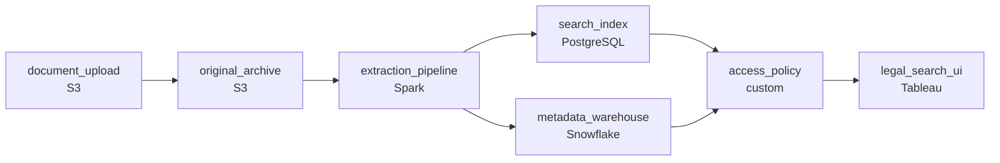

# A Shared Drive Full of Contracts
_Buried in PDFs. The data is in there somewhere._

- **Domain:** pipeline_architecture
- **Difficulty:** Medium
- **Est. time:** 20 min
- **URL:** https://datadriven.io/problems/a_shared_drive_full_of_contracts

## Problem

Our legal team receives thousands of contract documents every month in PDF and scanned image format. They need to search across all of them and extract key terms like party names, dates, and obligations. Right now every document lives in a shared drive and search is impossible. Design a pipeline to ingest these documents and make the content queryable.

**Concepts tested:** `paBatchProcessing`, `paBatchVsStreaming`, `paDagOrchestration`, `paDataLake`, `paDataQuality`, `paDeadLetterQueue`, `paDeduplication`, `paEltVsEtl`, `paFileIngestion`, `paFullVsIncremental`, `paIdempotency`, `paMedallion`, `paMonitoring`, `paRetryHandling`

## Requirements

- Today every contract sits on a shared drive and finding anything means opening files manually; legal needs to be able to search.
- Paralegals search for contracts by counterparty, by clauses like 'auto-renewal', and by expiry date; full-text alone doesn't let them filter by structured fields.
- Each contract is highly sensitive; only the legal team and the right account manager may see it.

## Must-have components

- Legal-defensibility requires the original PDFs and scans be preserved immutably alongside the extracted text. Without a cold-storage tier the originals have nowhere to live. Add S3, GCS, ADLS, or equivalent immutable object storage.
- Paralegals filter by counterparty, expiry, and clauses; that requires structured columns over the extracted text, not just full-text search. Add a warehouse / structured-store tier so filters work alongside search.

**Expected stages:** `document_intake` → `ocr_extraction` → `text_parsing` → `structured_output` → `search_index`

## Solution walkthrough

### Why this problem exists in real interviews

Legal can't search a shared drive. Two ways to fix that go wrong differently. Pure full-text search lets them grep but not filter by counterparty or expiry. A warehouse with structured fields lets them filter but doesn't search the body of the document. The actual answer is both, fed by an extraction pipeline, with the originals preserved and per-document access enforced by the platform.

Most candidates upload everything to a search index, run OCR on the scans, and call it done. Paralegals can grep text now, which is better than the shared drive, but they can't ask 'all contracts with auto-renewal expiring next quarter' because expiry isn't a column anywhere; it's a phrase buried in the text. Meanwhile, the search index has every contract indexed equally and an account manager from one team can search and find a contract that belongs to another. Two of the three requirements are unmet.

> **Trick to Solving**
>
> Original in cold storage, extracted text in search, extracted fields in the warehouse, access policy on the document; queries hit all three.
>
> 1. Originals stay in immutable object storage. Legal-defensibility requires the as-received scan, not just the OCR output.
> 2. Extraction produces both: full text for the search index, and structured fields (counterparty, dates, clauses) for the warehouse. Paralegals query both.
> 3. Per-document access lives in the platform: when a paralegal searches, the index and warehouse return only documents they're allowed to see, regardless of the query.

---

### Walk the requirements

**Step 1: Move documents through extraction into a search layer**

Uploads land in immutable object storage; an extraction pipeline OCRs scans, extracts text, and indexes the text in a search engine. Legal queries the search engine and gets back document hits with snippets. The originals stay in object storage and the search index references them by id; legal opens the original from the search result. Without a cold-storage tier the originals have nowhere defensible to live; without a search layer 'I need this contract' is still a manual hunt.

**Step 2: Expose both full-text and structured filters**

Paralegals search by counterparty, by clauses like 'auto-renewal,' and by expiry date. The extraction pipeline pulls these as structured fields and writes them to a warehouse table keyed on document id. The paralegal's UI queries the search index for full-text and joins the warehouse for the structured filter. A query like 'auto-renewal contracts expiring next quarter with counterparty Acme' becomes a structured filter on the warehouse plus a full-text intersect on the index. Without a warehouse the structured filters have nowhere to live; full-text alone leaves expiry as a phrase, not a column.

**Step 3: Per-document access enforced by the platform**

Each contract is sensitive. Per-document permissions live on the document id and propagate to both the search index and the warehouse: the search query returns only documents the user is allowed to see, the warehouse filter excludes the rest, the storage layer denies direct retrieval without permission. A 'we'll filter in the UI' approach is one bypass away from an account manager seeing a contract from another team. The policy is on the document and enforced at retrieval, not at the screen.

---

### The shape that fits

| node | type | tech | details |
|---|---|---|---|
| document_upload | source | S3 |  |
| original_archive | storage | S3 | backfillStrategy: incremental |
| extraction_pipeline | transform | Spark | errorAction: dlq; parallelism: 8 partitions; idempotencyStrategy: staging_table |
| search_index | storage | PostgreSQL | slaFreshness: < 15min |
| metadata_warehouse | storage | Snowflake | slaFreshness: < 15min; idempotencyStrategy: upsert |
| access_policy | quality_gate | custom | errorAction: alert |
| legal_search_ui | consumer | Tableau | slaFreshness: < 15min |

> **What this design gives up**
>
> Two query layers (search and warehouse) means two stores to operate, two indexes to keep in sync, and a join on every paralegal query. Per-document access has to be applied at three points (search, warehouse, storage) so a permission change propagates. The 'just put it in search' design goes; what arrives is a system that survives an audit, supports the queries paralegals actually run, and keeps the originals defensible.

> **What reviewers check**
>
> A reviewer looks at the canvas for these properties:
> - Original PDFs and scans are preserved unchanged in cold storage.
> - The extraction pipeline produces both full-text search and structured fields in a queryable warehouse.
> - Per-document access policies are enforced at the platform regardless of how the search is run.

> **The mistake that ships**
>
> The team's first cut uploads everything to a single search index, ignores structured extraction, and lets the search UI handle access by hiding hits. Paralegals can grep but not filter by counterparty or expiry, so they end up exporting hit lists and filtering in spreadsheets. An account manager runs a search that returns a contract belonging to a different team because the UI's access filter is one missing flag away from a leak. The team rebuilds with a structured warehouse layer and platform-level per-document access. The retrofit comes after the privacy review takes a finding and after the second team has built its own shadow filter.

---

- **Legal asks for an audit log of who searched for which contract. What in this design captures that, and where does it live?**
  - _Tests whether the candidate sees that the access-policy layer is the right place to log retrievals: every authorised hit is a log entry referencing user, document id, and time. Logging at the search index alone misses retrievals that come straight from object storage._
- **A new clause type ('change-of-control') becomes important and legal wants to filter on it. What changes in this design, and what doesn't?**
  - _Tests whether the candidate sees the extraction pipeline as the extension point: a new structured field in the warehouse, a new extraction rule, and a backfill of historical documents through the same pipeline. The search index, the original archive, and the access policy are unchanged._
