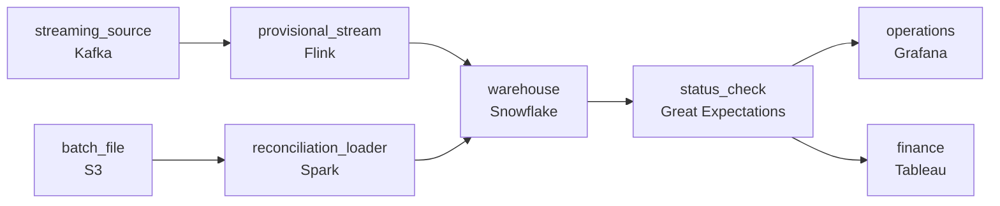

# A Stream All Day and a File at Midnight
_Real-time and batch. Same pipeline. No compromises._

- **Domain:** pipeline_architecture
- **Difficulty:** Hard
- **Est. time:** 30 min
- **URL:** https://datadriven.io/problems/a_stream_all_day_and_a_file_at_midnight

## Problem

We're a data services company and our enterprise client sends us two kinds of data: a continuous stream of transactions throughout the day, and a large daily batch file that reconciles and corrects the day's activity. Both need to land in the same warehouse and both matter to the analysts. Design a pipeline that handles both paths.

**Concepts tested:** `paBatchProcessing`, `paBatchVsStreaming`, `paDagOrchestration`, `paDataQuality`, `paDeadLetterQueue`, `paDeduplication`, `paEltVsEtl`, `paEventDriven`, `paEventPlatforms`, `paFileIngestion`, `paFullVsIncremental`, `paIdempotency`, `paLambdaArch`, `paLateData`, `paMedallion`, `paMonitoring`, `paPartitioning`, `paRetryHandling`, `paStreamProcessing`

## Requirements

- Operations watches the day's activity in real time and reads provisional figures; finance signs off only on reconciled figures.
- The midnight reconciliation file is the authoritative number for the prior day; finance's view of that day has to reflect it.
- Today the dashboard shows numbers without telling the analyst whether they have been reconciled or are still provisional; that's been the source of confusion.
- Amended files for prior periods sometimes arrive days late; an amendment for last Tuesday has to update last Tuesday's figures, not today's.

## Must-have components

- The architecture has an explicit streaming path (intraday provisional) and a batch path (nightly reconciliation that supersedes streaming for the same period). Show at least one streaming / sub-minute path and at least one batch path.
- Both paths land in the same warehouse, where finance reads reconciled figures and operations reads provisional ones with a status flag. Without a warehouse tier there's no shared serving layer. Add Snowflake, BigQuery, Redshift, or Databricks.

**Expected stages:** `streaming_path` → `batch_path` → `speed_layer` → `batch_layer` → `serving_layer`

## Solution walkthrough

### Why this problem exists in real interviews

Two pressures on one warehouse. Operations needs the day's activity in real time; finance wants the reconciled number that supersedes it once the midnight file lands. Carrying both as separate counts is the version where the two teams argue about whose number is right. The design has to make the reconciled batch supersede the provisional stream for the same period, in one warehouse, with the consumer told which they're seeing.

Most candidates draw two pipelines, two tables: a streaming table operations reads, a batch table finance reads. They show different numbers for yesterday because they were computed independently. Analysts can't tell which is canonical. A late amendment file for last Tuesday lands and gets appended to today's table because the loader doesn't know what period it covers.

> **Trick to Solving**
>
> One warehouse table with a status column; the reconciled file overwrites the provisional rows for its date; amendments overwrite by the period they cover.
>
> 1. Both paths land in the same warehouse, with each row carrying a status (provisional, reconciled, amended).
> 2. The reconciliation file partition-overwrites the date it covers, replacing the provisional rows the streaming path wrote earlier.
> 3. Late amendments key on `event_date` in the file, not arrival date, so they overwrite the right partition.

---

### Walk the requirements

**Step 1: Two views of the day, served from one warehouse**

Streaming events flow into the warehouse tagged provisional within minutes; operations reads the latest available rows. Finance queries the same table but filters to status=reconciled and reads only what the midnight file has finalised. Two consumers, two filters, one source of truth. Without two cadences either operations sits on a daily delay or the reconciliation pipeline pays streaming compute it doesn't need; without a warehouse tier the unified view has nowhere to live.

**Step 2: Reconciled overwrites provisional for the same period**

The midnight reconciliation file processes through a batch path and partition-overwrites the date it covers. Provisional rows for that date are replaced with reconciled rows in one transaction. After midnight, querying yesterday returns reconciled; before midnight, querying today returns provisional. The two views aren't separate tables that drift; they're stages of the same row in the same partition. A side-by-side approach is what makes the two teams argue about which is canonical.

**Step 3: Status on every row so consumers see what they're looking at**

Every row carries a status column: provisional while only the streaming data exists, reconciled after the batch lands, amended if a later file corrected it. Dashboards surface the status as a badge or footer. The named problem in the prompt is that today's dashboard hides the difference; the status column makes the lineage queryable and visible.

**Step 4: Amendments overwrite by `event_date`, not arrival date**

An amended file partitions by the period it covers (`event_date` in the file), not by when it arrived. The loader applies it as partition-overwrite on that period's partition, with status=amended on the affected rows. An amendment for last Tuesday replaces last Tuesday's rows, not today's. An append-by-arrival loader is the version where amendments inflate today's totals.

---

### The shape that fits

| node | type | tech | details |
|---|---|---|---|
| streaming_source | source | Kafka | parallelism: 8 partitions |
| batch_file | source | S3 |  |
| provisional_stream | transform | Flink | slaFreshness: real-time; idempotencyStrategy: upsert |
| reconciliation_loader | transform | Spark | slaFreshness: < 24h; backfillStrategy: partition_overwrite; idempotencyStrategy: staging_table |
| warehouse | storage | Snowflake | slaFreshness: < 1min; backfillStrategy: partition_overwrite |
| status_check | quality_gate | Great Expectations | errorAction: alert; monitorAlert: Provisional rows past expected reconciliation window |
| operations | consumer | Grafana | slaFreshness: < 1min |
| finance | consumer | Tableau | slaFreshness: < 24h |

> **What this design gives up**
>
> Status transitions and period-based overwrites cost more than blind appends, and the status column adds a filter every consumer has to know about. The reconciliation batch's partition-overwrite is heavier than an append. Warehouse complexity is the cost; the win is one source of truth, an unambiguous reconciliation flow, and amendments that always land on the right period.

> **What reviewers check**
>
> A reviewer looks at the canvas for these properties:
> - A streaming path writes provisional rows; a batch path partition-overwrites them with reconciled rows for the same period.
> - Each row carries a status column so consumers can tell what they're seeing.

> **The mistake that ships**
>
> What goes out the door first uses two separate tables and lets consumers join across them. Operations and finance see different numbers for yesterday; analysts can't tell which is right. A late amendment for last Tuesday lands as new rows in today's table because the loader keys on arrival date. By the time finance signs off on a quarter, three correction passes have moved numbers around with no clear lineage. The team rebuilds with one warehouse table, status transitions, and partition-overwrite by `event_date`.

---

- **An operations dashboard query for yesterday afternoon runs just before midnight, before reconciliation. What does it return, and how does the dashboard know?**
  - _Tests whether the candidate sees the status column as the answer: the query returns provisional rows with the status badge surfaced, the operator knows reconciliation hasn't run yet, the same query after midnight returns reconciled rows._
- **An amendment for last Tuesday changes a single row in the file. What in this design picks it up, and what does the warehouse look like after?**
  - _Tests whether the candidate sees the partition-overwrite for last Tuesday's date replaces all rows for that date with the amended file's contents. The partition rebuild produces the right end state regardless of how many rows in the file actually changed; status flips to amended on the affected day._
