# All at Once
_Two databases. One direction. No data left behind._

- **Domain:** pipeline_architecture
- **Difficulty:** Medium
- **Est. time:** 20 min
- **URL:** https://datadriven.io/problems/all_at_once

## Problem

Our product team stores application data as nested, schemaless documents in MongoDB, but the analytics team needs it as flat tables in Redshift they can query with ordinary joins. The nightly full export takes eight hours and refreshes only once a day, while reports run against Redshift throughout the day, so design a batch pipeline that pulls just the documents that changed, reshapes them, and stages them before loading into the warehouse.

**Concepts tested:** `paBackfill`, `paBatchProcessing`, `paBatchVsStreaming`, `paCdc`, `paColumnarVsRow`, `paCompression`, `paDagOrchestration`, `paDataQuality`, `paDeduplication`, `paDependencyMgmt`, `paEltVsEtl`, `paFileIngestion`, `paFullVsIncremental`, `paIdempotency`, `paMonitoring`, `paPartitioning`, `paRetryHandling`, `paSchemaEvolution`, `paSmallFiles`

## Requirements

- The analytics team wants to query application data with the same SQL they use for everything else, without parsing nested documents.
- Analysts run reports against the warehouse all day, so each refresh should be assembled in a staging area before it lands in the tables they are querying.

## Must-have components

- Analytics is in the warehouse and the documents have to land there as flat tables analysts can join with standard SQL. Without a warehouse tier, the data never reaches the people who use it. Add Redshift, Snowflake, BigQuery, or an equivalent warehouse as the target.

**Expected stages:** `mongodb_source` → `extraction_layer` → `s3_staging` → `transformation` → `redshift_target`

## Solution walkthrough

### Why this problem exists in real interviews

Application data is nested and updates continuously. Reporting wants flat tables that standard SQL can join. Reports run all day, so the load can never produce a moment when half the tables are updated and half aren't. The interesting pressure isn't the flattening, it's the atomicity.

First instinct is to flatten and load each table as it's transformed. The orders table updates first, then `line_items`, then customers. A report that runs partway through the load joins the new orders to yesterday's customers, gets a number that doesn't reconcile, and an analyst files a data-quality ticket the next morning. The bug isn't in the flattening; it's in not making the run visible all-or-nothing.

> **Trick to Solving**
>
> When reports run while the warehouse is loading, atomicity is a feature, not a nice-to-have. Land into staging, swap into production in one move.
>
> 1. Flatten once, swap atomically. Two distinct concerns; don't blur them into one job.
> 2. Staging is the cheap insurance policy. The cost of an extra storage layer is small compared to the cost of inconsistent reports.

---

### Walk the requirements

**Step 1: Pull only the changed documents and remember where you stopped**

The eight-hour nightly full export rereads all 500M documents to move the ~2M that actually changed. Read the source through its change feed instead and pull only the changed documents, persisting a resume token after each run so the next run starts exactly where the last one stopped. On the canvas this is an 'idempotency: `resume_token`' annotation on the extraction step, which is also what keeps a reprocessed batch from creating duplicate rows.

**Step 2: Flatten nested documents into relational tables before the warehouse**

Reports query with standard SQL joins. That means the extracted documents have to be unpacked into rows where each repeated structure becomes its own table, order header, order line, address, joinable on the natural keys. The flattening rules belong in the transformation layer (Spark, dbt, or whatever your team reaches for), separate from the warehouse load, so when the source adds a field you change one place. Write the flattened output to object storage (S3) so the warehouse can bulk-load it with COPY.

**Step 3: Make each load atomic by swapping from staging in one step**

COPY the flattened files from S3 into a staging schema in the warehouse. Once every table for that run is built and validated, swap them into the production schema in a single move (a rename, a view repointing, or a transactional batch, whatever your warehouse supports cheaply). On the canvas this is an 'idempotency: `staging_table`' annotation on the load step. Reports running mid-load see either the prior run or the new one, never half-and-half.

---

### The shape that fits

```mermaid
flowchart LR
    document_source["document_source<br/>MongoDB"]
    cdc_extraction["cdc_extraction<br/>Flink"]
    flattener["flattener<br/>Spark"]
    s3_staging["s3_staging<br/>S3"]
    staging_schema["staging_schema<br/>Redshift"]
    warehouse_swap["warehouse_swap<br/>SQL"]
    warehouse_prod["warehouse_prod<br/>Redshift"]
    reports["reports<br/>Tableau"]
    document_source --> cdc_extraction
    cdc_extraction --> flattener
    flattener --> s3_staging
    s3_staging --> staging_schema
    staging_schema --> warehouse_swap
    warehouse_swap --> warehouse_prod
    warehouse_prod --> reports
```

| node | type | tech | details |
|---|---|---|---|
| document_source | source | MongoDB |  |
| cdc_extraction | transform | Flink | idempotencyStrategy: resume_token |
| flattener | transform | Spark |  |
| s3_staging | storage | S3 |  |
| staging_schema | storage | Redshift | idempotencyStrategy: staging_table |
| warehouse_swap | transform | SQL | idempotencyStrategy: staging_table |
| warehouse_prod | storage | Redshift | slaFreshness: < 24h |
| reports | consumer | Tableau | slaFreshness: < 24h |

> **What this design gives up**
>
> Staging costs you double storage during the load window and a couple extra minutes on each run. Atomicity isn't free. What you're buying is that analysts trust the warehouse: nobody files a ticket for an inconsistent join, and the team isn't on the hook for a class of bug that only happens during the load window.

> **What reviewers check**
>
> A reviewer looks at the canvas for these properties:
> - Only the changed documents are pulled, with a resume token so the next run continues from the last position and a reprocessed batch does not duplicate rows.
> - Analytics is in the warehouse and the documents have to land there as flat tables analysts can join with standard SQL.
> - A staging layer (object storage plus a staging schema) sits ahead of the production tables so a refresh is assembled before it replaces what analysts are reading.

> **The mistake that ships**
>
> The version that ships writes each flattened table directly into the production schema as it finishes. A morning report runs while the load is in flight, joins yesterday's `customers` to today's `orders`, and the revenue total comes in 2% off. An analyst spends two days investigating, the team adds 'don't query during the load window' to the runbook, and somebody eventually proposes a flag column to indicate freshness. The cleaner fix has always been the staging swap; the runbook entry is a workaround for a missing atomicity guarantee.

---

- **How would you make sure a long-running report that started before the swap still sees a consistent view?**
  - _Probes whether 'atomic load' is actually atomic across long-running reads, not just at the moment of swap._
- **If the source had hard deletes, how would you make sure deleted records actually leave the warehouse rather than just stop appearing?**
  - _Tests handling of removals, the easiest thing to miss in a copy-from-source pipeline._
