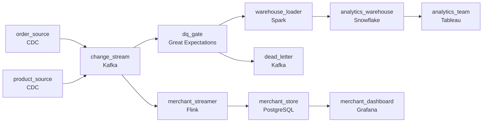

# Analysts Are Slowing the Store Down
_Orders placed. Data warehouse hungry._

- **Domain:** pipeline_architecture
- **Difficulty:** Medium
- **Est. time:** 10 min
- **URL:** https://datadriven.io/problems/analysts_are_slowing_the_store_down

## Problem

We run an e-commerce marketplace where the analytics team queries the production database directly, and that load is degrading the live application. Move analytics onto its own warehouse by reading the database's change log instead of querying the live system, while a merchant-facing dashboard still shows each seller their new orders within fifteen minutes on a path of its own. A small fraction of orders arrive with broken merchant references or totals that do not add up, so those have to be held back and caught before they reach the reporting tables.

**Concepts tested:** `paBatchVsStreaming`, `paCdc`, `paDataQuality`, `paDeadLetterQueue`, `paEventDriven`, `paFullVsIncremental`, `paIdempotency`, `paKappaArch`, `paLateData`, `paStreamProcessing`

## Requirements

- Analytics queries on the read replica have been spiking lag and breaking customer-facing features that depend on the same replica.
- Merchants watch their dashboards throughout the day; they expect a new order to show up within minutes.
- A small fraction of orders arrive with broken merchant references or totals that don't add up; these must be caught before they reach the reporting tables, not after finance finds them.

## Must-have components

- Analysts have to move off the production replica and onto a proper warehouse. Without a warehouse tier they still have nowhere to query. Add Snowflake, BigQuery, Redshift, or Databricks.
- Replication can't add query or write load to the production system; that's the named problem. Read the change log into a continuous stream instead of batch-querying production. Add a streaming CDC path off the database log (a CDC source feeding Kafka, Flink, or Kinesis), which also feeds the near-real-time merchant path.

**Expected stages:** `order_cdc_capture` → `change_event_stream` → `merchant_dashboard_stream` → `order_quality_gate` → `fact_orders_warehouse`

## Solution walkthrough

### Why this problem exists in real interviews

Analytics is hitting the read replica that the application also depends on, lag spikes, customers feel it. The fix sounds obvious: move analytics off the replica. The trap is that the obvious fix is incomplete: a warehouse fed by a nightly batch satisfies the analysts but leaves the merchant dashboard a day stale, and a pipeline that trusts every row lets the small fraction of broken orders poison the reporting tables.

The natural shape is a nightly batch from the replica into a new warehouse. Analytics is happy, the replica recovers, and merchants discover their dashboards are showing yesterday's orders. Somebody bolts on a 'realtime view' over the replica, which puts the load right back. Meanwhile the orders with broken merchant references or totals that do not reconcile flow straight into the marts, and finance opens a ticket when the numbers fail to tie out.

> **Trick to Solving**
>
> CDC off the log into a warehouse, a streaming path for merchant dashboards, and a validation step that quarantines bad orders before they reach reporting.
>
> 1. Log-based CDC reads the binlog/WAL the database is already writing for replication. Zero query load on either the primary or the replica.
> 2. Two consumer paths from the same change stream: a streaming path that updates a merchant-facing store within minutes, and a batch path that lands in the warehouse for analytics.
> 3. A data quality gate sits in front of the reporting tables: orders that fail referential or total checks are routed to a dead-letter path and retried, not loaded.

---

### Walk the requirements

**Step 1: Move analytics off the replica with log-based CDC**

Replication has to add zero load to the production system. Log-based CDC (Debezium, Datastream, built-in connectors) reads the binlog or WAL that the database is already writing, runs as a separate process, and emits change events to a stream. Analytics reads from the warehouse fed by that stream; nothing analytics-shaped touches the OLTP or the replica. Without a CDC capture path the replication is a query against production, which is the named cause of the problem.

**Step 2: Streaming path serves merchant dashboards in minutes**

Merchants expect their orders within minutes. The same change stream feeds a streaming consumer that updates a merchant-facing serving store; the dashboard reads from there. Analytics runs on a slower batch path into the warehouse. One stream, two consumer paths sized to the consumer; merchants do not pay the latency of the analytics batch and analytics does not pay the cost of a streaming serving tier. A 'we'll just make analytics fast and let merchants read it too' design ends up paying streaming prices for analytics.

**Step 3: A data quality gate guards the reporting tables**

Around 0.3% of orders arrive with a `merchant_id` that is not in the merchant table yet, or a total that does not equal the sum of their line items. A data quality gate validates each order before it lands in the reporting tables; failures go to a dead-letter path and get retried, since the referential gaps are usually race conditions that resolve within minutes. A failure that survives the retries is alerted on, not silently dropped. Without the gate, broken rows flow straight into the marts and finance finds them when the daily totals do not reconcile.

---

### The shape that fits

| node | type | tech | details |
|---|---|---|---|
| order_source | source | CDC |  |
| product_source | source | CDC |  |
| change_stream | queue | Kafka |  |
| merchant_streamer | transform | Flink |  |
| merchant_store | storage | PostgreSQL |  |
| dq_gate | quality_gate | Great Expectations |  |
| dead_letter | queue | Kafka |  |
| warehouse_loader | transform | Spark |  |
| analytics_warehouse | storage | Snowflake |  |
| merchant_dashboard | consumer | Grafana |  |
| analytics_team | consumer | Tableau |  |

> **What this design gives up**
>
> Log-based CDC plus a streaming serving store plus a warehouse is more pieces than one nightly batch from the replica, and the quality gate adds a validation pass and a dead-letter path to operate. Operational complexity is the cost; in return, the application stops being slowed by analytics, merchants believe their dashboards, and broken orders never reach the reporting tables.

> **What reviewers check**
>
> A reviewer looks at the canvas for these properties:
> - A change-data-capture path off the production database log adds zero query load.
> - A fast path off the change stream serves merchant dashboards within minutes, separate from the analytics warehouse path.
> - A data quality gate validates orders before they reach the reporting tables, with a dead-letter path for failures.

> **The mistake that ships**
>
> The design the team ships does nightly batch from the replica into a new warehouse and loads every order straight into the marts. Replica lag stops spiking; merchants discover their dashboards lag a day, and finance finds orders whose totals do not reconcile sitting in the reporting tables. The team adds a streaming path, a quality gate with a dead-letter queue, and switches replication to log-based CDC after the fact. The rebuild walks back the three properties the original cut decided to skip.

---

- **An order fails the referential check because its merchant was created a second after the order, while another fails because its total genuinely does not match its line items. What should the pipeline do differently with each?**
  - _Tests whether the candidate separates transient from permanent failures: a referential miss from a merchant-creation race is retried via the dead-letter path and usually resolves in minutes, while a total that genuinely does not add up is a data bug that should alert rather than retry forever._
- **The CDC stream falls behind during a maintenance window on the production database. What does the merchant dashboard show, and what does the analytics warehouse do?**
  - _Tests whether the candidate has thought about staleness: the dashboard either freezes at the last update or surfaces a 'stale' indicator; the warehouse keeps catching up when the stream resumes; the lag alert fires before either consumer is meaningfully impacted._
