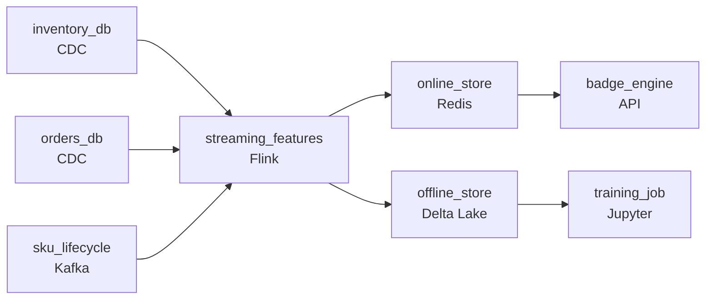

# Badging Items That Already Sold Out
_Same-day delivery. The features have to be faster._

- **Domain:** pipeline_architecture
- **Difficulty:** Hard
- **Est. time:** 10 min
- **URL:** https://datadriven.io/problems/badging_items_that_already_sold_out

## Problem

We guarantee same-day delivery on millions of SKUs, and the engine that decides which items to badge as Rocket Delivery needs fresh data every few minutes. Right now, stale features are causing us to over-promise on items that have gone out of stock or whose nearest fulfillment center is already at capacity. Design a data pipeline that keeps the feature store current.

**Concepts tested:** `paApiIngestion`, `paBackfill`, `paBatchProcessing`, `paBatchVsStreaming`, `paCdc`, `paDagOrchestration`, `paDataQuality`, `paDependencyMgmt`, `paFullVsIncremental`, `paIdempotency`, `paLambdaArch`, `paMicroBatchVsTrue`, `paMonitoring`, `paPartitioning`, `paRetryHandling`, `paStreamProcessing`

## Requirements

- False same-day promises trigger a customer voucher and erode trust; the engine that decides the badge has to read fresh inventory and order data.
- The promise check happens on every product page view; the lookup can't slow down the page for every visitor.
- The inventory and order databases are live operational systems; querying them synchronously on every product view would crush them.
- When a SKU is discontinued, the engine has to stop badging it; without an expiry on the feature store, stale entries keep badging items that can't ship.

## Must-have components

- Online lookups serve the badge engine on every product view while offline features feed model training; those are different freshness tiers. Show at least one streaming path and at least one batch path.
- Polling the inventory and order databases at this rate would crush the OLTP; CDC pulls changes off the change log without read pressure. Add a CDC capture mechanism (Debezium, Datastream, or built-in CDC).

**Expected stages:** `feature_store_online` → `feature_store_offline` → `delivery_promise_features`

## Solution walkthrough

### What this really is

This is cache invalidation dressed up as a delivery badge. The badge engine needs a per-SKU answer in milliseconds, and the truth lives in two OLTP databases that change every second. Everyone draws a feature store. What separates candidates is **where the badge engine's reads land and what happens to a row when the SKU dies**. Query the OLTP on every page view and inventory falls over at peak. Refresh nightly and you badge items that sold out at 9am. Never expire rows and discontinued SKUs keep promising same-day delivery, each false promise paid out as a voucher.

### Walk the requirements

**Step 1: Capture changes off the log, not the tables**

CDC tails the inventory and order change logs, so the live databases see zero query traffic from the badge path. Polling every few minutes looks cheaper on a whiteboard, but at millions of SKUs it is a full scan the operations team will veto.

**Step 2: Materialize into an online store keyed on SKU**

A streaming job folds stock level and fulfillment-center capacity into one row per SKU and writes it to a key-value store within seconds. The badge engine does a single point lookup. Nothing is computed at request time, so the page never waits on a join.

**Step 3: Make discontinuation a write, not an absence**

SKU lifecycle events ride the same stream. A 'discontinued' event deletes the online row, so the engine finds nothing and shows no badge. A TTL on every row is the backstop if the stream stalls.

**Step 4: Fork the same stream into the offline store**

The streaming job also appends to a lakehouse table for training. One feature definition feeds both tiers, so the model never trains on numbers the engine never served.

### The shape that fits

| node | type | tech | details |
|---|---|---|---|
| inventory_db | source | CDC |  |
| orders_db | source | CDC |  |
| sku_lifecycle | source | Kafka |  |
| streaming_features | transform | Flink | slaFreshness: real-time; idempotencyStrategy: upsert |
| online_store | storage | Redis | slaFreshness: < 1min |
| offline_store | storage | Delta Lake | backfillStrategy: partition_overwrite |
| badge_engine | consumer | API | slaFreshness: real-time |
| training_job | consumer | Jupyter | slaFreshness: < 24h |

| What usually gets drawn | What holds at peak |
|---|---|
| The badge engine queries inventory on each view, with a nightly batch table as fallback. OLTP load scales with page traffic and the fallback is hours stale. | CDC into a stream, upserts into an online store. OLTP load is flat regardless of traffic, and freshness is bounded by stream lag, not a cron schedule. |

> **A TTL alone does not retire a SKU**
>
> Candidates say 'set a TTL' and stop. But a discontinued SKU can still get inventory updates (returns, recounts), and each one refreshes the TTL, so the row never dies. The lifecycle event has to delete it explicitly; the TTL only covers a stalled stream.

> **Upsert by SKU makes replay free**
>
> The tell is naming why recovery is safe. The streaming job writes with an `upsert` keyed on SKU, so a restart that replays the last few minutes of change log rewrites the same values instead of double-counting orders against capacity.

> **The bill is a replication slot and RAM**
>
> CDC holds a replication slot the DBA will watch for lag, and the online store keeps every live SKU in memory. A few million small rows is a few GB: cheap next to one day of vouchers.

- **The streaming job is paused for an hour of maintenance. What does the badge engine serve, and how does it catch up?**
  - _Tests whether you lean on the change log as the source of truth and replay from the last offset, plus a staleness guard on the row._
- **A discontinued SKU is reactivated. What makes the badge fire again, and how fast?**
  - _Tests that reactivation is just another lifecycle event on the same path, with no manual cleanup._
