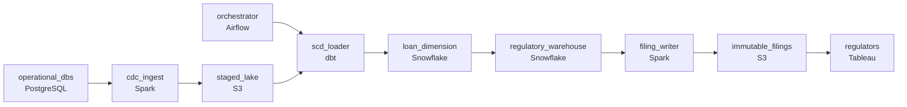

# Basel, CCAR, and Monday Morning
_The regulator does not accept 'eventually consistent.'_

- **Domain:** pipeline_architecture
- **Difficulty:** Medium
- **Est. time:** 20 min
- **URL:** https://datadriven.io/problems/basel_ccar_and_monday_morning

## Problem

We run consumer credit products and need a regulatory reporting warehouse the risk and compliance team can file from. Loan attributes live in one operational database and payment activity in another, and both feed the daily Basel III liquidity ratio that regulators expect by 9am each business day, so the pipeline has to land and reconcile both sources and warn on-call well before that deadline if a stage slips. Once a day's report is filed it can never change: corrections go out as new filings, so the submitted snapshots need a durable archive that is written once and kept separate from the warehouse the analysts keep refreshing.

**Concepts tested:** `paBatchProcessing`, `paCdc`, `paDagOrchestration`, `paDataLake`, `paDataQuality`, `paDeduplication`, `paEltVsEtl`, `paEventPlatforms`, `paFullVsIncremental`, `paIdempotency`, `paLateData`, `paMedallion`, `paMonitoring`, `paPartitioning`, `paRetryHandling`, `paStreamProcessing`, `paTableFormats`

## Requirements

- Regulators receive the daily liquidity ratio by 9am every business day; missing the deadline has direct regulatory consequences, so on-call needs warning before it slips.
- Basel III and CCAR fields are split across the loan origination database and the payment processor; a complete regulatory record has to bring both together.
- Once a regulatory filing has gone in, the underlying data can't quietly change; a correction has to be a new filing alongside, not an overwrite.

## Must-have components

- Daily regulatory reporting runs from a warehouse with regulatory fact tables. Without a warehouse tier there's no analytical surface for Basel III liquidity ratios or CCAR stress tests. Add Snowflake, BigQuery, Redshift, or Databricks.
- Once a regulatory filing has been submitted, the underlying data cannot be retroactively modified; corrections are amendments, not overwrites. Without a durable archive tier (S3, GCS, ADLS) there's nowhere for filed snapshots to live unchanged.

**Expected stages:** `loan_origination_cdc` → `payment_event_stream` → `regulatory_fact_tables` → `immutable_filing_archive` → `compliance_reporting_mart`

## Solution walkthrough

### Why this problem exists in real interviews

Regulatory reporting has three properties that don't share well: a hard deadline, time-traveled data for historical stress tests, and immutability after filing. The trap is treating it as 'build a warehouse, run a daily job.' Daily jobs cover the deadline. They're hostile to historical reproduction (which needs SCDs), and they're poison for filing immutability (which needs an unchanging archive of what was filed).

The whiteboard answer is a daily ETL into a warehouse with current loan attributes, run a report, file it. The 9am deadline gets hit most days. CCAR stress testing asks for the portfolio as of last quarter and the team realizes the warehouse only holds current state; a correction to a loan from three months ago overwrote the original. A regulator queries last month's filing against the warehouse and the numbers don't match what was filed because the warehouse has since updated. Two of the three requirements are actively failing.

> **Trick to Solving**
>
> Loan history as a slowly-changing dimension, filed snapshots written to immutable storage, an orchestrator that owns the 9am deadline.
>
> 1. Loans are a slowly-changing dimension. Each modification is a new row with `valid_from` / `valid_to`; CCAR queries do an as-of join.
> 2. Filed snapshots are written to immutable storage at filing time and never overwritten. Corrections are new amended snapshots, separate records, both queryable.
> 3. An orchestrator schedules the daily DAG with sensors and alerts that fire before 9am if any stage is at risk; on-call has hours, not minutes.

---

### Walk the requirements

**Step 1: Land regulatory data and complete the report before 9am**

An orchestrator owns the daily DAG: ingest from each operational database, build the warehouse models, run quality checks, generate the regulatory report. Each stage has its own SLA and its own sensor; alerts fire before 9am if any stage is at risk. On-call sees the issue with hours to fix, not minutes. Without an orchestration layer there's nothing watching the deadline; without a warehouse tier the regulatory fact tables have nowhere to live.

**Step 2: Loan history as a slowly-changing dimension for as-of queries**

CCAR stress tests run the portfolio as of a past date, including modifications applied by then. Model loans as a slowly-changing dimension keyed on (`loan_id`, `valid_from`, `valid_to`), with one row per modification. The stress-test query does an as-of join: for each loan, the row whose `valid_from` / `valid_to` bracket the test date. A 'current attributes' approach silently corrupts historical stress tests every time a loan is modified; SCDs are the version that survives the audit.

**Step 3: Filed snapshots written immutably; corrections are new filings**

Each filed snapshot writes to immutable cold storage at filing time: versioned object storage, write-once policy, or an immutable lakehouse table. Once written, no overwrite. A correction is a new amended record alongside the original, both queryable; the regulator sees both and the filing trail is intact. A 'we'll just update the warehouse and refile' approach is what makes regulators escalate; immutability is non-negotiable.

---

### The shape that fits

| node | type | tech | details |
|---|---|---|---|
| operational_dbs | source | PostgreSQL |  |
| orchestrator | transform | Airflow | errorAction: alert; monitorAlert: Stage at risk vs 9am SLA |
| cdc_ingest | transform | Spark | errorAction: alert |
| staged_lake | storage | S3 | backfillStrategy: partition_overwrite |
| scd_loader | transform | dbt | slaFreshness: < 24h; idempotencyStrategy: upsert |
| loan_dimension | storage | Snowflake |  |
| regulatory_warehouse | storage | Snowflake | slaFreshness: < 24h |
| filing_writer | transform | Spark | idempotencyStrategy: staging_table |
| immutable_filings | storage | S3 | backfillStrategy: incremental |
| regulators | consumer | Tableau | slaFreshness: < 24h |

> **What this design gives up**
>
> An slowly-changing dimension doubles or triples the loan dimension's row count over time and as-of joins are more expensive than equi-joins. Immutable filed snapshots cost storage per filing forever (or for the retention window). The orchestrator and per-stage monitoring is infrastructure that has to be operated. The simple daily-overwrite warehouse goes; what arrives is time-traveled stress tests, immutable filings, and a deadline that's monitored before it's missed.

> **What reviewers check**
>
> A reviewer looks at the canvas for these properties:
> - An orchestrator sequences the daily DAG with alerts before the 9am regulatory deadline.
> - Loan history is retained as a slowly-changing dimension and filed snapshots write to immutable storage.

> **The mistake that ships**
>
> The design the team ships does daily overwrites of the warehouse with current loan attributes and stores filed reports in a regular table. The 9am deadline gets hit. CCAR stress testing asks for the portfolio last quarter and the team realizes only current state exists. A correction to a loan overwrites the original; the warehouse no longer matches the filing the regulator received. The team rebuilds with SCDs, an immutable filing archive, and orchestrated SLAs. The regulator now has its own questions about the warehouse's ability to reproduce a filed number.

---

- **Stress testing asks for the portfolio as of a date, but the slowly-changing dimension only goes back two years and the test wants three. What changes?**
  - _Tests whether the candidate sees the slowly-changing dimension's retention as a property of the warehouse: extending it means longer retention on the loan dimension, possibly with the older history in cold storage queryable through the same engine. The query shape stays the same; the storage tier shifts._
- **A regulator amends the rules for the next filing cycle. Where in this design does the rule change live, and what gets rebuilt?**
  - _Tests whether the candidate sees the report-generation step as the place where rules live, separate from the warehouse layer. The rule change is a new version of the report builder; the historical filings remain untouched (the rules under which they were filed don't change), the next filing uses the new rules._
