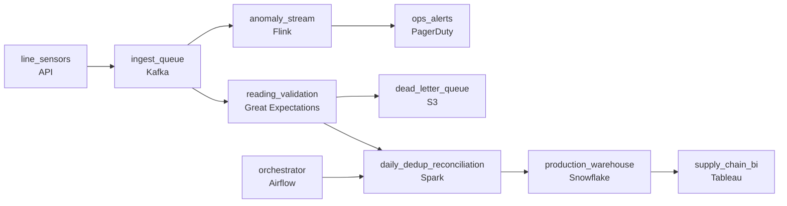

# Before the Batch Is Lost

- **Domain:** pipeline_architecture
- **Difficulty:** Hard
- **Est. time:** 30 min
- **URL:** https://datadriven.io/problems/before_the_batch_is_lost

## Problem

We run bottling and canning lines across a few hundred breweries, and every line streams sensor readings (fill level, temperature, capper torque) at about 4 billion events a day, some of them stuck at a constant value or spraying out-of-range garbage. Plant operators need to catch a line drifting out of spec within seconds so they can stop it before a whole batch is scrapped, while supply chain needs an exact daily count of good units produced per SKU that reconciles for finance, and a stuck or garbage reading can neither halt the line monitors nor corrupt that count. Many plants have flaky connectivity, so readings arrive late and out of order, and the daily numbers still have to include them.

**Concepts tested:** `paBackfill`, `paBatchProcessing`, `paBatchVsStreaming`, `paDagOrchestration`, `paDataQuality`, `paDeadLetterQueue`, `paDeduplication`, `paDependencyMgmt`, `paEltVsEtl`, `paEventDriven`, `paEventPlatforms`, `paIdempotency`, `paLambdaArch`, `paLateData`, `paMicroBatchVsTrue`, `paMonitoring`, `paPartitioning`, `paRetryHandling`, `paStreamProcessing`, `paTableFormats`

## Requirements

- As a plant operator I need to know a line is drifting out of spec within seconds so I can stop it before we scrap a whole batch.
- As supply chain I need an exact daily count of good units produced per SKU that reconciles cleanly for finance.
- As supply chain I need the daily numbers to include readings from plants that were offline and reported late.
- As the data engineering team I need a stuck or malformed sensor to not corrupt the numbers or halt the line-monitoring pipeline.

## Must-have components

- Plants reconnect in bursts and dump backlogged readings all at once. Put a durable buffer (a message queue) in front of processing so a reconnecting plant cannot overwhelm the consumers and so late data has somewhere to land.
- Operators need to catch an out-of-spec line within seconds. That requires a streaming processor on the telemetry path, not a batch job that runs on a schedule.
- The anomaly path has to alert within seconds. At least one node must carry a sub-minute freshness target so the design proves the ops SLA, not just that events flow.
- Finance needs an exact daily count per SKU that includes late arrivals. That is a daily batch reconciliation with a watermark, separate from the live anomaly path.
- Two consumers have different correctness budgets: seconds-fresh-and-approximate for ops, exact-and-daily for finance. The canvas should show at least two distinct freshness tiers rather than forcing everything onto one.
- Sensors emit malformed or out-of-range readings. Add a validation step so bad records are caught and routed aside instead of corrupting the daily production numbers.
- Supply chain reports read the reconciled daily production and yield numbers. Land those in a warehouse tier the BI tools can query.
- The streaming anomaly detector has to feed an ops alert destination. Wire the stream processor to an alerting node so operators are actually notified when a line drifts out of spec.
- The reconciled daily counts have to reach the warehouse the BI tools read. Connect the daily batch reconciliation to the warehouse tier.

**Expected stages:** `Sensor ingestion` → `Durable ingest buffer` → `Streaming anomaly detection` → `Ops alerting` → `Quality validation` → `Dead-letter store` → `Late-data batch reconciliation` → `Production warehouse` → `Supply-chain BI`

## Solution walkthrough

### What this really is

This is a lambda architecture dressed up as a bottling line. One sensor stream feeds two consumers with opposite correctness budgets. Operators want drift flagged in seconds and can live with an approximate count. Finance wants an exact per-SKU daily count and can wait until tomorrow. Anyone can draw Kafka and Flink. What separates candidates is refusing to let the fast aggregate become the financial number. That aggregate buckets by arrival time, so a plant that reconnects after four hours either lands its production in the wrong day or double-counts it on replay. Then **the count never reconciles**.

The second trap sits upstream. A stuck sensor repeating a constant torque, or spraying out-of-range fill levels, trips false pages or wedges the monitor, and it quietly inflates the count. Quarantine it before it reaches the reconciliation, and never let it block the line monitors.

> **Two budgets, two paths, one buffer**
>
> Ops gets a streaming path that is approximate, at-least-once and sub-minute. Finance gets a daily batch on event time with a watermark, deduplicated on a stable unit id. A durable queue in front absorbs a reconnecting plant's backlog, so late data waits instead of vanishing.

### Walk the requirements

**Step 1: Put ops on a sub-minute streaming path**

Flink reads the queue, scores fill level, temperature and capper torque per line against spec, and pages within seconds. Approximate and at-least-once are fine here. A scheduled job is not, however elegant the rest of the design is. In-line range guards drop stuck or garbage values so they cannot fire false pages.

**Step 2: Reconcile finance on event time**

The daily count keys on the reading's PLC timestamp, with a watermark and a grace window sized to the typical offline gap. If you key on arrival time, the plants with the worst links report less than they made, and no error is raised anywhere.

**Step 3: Make exactly-once a property of the sink**

Deduplicate on a stable unit id (line id plus PLC sequence number) and upsert idempotently, so a retry or a full backlog replay cannot inflate yield. The transport stays at-least-once, because only finance ever needed exactness.

**Step 4: Quarantine bad readings and keep draining**

Schema and range checks route garbage to a dead-letter store and the main flow keeps moving. A rising dead-letter rate is itself the signal that a sensor is failing.

### The reference design

| node | type | tech | details |
|---|---|---|---|
| line_sensors | source | API |  |
| ingest_queue | queue | Kafka |  |
| anomaly_stream | transform | Flink | slaFreshness: < 1min |
| ops_alerts | consumer | PagerDuty | slaFreshness: real-time |
| reading_validation | quality_gate | Great Expectations | errorAction: dlq |
| dead_letter_queue | storage | S3 |  |
| daily_dedup_reconciliation | transform | Spark | slaFreshness: < 24h; idempotencyStrategy: upsert |
| orchestrator | transform | Airflow |  |
| production_warehouse | storage | Snowflake | slaFreshness: < 24h |
| supply_chain_bi | consumer | Tableau | slaFreshness: < 24h |

> **Exactness is cheap once a day, ruinous per event**
>
> At 4 billion readings a day, the stream only compares each reading to a spec band, so its state stays small. The heavy machinery (dedup index, watermark state, restatement) runs once, off-peak, in the batch. Streaming the finance count would run that machinery continuously against the firehose, for a number nobody reads until tomorrow.

> **Name the split before drawing boxes**
>
> Say which consumer is streaming, which is batch, and why streaming the finance number costs more and is less correct. Then cover event time versus arrival time, dedup on a stable id, and a dead-letter path. An answer of 'stream everything' or 'batch everything' tells the interviewer you missed the two budgets.

> **Arrival time passes the demo and fails the audit**
>
> In a demo every plant is online, so processing-time windows look right. In production the flakiest plants under-report. And if you trust the streaming aggregate for the daily count, it double-counts the moment a backlog replays.

- **A plant replays four hours of backlog. What stops double-counting, and what puts each reading in the right day?**
  - _Whether the dedup key and the watermark are wired in, or just named._
- **Finance closed last month on the 3rd, and a plant reports late on the 4th. How do you restate a closed day?**
  - _Versioned daily partitions and idempotent overwrite, not a window left open forever._
- **Volume grows 5x and the anomaly job misses its sub-minute budget. Where do you look first?**
  - _Queue partitioning, skewed hot lines, and isolating the ops path from batch spikes._
