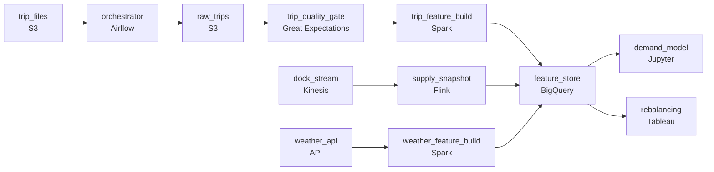

# Bikes Before Rush Hour
_Bikes in, bikes out. The city needs to predict demand._

- **Domain:** pipeline_architecture
- **Difficulty:** Hard
- **Est. time:** 10 min
- **URL:** https://datadriven.io/problems/bikes_before_rush_hour

## Problem

We run a bike-share network across dozens of cities and forecast bike demand at each station every hour so operations can pre-position bikes before rush hour. Trip history lands once a day as files from several city operators in different schemas, and each hourly forecast depends on scheduling those daily files through ingest, cleaning, and feature build before it runs, while dock availability streams in continuously and must stay fresh within minutes for the supply signal to hold. Design the pipeline from raw ingestion to a model-ready feature store, keeping the roughly two percent of corrupt trip records (negative durations, zero-distance test rides) out of the features while retaining them in the raw layer.

**Concepts tested:** `paBatchProcessing`, `paBatchVsStreaming`, `paDagOrchestration`, `paDataQuality`, `paDeduplication`, `paEltVsEtl`, `paEventDriven`, `paFileIngestion`, `paFullVsIncremental`, `paIdempotency`, `paLambdaArch`, `paLateData`, `paMedallion`, `paMonitoring`, `paPartitioning`, `paRetryHandling`, `paSchemaEvolution`, `paSmallFiles`, `paStreamProcessing`, `paTableFormats`

## Requirements

- Operations pre-positions bikes before each rush hour and needs the demand forecast in time for that.
- Dock availability changes minute to minute while trip history only lands once a day, so the supply signal has to be near-real-time even though trip features are batch.
- Corrupt trip records like negative durations and zero-distance test rides must never reach the model's features, though we still keep them in the raw layer.

## Must-have components

- Daily files, an hourly prediction run, and a streaming dock feed all have to be coordinated. Without an orchestration layer (Airflow, Cloud Composer, Dagster, Prefect) the team has no way to express the hourly cadence, sequence ingest before quality checks before feature compute, or alert when a source is late.
- The model reads point-in-time correct features at prediction time and trains on 90 days of history per zone. Without a warehouse / feature store tier, there's nowhere to materialize features the model can read on the hour or train against.

**Expected stages:** `raw_zone_events` → `cleaned_trip_features` → `weather_features` → `station_supply_snapshot` → `demand_feature_store`

## Solution walkthrough

### What this problem really is

Under the demand-forecast costume, this is two pipelines on two different clocks feeding one feature store, plus a filter that has to keep bad rows out of the features without deleting them. Trip history lands once a day as a pile of operator-specific files. Dock availability changes every minute and is worthless the moment it goes stale. The trap is treating both as one nightly batch: do that and the supply feature is up to a day old, so the model predicts rush-hour demand against docks that emptied hours ago.

> **Trick to Solving**
>
> Two freshness tiers, one store.
>
> 1. Trip and weather features are batch: daily files in, features computed on the hourly orchestrated run, landed in the feature store.
> 2. Dock supply is streaming: the dock feed flows through a real-time job so the supply feature is minutes old, not a day old.
> 3. Both tiers write the same feature store the model reads on the hour, so serving sees one point-in-time-correct row per zone.

---

### The two clocks

**Step 1: Batch the trip and weather features**

Trip history arrives daily as operator files and weather updates hourly, so neither needs sub-minute freshness. Land them in raw, normalize the operator schemas to one canonical shape, and compute features on the hourly run under a sub-hour SLA. The orchestrator owns the cadence: every hour it ingests what has arrived, runs the quality check, computes features, and writes the store before the prediction job reads it.

**Step 2: Stream the dock supply**

Dock availability is the one signal that decays fast: a snapshot an hour old tells the model a full dock is empty and an empty dock is full. Run the dock feed through a streaming job that holds a current supply snapshot within a few minutes, and write it into the same feature store. This tier is what separates a working design from one that looks complete but forecasts against stale supply.

**Step 3: Filter corrupt trips between raw and features**

About two percent of trips are junk: negative durations from dock clock skew, zero-distance test rides. They cannot reach the features, but the raw layer has to keep them for audit and reprocessing. So the quality check sits between raw and feature compute: raw stores everything, the gate drops the bad rows, and only clean trips flow into features. Filtering inside the raw ingest instead would destroy records you are required to retain.

---

### The shape that fits

| node | type | tech | details |
|---|---|---|---|
| trip_files | source | S3 | slaFreshness: < 24h |
| dock_stream | source | Kinesis | slaFreshness: real-time |
| weather_api | source | API | slaFreshness: < 1h |
| orchestrator | transform | Airflow |  |
| raw_trips | storage | S3 |  |
| trip_quality_gate | quality_gate | Great Expectations |  |
| trip_feature_build | transform | Spark | slaFreshness: < 1h |
| supply_snapshot | transform | Flink | slaFreshness: real-time |
| weather_feature_build | transform | Spark | slaFreshness: < 1h |
| feature_store | storage | BigQuery | slaFreshness: < 1h |
| demand_model | consumer | Jupyter | slaFreshness: < 1h |
| rebalancing | consumer | Tableau |  |

> **What reviewers check**
>
> A reviewer reads the canvas for three properties:
> - Dock supply rides a streaming or near-real-time path, separate from the daily batch trip path.
> - A quality gate sits between the raw layer and the feature store, so corrupt trips never reach features.
> - An orchestrator drives the hourly cadence and both tiers land in one warehouse or feature store the model reads on the hour.

> **The mistake that ships**
>
> The design that looks finished pulls every source, including the dock feed, through one nightly batch into one feature table. It passes review on the whiteboard. In production the supply feature is up to 24 hours stale, the model pre-positions bikes against docks that emptied hours ago, and operations quietly stops trusting the forecast. The fix is the streaming tier that should have been there from the start.

---

- **You have thirty cities on different file schedules. How do you keep one city's late file from blocking predictions for the others?**
  - _Tests whether the candidate treats each city as an isolated orchestration unit with its own sensor, so downstream feature compute proceeds with the cities that finished and flags the one that did not, rather than a single top-level wait-for-all-cities step._
- **A new city onboards with three years of history to backfill. How do you keep that from starving the live hourly run?**
  - _Tests whether the candidate routes backfill to a separate worker pool or queue from the live pipeline, so a large historical load runs in parallel without draining the compute the hourly forecast depends on._
