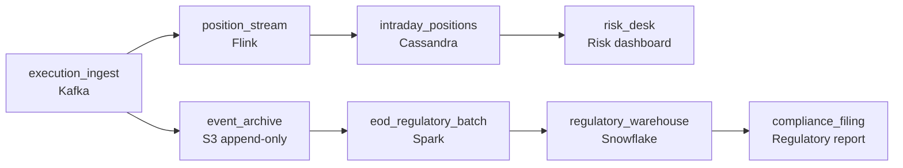

# Counted Once, Remembered Forever

- **Domain:** pipeline_architecture
- **Difficulty:** Hard
- **Est. time:** 20 min
- **URL:** https://datadriven.io/problems/counted_once_remembered_forever

## Problem

A retail brokerage processes about 50 million trade executions a day across 12 million accounts, and the risk desk needs account positions updated within seconds so it can freeze accounts that breach exposure limits while the market is still open. The same execution events feed an end-of-day regulatory report where every trade must be counted exactly once, and that report has to be reproducible byte-for-byte months later when an auditor asks what was filed. Design the pipeline that serves both consumers.

**Concepts tested:** `paApiIngestion`, `paBatchProcessing`, `paDataQuality`, `paDeduplication`, `paEventDriven`, `paEventPlatforms`, `paFullVsIncremental`, `paIdempotency`, `paLambdaArch`, `paLateData`, `paMonitoring`, `paPartitioning`, `paRetryHandling`, `paStreamProcessing`

## Requirements

- The risk desk says it cannot wait for an overnight job. If an account blows through its exposure limit at 11am, they need to see it and freeze the account within seconds, not the next morning.
- Compliance says the regulatory report must count every execution once and only once. A duplicate or a dropped trade in the filing is a reportable error.
- When an auditor asks six months later what we filed on a given day, we have to reproduce that exact report from the underlying data, not approximate it from today's state.

## Must-have components

- The risk desk needs positions within seconds of an execution. Add a streaming processor so intraday exposure updates land sub-minute rather than waiting for an end-of-day job.
- Both consumers read the same executions. Add a durable message queue at ingest so the streaming and batch paths each consume the events independently without one starving the other.
- The regulatory report is an end-of-day deliverable that must count each trade exactly once. Add a daily batch stage that produces the filing rather than reading approximate counts off the live position store.
- An auditor can ask months later what was filed. Add an immutable append-only archive of the raw executions so any past report can be reproduced exactly, since the live position store is mutable and cannot be replayed.
- Risk is sub-minute and regulatory is daily. Give the two paths distinct freshness tiers so you are not paying streaming cost for the report or accepting daily latency on risk.
- The streaming risk path must consume from the durable queue. Connect the message queue to the streaming processor so executions flow into the real-time position computation.
- The regulatory output needs a queryable home for filing and audit. Connect the end-of-day batch to a warehouse so the exact-once aggregated report lands where it can be reviewed and re-filed.

**Expected stages:** `trade execution ingest` → `immutable event log` → `real-time position stream` → `intraday position store` → `end-of-day regulatory batch` → `audit and replay archive` → `regulatory warehouse`

## Solution walkthrough

### Why this problem exists in real interviews

This is one execution stream serving two consumers with opposite correctness budgets: the risk desk wants positions within seconds and tolerates approximation, while compliance wants a report that counts every trade exactly once and can be reproduced months later. The trap is the design that reads the regulatory report straight off the live position store. That store is mutable, it overwrites account state on every fill, and the moment an auditor asks what you filed in March you have nothing to replay because the state has moved on a hundred times since.

The whiteboard answer streams every execution into a positions table, shows it to risk, and runs a nightly SELECT over that same table to produce the filing. It looks clean until two things happen. A producer retries and the same execution gets counted twice in the report, because nothing deduped on a stable id. And six months later the replay request comes in and the only source of truth is a table that has been mutated continuously since, so the past filing simply cannot be reconstructed. Two of the three requirements have quietly failed.

> **Trick to Solving**
>
> The system of record is an immutable append-only log of raw executions, not the position store. Everything else is a derived view.
>
> 1. Land every execution once in a durable queue and append it to an immutable archive partitioned by trade date. This is the only thing you ever replay from.
> 2. Risk reads a streaming view: at-least-once is fine because positions are continuously corrected by upsert.
> 3. The regulatory report is a deterministic daily batch over the archive, deduped on a stable execution id, so it is exactly-once and byte-for-byte reproducible.

---

### Walk the requirements

**Step 1: Fan the same executions to both paths through a durable queue**

A durable queue at ingest lets the streaming risk path and the batch path each consume the executions independently, so a slow report run never starves risk and a streaming hiccup never delays the filing. Partition by account so per-account fills stay ordered, which matters because positions are sequence-dependent, while leaving cross-account order free so you keep throughput at the open and close peaks that run several times the daily average.

**Step 2: Serve risk from a streaming position store, approximate but live**

The streaming processor folds each execution into account state and upserts an intraday store the risk desk reads. At-least-once delivery is acceptable here: a duplicated fill briefly nudges a position and the next event corrects it, and what matters is that a breach surfaces within seconds so an account can be frozen while the market is open. Forcing exactly-once on this path buys nothing risk cares about and adds latency it cannot afford.

**Step 3: Compute the filing as a deterministic batch over the immutable archive**

The end-of-day batch reads the day's partition from the append-only archive, dedups on the stable execution id from the matching engine, and aggregates the filing into the warehouse. Exactly-once lives here, in the dedup, not in a hope that the stream never duplicated. Because the input partition is immutable and the logic is deterministic, re-running the same day next year produces the identical report. That is the property an audit actually tests.

---

### The shape that fits

| node | type | tech | details |
|---|---|---|---|
| execution_ingest | source | Kafka | parallelism: account-partitioned |
| event_archive | storage | S3 append-only |  |
| position_stream | transform | Flink | slaFreshness: real-time |
| intraday_positions | storage | Cassandra | slaFreshness: < 1min; idempotencyStrategy: upsert |
| risk_desk | consumer | Risk dashboard | slaFreshness: < 1min |
| eod_regulatory_batch | transform | Spark | slaFreshness: < 24h; idempotencyStrategy: dedup_on_execution_id |
| regulatory_warehouse | storage | Snowflake | slaFreshness: < 24h |
| compliance_filing | consumer | Regulatory report | slaFreshness: < 24h |

> **Scale + Cost**
>
> 50 million executions a day is modest in raw volume; the cost concentrates in two places. The open and close peaks run roughly 5x the daily rate, so the queue and the streaming job must be sized for the spike, not the average. The seven-year immutable archive is cheap object storage partitioned by trade date, so a single-day replay touches one partition instead of scanning years. You pay streaming cost only on the risk path, where it is justified, and the report runs once a day on commodity batch compute.

> **Interviewers Watch For**
>
> A strong candidate says out loud which path needs exactly-once and which does not, and why at-least-once on risk is a feature rather than a shortcut. They name the dedup key (a stable execution id from the matching engine) and put the dedup in the batch, not the stream. And they identify the immutable archive as the system of record for replay, explaining that the position store is mutable and therefore disqualified as an audit source.

> **Common Pitfall**
>
> Computing the regulatory report by querying the live position store. It works in the demo and fails the first audit: the store has been overwritten continuously, so a past day cannot be reproduced, and any producer retry that touched the store has already double-counted. The fix is to treat the append-only execution log as truth and derive both the live view and the filing from it, with dedup on a stable id where exactness is required.

---

- **A correction for a trade arrives after the streaming store already applied the original fill but before the end-of-day cutoff. What does each path do?**
  - _Tests whether the candidate treats corrections as appended events: the stream converges by applying the correction to account state, and the batch includes it because it reads the archive at cutoff. A correction after cutoff becomes the next day's amendment, never an in-place edit._
- **Volume grows 10x and the open and close peaks get spikier. Where does this design strain first, and what do you change?**
  - _Tests capacity reasoning: queue partition count and streaming job parallelism scale for the peak, the archive stays cheap because it is partitioned object storage, and the daily batch is embarrassingly parallel per partition. The strain point is the streaming position store's write throughput at peak._
