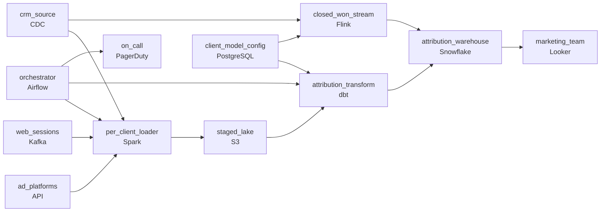

# Credit for Every Touch
_They saw the ad, clicked the email, then bought. Who gets credit?_

- **Domain:** pipeline_architecture
- **Difficulty:** Medium
- **Est. time:** 10 min
- **URL:** https://datadriven.io/problems/credit_for_every_touch

## Problem

Our marketing analytics platform stitches together ad spend from Google and Facebook, CRM opportunities from Salesforce, and web session data from multiple clients. The attribution model needs to give credit to every touchpoint in the customer journey before a conversion, but the data quality is inconsistent across sources and some of them don't expose an updated_at field, which makes incremental processing painful. Design a transformation pipeline that handles these sources reliably and keeps attribution fresh enough for daily campaign decisions.

**Concepts tested:** `paApiIngestion`, `paBatchProcessing`, `paDataQuality`, `paDeduplication`, `paEltVsEtl`, `paFullVsIncremental`, `paIdempotency`, `paLateData`, `paMonitoring`, `paPartitioning`, `paRetryHandling`, `paSchemaEvolution`

## Requirements

- Attribution has to be fresh enough for daily campaign decisions.
- Some sources don't expose an updated_at field, so incremental processing has to cope without knowing exactly what changed.
- Data quality is inconsistent across sources, and the pipeline has to handle them reliably.
- Attribution gives credit to every touchpoint in the customer journey before a conversion, across ad, CRM and web data.

## Must-have components

- Attribution credits and campaign performance need an analytical store that daily campaign reporting reads from. Without a warehouse tier there's nowhere for the attribution results to land. Add Snowflake, BigQuery, Redshift, or Databricks.
- Attribution has to be refreshed every day for campaign decisions, and the ingest has to finish before attribution runs; without an orchestration layer nothing schedules the daily run, orders its steps, or retries a failed load. Add Airflow, Dagster, or Prefect.

**Expected stages:** `touchpoints` → `conversions` → `attribution_credits` → `campaign_performance`

## Solution walkthrough

### What this really is

This is a multi-tenant scheduling problem dressed up as marketing attribution. The attribution math is the easy part. The design has to satisfy four constraints that pull against each other: a hard morning deadline, closed-won revenue that cannot wait for the nightly run, model switches that ship as config, and clients that never share a failure. The trap is a single shared nightly job that pulls every client through one code path with the model hard-coded in SQL. When one client's Salesforce export arrives malformed, **nobody's attribution lands by morning**, and every model switch becomes a deploy.

> **The failure boundary is the per-client task**
>
> Give each client its own task in the orchestrator. Have the transform read the active attribution model from a per-client config table at run time. Put closed-won deals on a narrow streaming path. Each move satisfies one requirement, and none of them forces the others to change.

### Walk the requirements

**Step 1: Let the orchestrator own the deadline**

`orchestrator` (Airflow) schedules one run per client and checks each run against the morning cutoff. If a run is at risk, it pages `on_call` with the client's name. An alert that just says 'pipeline late' tells on-call nothing about which client to fix.

**Step 2: Split closed-won off the batch**

The CRM's CDC feed forks. The full history goes to `per_client_loader`, and closed-won events go to `closed_won_stream` (Flink), which upserts that client's credit straight into the warehouse. Keep the stream narrow so you only pay streaming costs for the one event that is actually time-sensitive.

**Step 3: Make the model a row in `client_model_config`**

`client_model_config` holds one row per client: the active model (last-touch, position-based, time-decay) and its parameters. Both `attribution_transform` and `closed_won_stream` read it, so the nightly credits and the fast-path credits always agree. A switch is an update to that row, picked up on the next run. Hard-code the model in SQL and every switch becomes a release, with clients mid-rollout on different code versions.

**Step 4: Partition everything by client**

`staged_lake` and `attribution_warehouse` both partition by client and use `partition_overwrite`. A malformed feed stops only that client's task, and a rerun rewrites only that client's partition. Sources with no `updated_at` get a full reload into their own partition, so they never force a full reload for anyone else.

### The reference design

| node | type | tech | details |
|---|---|---|---|
| ad_platforms | source | API |  |
| crm_source | source | CDC |  |
| web_sessions | source | Kafka |  |
| orchestrator | transform | Airflow | errorAction: alert; monitorAlert: Per-client task at risk vs morning deadline |
| per_client_loader | transform | Spark | errorAction: alert; parallelism: 8 partitions; idempotencyStrategy: staging_table |
| staged_lake | storage | S3 | backfillStrategy: partition_overwrite |
| client_model_config | storage | PostgreSQL |  |
| attribution_transform | transform | dbt | backfillStrategy: partition_overwrite; idempotencyStrategy: upsert |
| closed_won_stream | transform | Flink | slaFreshness: real-time; idempotencyStrategy: upsert |
| attribution_warehouse | storage | Snowflake | slaFreshness: < 24h; backfillStrategy: partition_overwrite |
| marketing_team | consumer | Looker | slaFreshness: < 24h |
| on_call | consumer | PagerDuty |  |

| One shared nightly job | Per-client tasks plus config |
|---|---|
| One client's bad row fails the whole job. Closed-won credit waits a full day. The model lives in code, so every switch needs a deploy. | A bad feed stops one task and pages on that client. `closed_won_stream` lands credit within hours. A model switch is one row in `client_model_config` that `attribution_transform` reads on its next run. |

> **Streaming everything to hit the deadline**
>
> Some candidates respond to the closed-won requirement by moving all attribution to streaming. That pays streaming costs to recompute touchpoints nobody needs until morning. Only the closed-won event is time-sensitive, so only that event goes on the stream.

> **Show where the model choice lives**
>
> Saying the model is 'configurable' is not a design. Senior candidates draw the config store, show which stages read it, and say when a change takes effect. They also say what on-call sees when a run is late: which client, which source, and how much time is left.

- **A new client arrives with three months of history and a custom model. What changes?**
  - _A new row in `client_model_config` and a backfill of their own partition. The shared transform and every other client's runs stay untouched._
- **A client switches models mid-month. Do past credits get recomputed?**
  - _Tests whether the config row carries an effective date and whether `partition_overwrite` lets you restate only that client's history._
- **An ad API rate-limits `per_client_loader` at peak. What does the morning report show?**
  - _The loader retries with backoff, and the orchestrator alerts if the retries push past the deadline. The report ships with that source flagged and the rest of the client's data complete._
