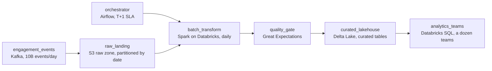

# Disappearing Ink

- **Domain:** pipeline_architecture
- **Difficulty:** Easy
- **Est. time:** 20 min
- **URL:** https://datadriven.io/problems/disappearing_ink

## Problem

We run a photo and video messaging app where about 10 billion engagement events land every day: opens, replays, story views, ad views. A dozen analytics teams each want the data shaped differently and their needs keep changing, so we cannot lock every transformation in before the data is stored. Design a pipeline that lands the raw events cheaply and rebuilds the curated tables those teams read on a daily schedule, gating the publish on a quality check so bad data never reaches them and paging on-call when a run is late or fails.

**Concepts tested:** `paBackfill`, `paBatchProcessing`, `paDagOrchestration`, `paDataLake`, `paDataQuality`, `paDeduplication`, `paEltVsEtl`, `paFileIngestion`, `paFullVsIncremental`, `paIdempotency`, `paMedallion`, `paMonitoring`, `paPartitioning`, `paRetryHandling`, `paSchemaEvolution`, `paTableFormats`

## Requirements

- Our teams keep changing what they want from the data, so we do not want to decide the final shape before we even store it.
- A dozen teams each read the data differently and I do not want one team's change to break another's.
- When a day's data is malformed I do not want the analysts to be the ones who discover it.
- This has to run every day on its own and page someone when it does not.

## Must-have components

- There is no cheap raw landing zone. With changing downstream needs you cannot pre-shape everything, so land the untouched events in low-cost object storage first, then transform from there.
- There is nowhere for the curated tables to live. Transform the raw events into a lakehouse layer that the analytics teams query, so reshaping a table does not mean re-ingesting the source.
- Nothing does the heavy transformation. Add a batch compute step (Spark on Databricks) that reads the raw landing zone and builds the curated tables on a daily cadence.
- The daily run needs an owner. Add an orchestration layer (Airflow) that schedules ingestion, transformation, and the quality gate, and alerts when the run is late or fails.
- Nothing stops bad data from reaching the teams. Add a validation step between the transformation and the curated tables so malformed or incomplete partitions are caught before publish.
- The raw landing zone must actually feed the transformation. Wire the raw object storage into the batch step that reads it, otherwise the curated tables are built from nothing and the two halves are disconnected.

**Expected stages:** `Raw event ingestion` → `Raw landing zone` → `Daily orchestration` → `Batch transformation` → `Curated tables` → `Quality validation` → `Analytics consumers`

## Solution walkthrough


### Why this problem exists in real interviews

This is an ELT-versus-ETL question wearing a scale costume. The tell is one line in the prompt: a dozen teams want the data shaped differently and their needs keep changing. The trap is the reflex ETL design that transforms events on the way in and stores only the shaped result. It looks clean until the first team asks for a field you dropped, and now you are re-ingesting 8 TB a day of history you no longer have in raw form. Land raw first and that request is a reprocessing job, not an incident.

The second trap is reaching for streaming because 10 billion events sounds like a firehose. Nobody here needs sub-minute data; the analysts work off yesterday. A daily batch over cheaply-stored raw events is both cheaper and simpler, and choosing it on purpose is what separates a candidate who designs for the requirement from one who defaults to the fanciest tool.

---

### Walk the requirements

**Step 1: Land the raw events untouched and cheap**

Ingest the full event stream into low-cost object storage as-is, partitioned by date. No shaping, no dropping fields. This is the L-before-T: storage is cheap, re-collection is impossible. When a team changes its mind or a schema drifts, the answer already sits in the landing zone waiting to be reprocessed.

**Step 2: Transform in batch, on a daily cadence**

A Spark job on Databricks reads yesterday's raw partition and builds the curated tables. Batch fits because the freshness target is T+1; a streaming design would cost far more to serve a need no consumer has. The transformation is where field mapping, sessionization, and de-duplication happen, downstream of storage where they are cheap to change.

**Step 3: Publish curated tables the teams share**

Write the shaped output into a lakehouse layer that every analytics team queries. Because the raw source is decoupled, one team's new column or reshaped table does not force a re-ingest and does not break another team. The curated layer is the contract; the raw zone is the safety net behind it.

**Step 4: Gate quality before anyone reads**

Run validation between the transformation and the published tables: row-count sanity, null and schema checks, partition completeness. If a day is malformed, the gate holds the publish and alerts, so the analysts are never the ones who discover bad data. Orchestration owns the whole daily chain and pages when the run is late or fails.

---

### The shape that fits



| node | type | tech | details |
|---|---|---|---|
| engagement_events | source | Kafka, 10B events/day |  |
| raw_landing | storage | S3 raw zone, partitioned by date |  |
| batch_transform | transform | Spark on Databricks, daily |  |
| quality_gate | quality_gate | Great Expectations |  |
| curated_lakehouse | storage | Delta Lake, curated tables |  |
| orchestrator | transform | Airflow, T+1 SLA |  |
| analytics_teams | consumer | Databricks SQL, a dozen teams |  |

**The daily ELT run as an orchestrated DAG**

```python
$1c
```

> **Trick to Solving**
>
> Store raw, transform late. The single decision that cracks this problem is putting the T after the L: land every event unshaped, then build curated tables from storage. Everything the prompt worries about, changing team needs and drifting schemas, becomes a cheap reprocessing job instead of a re-ingestion emergency.

> **Interviewers Watch For**
>
> A candidate who says out loud why ELT beats ETL here, and who justifies batch over streaming against the T+1 freshness fact instead of defaulting to real-time. Bonus signal: naming date partitioning and file sizing on the raw zone so the daily Spark read scans a slice, not the whole lake.

> **Common Pitfall**
>
> Transforming on ingest and keeping only the shaped output. It passes the first demo and fails the first new requirement: a team asks for a field you discarded and there is no raw history to rebuild from. The other pitfall is streaming the whole 10B/day firehose for a report nobody reads before morning, paying real-time cost for batch value.

> **Scale + Cost**
>
> Roughly 10 billion events and 8 TB of raw JSON per day. Cost concentrates in two places: object storage for the raw zone (cheap per TB, so keeping raw is affordable) and the daily Spark cluster. Partition the raw zone by date and compact into right-sized files so the transform reads yesterday's partition only; that keeps the daily job's compute proportional to one day, not the whole history.

---

- **A team asks for a metric that needs a field you never mapped into the curated tables, but which is present in the raw events. What do you do?**
  - _Tests whether the candidate sees the payoff of ELT: reprocess the raw landing zone into a new or extended curated table without touching ingestion or the source._
- **Event schemas drift weekly as the app ships features. How does the pipeline avoid breaking when a new field appears or an old one is deprecated?**
  - _Tests schema-drift handling: raw preserves everything as received, the transform tolerates unknown fields, and a schema check in the quality gate flags breaking changes before curated tables are rebuilt._
