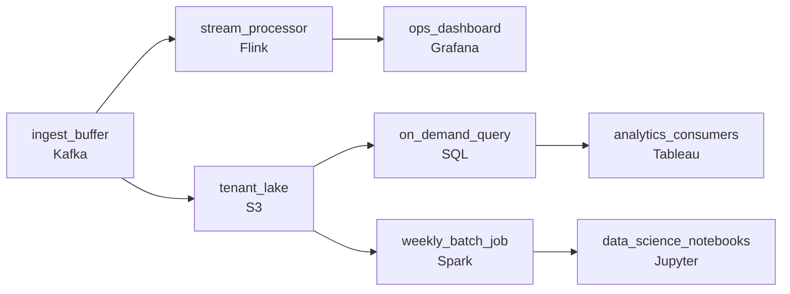

# Doubling Every Six Months
_Tuesdays are quiet. Black Friday is not._

- **Domain:** pipeline_architecture
- **Difficulty:** Hard
- **Est. time:** 30 min
- **URL:** https://datadriven.io/problems/doubling_every_six_months

## Problem

We're a fast-growing marketplace and our data volume has been doubling every six months. We keep throwing more servers at the problem but it doesn't scale and the costs are exploding. Three teams read this data on completely different cadences (operations live, analytics hourly, data science weekly), flash sales drive 10x traffic spikes that take hours to recover from, and three new enterprise customers signed contracts requiring their data be kept separate from everyone else's. Design a pipeline that scales automatically without manual provisioning, brings cost per unit down as we grow, and holds all three constraints at once.

**Concepts tested:** `paBatchProcessing`, `paBatchVsStreaming`, `paCompression`, `paDagOrchestration`, `paDataLake`, `paDataQuality`, `paDeadLetterQueue`, `paEventDriven`, `paFileIngestion`, `paIdempotency`, `paLambdaArch`, `paLateData`, `paMicroBatchVsTrue`, `paMonitoring`, `paPartitioning`, `paRetryHandling`, `paSchemaEvolution`, `paSmallFiles`, `paStreamProcessing`, `paTableFormats`

## Requirements

- The CTO wants cost per unit of data to go down as we grow, not up.
- Operations needs to see issues as they happen, analytics works hourly, and data science only runs once a week.
- Flash sales drive huge spikes that the current system can't keep up with, and recovery has been taking hours.
- Three new enterprise customers signed contracts requiring their data be kept separate from everyone else's.

## Must-have components

- Data is doubling every six months and the CTO wants cost per unit to fall as we grow. That requires a cheap, partitioned landing layer that separates storage from compute. Your design has no cold storage tier. Add a data lake (S3, GCS, ADLS, or equivalent) as the anchor for the scaled data.
- Operations needs sub-minute freshness, analytics is hourly, and data science runs weekly. Routing all three through one freshness tier either over-spends on the slow consumers or under-serves the fast one. Show at least one streaming path AND at least one batch path so consumers with different freshness needs aren't forced onto the same tier.

**Expected stages:** `event_ingestion` → `auto_scaling_transform` → `s3_data_lake` → `query_engine` → `monitoring_layer`

## Solution walkthrough

### What this really is

This is a cost-curve problem dressed up as a scaling problem. The real question is whether you can separate storage from compute so that idle costs nothing, and then hang three serving paths off one cheap, durable layer. Anyone can draw Kafka into Flink. The trap is **treating 'scales automatically' as 'a bigger cluster with autoscaling turned on'**. Do that and the bill still rises with volume, a flash sale still saturates compute, and the enterprise audit fails because every tenant sits in one table.

Most candidates start by keeping the fixed cluster, adding worker autoscaling, and filtering tenants with `WHERE customer_id = ?` in the BI tool. The cluster idles at its floor most of the week. Every query scans one giant partition. Isolation then depends on every analyst remembering a filter. Each of the four constraints breaks at a different seam, and none of them is fixed by adding servers.

> **Idle compute should cost zero**
>
> Make object storage the anchor and treat every compute engine as something that spins up when a reader shows up. Once the lake is the source of truth, each cadence becomes its own cheap path off it, and tenant isolation becomes a property of the storage layout rather than of the query.

---

### Walk the requirements

**Step 1: Anchor on partitioned object storage**

Cost per unit only falls when you pay for bytes at rest and for compute only while it runs. Land everything in S3, partitioned by date and tenant. A 24/7 cluster bills for peak capacity every hour of the year, and that bill is exactly what has been exploding.

**Step 2: Give each cadence its own path**

Ops needs sub-minute, so it gets a narrow Flink stream into Grafana. Analytics is hourly, so an on-demand SQL engine reads the lake for Tableau. Data science is weekly, so a Spark job reads the same lake, spins up once a week, and shuts down. If you skip the weekly path, data science ends up competing with hourly reporting for the same compute.

**Step 3: Absorb spikes in a buffer, then scale behind it**

Kafka holds a 10x flash sale while consumers catch up. Buffering only fixes half the problem, though. The stream processor behind it also carries `parallelism: auto`, so it adds slots during the spike and releases them afterward. Recovery time then becomes the time to drain the buffer, not hours of a failing cluster.

**Step 4: Put tenant isolation in the layout**

Each enterprise customer gets its own prefix in `tenant_lake`, protected by storage permissions. Any query that has not been granted that prefix cannot read it. A `WHERE` clause is a convention, but a prefix is an actual boundary.

---

### The reference design

| node | type | tech | details |
|---|---|---|---|
| ingest_buffer | queue | Kafka | parallelism: auto |
| stream_processor | transform | Flink | parallelism: auto; slaFreshness: real-time |
| ops_dashboard | consumer | Grafana | slaFreshness: real-time |
| tenant_lake | storage | S3 | backfillStrategy: partition_overwrite |
| on_demand_query | transform | SQL | slaFreshness: < 1h |
| analytics_consumers | consumer | Tableau | slaFreshness: < 1h |
| weekly_batch_job | transform | Spark | parallelism: auto |
| data_science_notebooks | consumer | Jupyter |  |

> **What this design gives up**
>
> On-demand engines cold-start, so the first hourly query and the weekly Spark run both pay a few minutes of spin-up. Per-tenant prefixes also make cross-tenant rollups read many partitions. The trade buys a bill that follows usage and isolation that holds up under an audit.

> **Three cadences means three readers**
>
> Strong candidates draw the weekly path explicitly and explain why it stays separate from the hourly one: a heavy weekly job running on reporting compute slows down the dashboards. They also say what scales behind the buffer, not only the buffer itself.

> **Isolation by filter fails the audit**
>
> The design that ships keeps one big table plus a `customer_id` filter in BI. Eventually an analyst forgets the filter and returns rows that belong to an enterprise customer. A code-review rule does not fix this. Moving the boundary into the storage layout does.

- **When a flash sale doubles traffic for an hour, what saturates first and what catches up first?**
  - _Where back-pressure lives: buffer depth, processor scale-out speed, query cold-start._
- **How do you cap one enterprise customer's query cost without rewriting the pipeline?**
  - _Per-tenant credentials or chargeback built on the prefix layout you already have._
- **Data science wants daily instead of weekly. What changes?**
  - _Only the Spark schedule changes, because the lake already holds the data._
