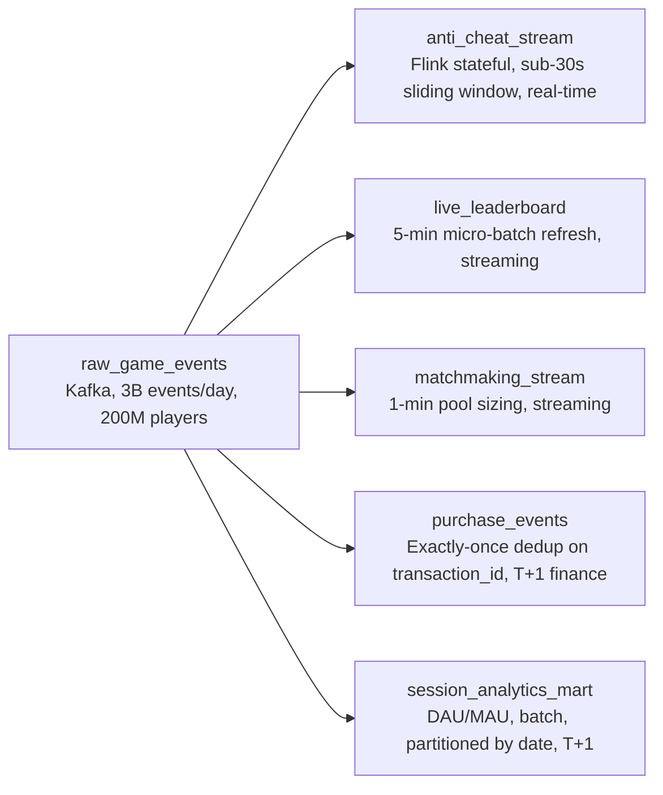

# Eight Teams, Eight Latencies
_Millions of gamers. The architecture decision changes everything._

- **Domain:** pipeline_architecture
- **Difficulty:** Medium
- **Est. time:** 10 min
- **URL:** https://datadriven.io/problems/eight_teams_eight_latencies

## Problem

Our gaming platform generates hundreds of millions of player events per day across millions of concurrent sessions - matchmaking events, trophy unlocks, in-game purchases, and session telemetry. Different internal teams need this data at very different latencies and granularities. Design the event pipeline and justify where you use real-time streaming versus batch processing for each consumer.

**Concepts tested:** `paApiIngestion`, `paBackfill`, `paBatchProcessing`, `paBatchVsStreaming`, `paColumnarVsRow`, `paCompression`, `paDagOrchestration`, `paDataLake`, `paDataQuality`, `paDeduplication`, `paEltVsEtl`, `paEventDriven`, `paEventPlatforms`, `paFullVsIncremental`, `paIdempotency`, `paLambdaArch`, `paLateData`, `paMedallion`, `paMonitoring`, `paPartitioning`, `paRetryHandling`, `paSchemaEvolution`, `paSmallFiles`, `paStreamProcessing`, `paTableFormats`

## Requirements

- Suspected cheaters must be banned before the match they are currently playing ends (matches last 8-12 minutes).
- In-game purchase revenue must reconcile to the payment processor to the cent, with no duplicated or dropped transactions.
- The eight downstream consumers have freshness needs ranging from 30 seconds to T+1, and pipeline cost is reviewed quarterly against consumer benefit.

## Must-have components

- Anti-cheat has to act during the match (matches last 8-12 minutes), but your design has no streaming / sub-minute path. Add a streaming technology (e.g. Flink, Kafka Streams, Spark Streaming) or explicitly set SLA Freshness to "real-time" or "< 1min" on at least one processing node.
- The eight downstream consumers have freshness needs ranging from 30 seconds to T+1, but your design routes everything through a single freshness tier. Show at least one streaming path AND at least one batch path (by tech choice or by explicit SLA Freshness) so consumers with different freshness needs aren't all paying the streaming price or all starved of fresh data.

**Expected stages:** `raw_game_events` → `anti_cheat_stream` → `live_leaderboard` → `matchmaking_stream` → `purchase_events` → `session_analytics_mart`

## Solution walkthrough

### Why this problem exists in real interviews

This is a per-consumer streaming-versus-batch decision wearing a gaming costume. Eight internal teams drink from the same event firehose, but only three of them (anti-cheat at 30 seconds, live leaderboards at 5 minutes, matchmaking at 1 minute) actually change the business when the data is fresh. The trap is treating all eight as equal: default to streaming everything and you triple the bill so five consumers can get data they were happy to see tomorrow; default to batching everything and anti-cheat can never ban a cheater before the match ends. The interview is watching whether you cost-justify freshness per consumer instead of picking one tier for the whole platform.

> **Trick to Solving**
>
> Of 8 consumers, only 3 need streaming (anti-cheat at sub-30s, live leaderboards at 5-min, matchmaking at 1-min). The other 5 are batch-appropriate (DAU/MAU, purchase reporting, trophy rates, recommendation training, content performance). Streaming the full event stream costs significantly more than batch, and only 3 consumers benefit.
>
> 1. Justify streaming vs batch per consumer, not globally
> 2. Anti-cheat requires stateful stream processing (sliding windows)
> 3. Purchase events need exactly-once for financial reporting

---

### Break down the requirements

**Step 1: Design single ingestion layer**

Kafka for all events. Schema includes `event_type`, `player_id`, `session_id`, timestamp, `game_title`. Partition strategy must handle high-cardinality `player_id`.

**Step 2: Build the sub-30-second anti-cheat path**

Anti-cheat: a stateful stream engine (Flink or Kafka Streams) with sub-30-second freshness running sliding-window anomaly detection (kill rate > mean + 3 SD). This node must carry a real-time or < 1min SLA so it can act inside an 8-12 minute match.

**Step 3: Build the remaining streaming paths**

Live leaderboards: 5-minute micro-batch refresh. Matchmaking: 1-minute pool sizing. Both read the same Kafka topic as anti-cheat but at looser freshness, so they are separate streaming nodes with their own SLA labels.

**Step 4: Build the batch path**

DAU/MAU: T+1, partitioned by date, no full table scans. Trophy completion rates: T+1. Recommendation model training: weekly batch. All served from the batch tier, not the stream.

**Step 5: Deduplicate purchase events**

Exactly-once for financial reporting. Deduplicate on the PSN Commerce `transaction_id` before writing the purchase fact table, and keep the data durable so no purchase is silently dropped. A duplicated in-game purchase inflates revenue; a dropped one under-reports it. Neither can happen if finance is to reconcile to the cent.

---

### The solution

| node | type | tech | details |
|---|---|---|---|
| raw_game_events | source | Kafka, 3B events/day, 200M players |  |
| anti_cheat_stream | transform | Flink stateful, sub-30s sliding window, real-time |  |
| live_leaderboard | transform | 5-min micro-batch refresh, streaming |  |
| matchmaking_stream | consumer | 1-min pool sizing, streaming |  |
| purchase_events | storage | Exactly-once dedup on transaction_id, T+1 finance |  |
| session_analytics_mart | storage | DAU/MAU, batch, partitioned by date, T+1 |  |

> **Interviewers Watch For**
>
> The strongest signal is explicit per-consumer justification:
> 1. **Name which consumers need streaming and why**: not 'everything should stream'
> 2. Cost-latency trade-off shown structurally: streaming costs more, only 3 consumers benefit, so only 3 sit on the streaming tier
> 3. Anti-cheat as stateful stream processing: sub-30s sliding window pattern detection
> 4. Exactly-once for purchase events: financial data cannot tolerate duplicates or drops

> **Cost-Latency Trade-off**
>
> 3B events/day from 200M active players. Peak: 8M concurrent sessions on Friday evenings. Kill events are 40% of volume. The cost of streaming the full event stream is significant; only the anti-cheat, leaderboard, and matchmaking consumers justify it.

> **Common Pitfall**
>
> Streaming everything because 'real-time is always better.' For DAU/MAU metrics, finance purchase reporting, and recommendation model training, batch is cheaper, simpler, and sufficient. Over-streaming wastes compute and money without providing additional business value.

---

- **A major tournament launches in 48 hours with 2M concurrent players (25x normal peak for that title). How does the pipeline handle it?**
  - _Tests capacity planning: Kafka partition scaling, streaming job auto-scaling, and isolation from non-tournament traffic._
- **500+ game titles each have custom event taxonomies. How do you handle the schema?**
  - _Tests common schema with game-specific extension fields, managed by a schema-contract layer._
