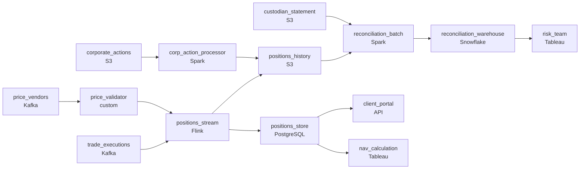

# Eight-Hour-Old Positions
_Positions shift by the second. The math cannot lag._

- **Domain:** pipeline_architecture
- **Difficulty:** Hard
- **Est. time:** 10 min
- **URL:** https://datadriven.io/problems/eight_hour_old_positions

## Problem

Our portfolio analytics platform shows clients their real-time holdings value, but trade executions aren't reflected in positions until the nightly batch runs 8 hours later. The risk team also needs intraday P&L with market prices validated against multiple data vendors before they feed NAV calculations. Design a pipeline that makes positions and P&L available in near-real-time throughout the trading day.

**Concepts tested:** `paBatchVsStreaming`, `paCdc`, `paDataQuality`, `paDeduplication`, `paEventDriven`, `paEventPlatforms`, `paFullVsIncremental`, `paIdempotency`, `paLambdaArch`, `paLateData`, `paMicroBatchVsTrue`, `paMonitoring`, `paPartitioning`, `paRetryHandling`, `paStreamProcessing`

## Requirements

- Clients see their holdings on the portal; an executed trade has to show up there immediately, not eight hours later.
- Stale or wrong prices flowing into NAV is a regulatory mis-reporting incident; the calculation can't use a price we haven't validated.
- Streaming positions can drift from the custodian's record because of late executions or write failures; the warehouse has to be reconciled against the custodian nightly.
- When a stock splits or pays a dividend, every historical position and price for that security has to be adjusted, or P&L is wrong for everyone holding it.

## Must-have components

- The architecture is a streaming path for intraday positions and P&L plus a nightly batch reconciliation against the custodian; that's two distinct freshness tiers. Show at least one streaming path and at least one batch path.
- Corporate actions retroactively adjust historical positions and prices; without a durable history tier (S3, GCS, ADLS, or lakehouse) there's nothing to rewrite for splits and dividends.

**Expected stages:** `portfolio_positions` → `intraday_pnl` → `price_validated` → `execution_events`

## Solution walkthrough

### What this really is

This is a lambda architecture dressed up as a client portal fix. Almost everyone draws the stream from trade executions into a positions store. That ends the 8-hour lag, and it is the easy quarter of the design. What separates candidates is treating the stream as **fast but not authoritative**. Prices from one vendor go straight into NAV. Nothing checks the streamed positions against the custodian. A stock split leaves history unadjusted. Get that wrong and one bad quote becomes a regulatory mis-report, and a single split misstates P&L for every account that holds the stock.

> **The custodian stays the source of truth**
>
> The stream serves clients, and the nightly batch proves the stream right. That gives you two freshness tiers: `positions_stream` at 'real-time' and `reconciliation_batch` at '< 24h'. You also need a durable history tier that both reconciliation and corporate actions can rewrite.

### Walk the requirements

**Step 1: Stream executions into `positions_store`**

`trade_executions` on Kafka feed a Flink `positions_stream` that upserts per account, so a replayed event cannot double a position. Clients read `positions_store` within seconds of the fill. That answers the lag, and nothing else.

**Step 2: Gate prices before anything reads them**

`price_vendors` land in `price_validator`, which compares each security's quotes. When they agree within tolerance it consolidates them, for example by median. When they disagree past tolerance it freezes the last validated price and alerts. P&L and NAV only ever see a price that passed.

**Step 3: Reconcile against the custodian nightly**

A Spark `reconciliation_batch` joins `positions_history` to `custodian_statement` per account and writes the differences to Snowflake. Late executions and dropped writes show up the next morning. Without this step they surface weeks later, once the drift is past tolerance and nobody can say where it started.

**Step 4: Rewrite only the affected security**

`corp_action_processor` reads the split or dividend and partition-overwrites that one security's positions and price series in `positions_history` on S3. Never rebuilding leaves P&L wrong. Rebuilding everything on every action never finishes. Per-security partitions keep the fix surgical.

### The reference design

| node | type | tech | details |
|---|---|---|---|
| trade_executions | source | Kafka |  |
| price_vendors | source | Kafka |  |
| custodian_statement | source | S3 |  |
| corporate_actions | source | S3 |  |
| positions_stream | transform | Flink | slaFreshness: real-time; idempotencyStrategy: upsert |
| price_validator | quality_gate | custom | errorAction: alert; monitorAlert: Vendor prices disagree past tolerance |
| positions_store | storage | PostgreSQL | slaFreshness: < 1min |
| positions_history | storage | S3 | backfillStrategy: partition_overwrite |
| reconciliation_batch | transform | Spark | slaFreshness: < 24h; idempotencyStrategy: staging_table |
| corp_action_processor | transform | Spark | backfillStrategy: partition_overwrite |
| reconciliation_warehouse | storage | Snowflake | slaFreshness: < 24h |
| client_portal | consumer | API | slaFreshness: real-time |
| nav_calculation | consumer | Tableau | slaFreshness: < 1h |
| risk_team | consumer | Tableau | slaFreshness: < 24h |

> **One vendor is one point of failure**
>
> The version that ships reads prices from a single feed because that feed is already streaming. A stale quote walks straight into NAV, and nobody notices until the regulator does. Validation belongs on the price path upstream of `positions_stream`, not in a report someone checks afterward.

> **Every write is safe to repeat**
>
> Senior candidates say how each write survives a rerun: an `upsert` on the stream, a `staging_table` swap in reconciliation, and a `partition_overwrite` for corporate actions. If you cannot rerun a pipeline, you cannot reconcile it.

---

- **Two price vendors agree and a third disagrees past tolerance. What does `price_validator` do, and what does NAV see?**
  - _Tests for a quorum or median rule: the majority consolidates, and the outlier is excluded with an alert._
- **The custodian sends a corrected statement two days late. How does the corrected reconciliation replace the original?**
  - _Tests for overwriting by reconciliation date, so a rerun replaces that day's diff instead of appending a second one._
