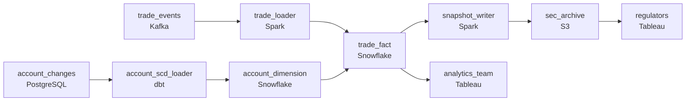

# Equities, ETFs, and the SEC
_Fractional shares, multi-currency, point-in-time. All of it._

- **Domain:** pipeline_architecture
- **Difficulty:** Hard
- **Est. time:** 30 min
- **URL:** https://datadriven.io/problems/equities_etfs_and_the_sec

## Problem

We run a retail brokerage handling equities, ETFs, and crypto - including fractional share trading and multi-currency settlement. The data warehouse needs to support business analytics, risk reporting, and SEC/FINRA regulatory submissions. Design the warehouse pipeline including the data model and ingestion architecture.

**Concepts tested:** `paBackfill`, `paBatchProcessing`, `paBatchVsStreaming`, `paCiCd`, `paDagOrchestration`, `paDataLake`, `paDataQuality`, `paDeduplication`, `paEnvironmentMgmt`, `paEventDriven`, `paFileIngestion`, `paFullVsIncremental`, `paIdempotency`, `paLateData`, `paMedallion`, `paMonitoring`, `paPartitioning`, `paRetryHandling`, `paScdPipeline`, `paSchemaEvolution`, `paTableFormats`

## Requirements

- A fifth of equity trades are fractional shares; quantities can't lose precision in the warehouse.
- SEC rules require trade records be retained unchanged for six years; we can't fail that audit.
- Account margin status, account type, and KYC status change over time; a trade from last year has to be reported using the account state in effect then, not today's.

## Must-have components

- Business analytics, risk reporting, and regulatory submissions all run from a warehouse with the trade fact and account dimension. Without a warehouse tier there's nowhere for that to live. Add Snowflake, BigQuery, Redshift, or Databricks.
- SEC rules require trade records be retained unchanged for six years; without a durable archive tier (S3, GCS, ADLS) there's nowhere to write the immutable regulatory snapshots.

**Expected stages:** `trade_execution_feed` → `settlement_normalizer` → `fact_trades` → `dim_account_scd2` → `regulatory_snapshot_store`

## Solution walkthrough

### Why this problem exists in real interviews

Brokerage warehousing pretends to be a normal data-modeling problem and isn't. Three quiet correctness traps, all of them invisible until somebody asks the right question. Fractional shares lose precision when somebody types `INT` somewhere. Account state from last year is gone if you only kept the latest. SEC archives become forensic exercises if the warehouse and the archive aren't separate stores.

Most candidates draw a star schema with a trade fact, an account dimension, and a daily ETL. The fact table uses `INT` for quantity because 'who buys 1.247 shares' until somebody actually does. The account dimension overwrites on update, so a trade from last March's report uses today's account type. SEC compliance is satisfied by 'we keep everything in the warehouse.' The first audit checks the warehouse and finds account history isn't there; the precision conversation comes the day a customer disputes a fractional balance.

> **Trick to Solving**
>
> Numeric type wide enough for fractions, account as a slowly-changing dimension, regulatory snapshots in immutable storage separate from the live warehouse.
>
> 1. Trade quantity uses a `NUMERIC(precision, scale)` type wide enough for fractional shares; never `INT`.
> 2. Account is a slowly-changing dimension keyed on (`account_id`, `valid_from`, `valid_to`). Trade fact joins on `trade_time BETWEEN valid_from AND valid_to`.
> 3. SEC archive is a separate, immutable store. The warehouse can change; the archive cannot. A regulator asks the archive what was filed; the warehouse is for analytics.

---

### Walk the requirements

**Step 1: Quantities in a precision-preserving numeric type**

Fractional share trades make up a meaningful share of volume. The trade fact's quantity column is `NUMERIC(precision, scale)` wide enough for fractional shares (wide enough to match the broker's internal representation), never `INT` and never `FLOAT`. Float silently loses precision on division and aggregation; INT truncates fractions outright. The type choice on a single column is the difference between balances that reconcile and balances that don't.

**Step 2: Daily regulatory snapshots written to immutable storage**

SEC retention is six years and the records have to be unchanged. Daily snapshots write to a separate, immutable archive (versioned object storage, write-once policy, or an immutable lakehouse table). The warehouse can be rebuilt or restated; the archive cannot. When a regulator asks for what was on file on a specific date, the answer comes from the archive, not the warehouse. A 'we keep it in the warehouse' approach fails the first audit that checks immutability.

**Step 3: Account as an SCD; trades join on the account state at trade time**

Account margin status, account type, and KYC status change. Model accounts as a slowly-changing dimension keyed on (`account_id`, `valid_from`, `valid_to`), with one row per change. The trade fact joins on `trade_time BETWEEN valid_from AND valid_to`, so a trade from last year reports under last year's account state, not today's. A 'current state' dimension silently rewrites every historical analysis the moment an account changes; the slowly-changing dimension plus as-of join is the version that survives any historical query.

---

### The shape that fits

| node | type | tech | details |
|---|---|---|---|
| trade_events | source | Kafka | parallelism: 8 partitions |
| account_changes | source | PostgreSQL |  |
| trade_loader | transform | Spark | slaFreshness: < 1h; idempotencyStrategy: upsert |
| account_scd_loader | transform | dbt | slaFreshness: < 1h; idempotencyStrategy: upsert |
| trade_fact | storage | Snowflake | slaFreshness: < 1h; backfillStrategy: partition_overwrite |
| account_dimension | storage | Snowflake |  |
| snapshot_writer | transform | Spark | idempotencyStrategy: staging_table |
| sec_archive | storage | S3 | backfillStrategy: incremental |
| analytics_team | consumer | Tableau | slaFreshness: < 1h |
| regulators | consumer | Tableau | slaFreshness: < 24h |

> **What this design gives up**
>
> NUMERIC types are slower to compute than INT. SCDs grow the account dimension with every change and as-of joins are more expensive than equi-joins. A separate immutable archive doubles storage for the data that's also in the warehouse. Some warehouse simplicity is the cost; in return, fractional precision that holds, historical reports that match what was filed, and an SEC archive that survives an audit.

> **What reviewers check**
>
> A reviewer looks at the canvas for these properties:
> - Trade quantities use a precision-preserving numeric type so fractional shares survive aggregation.
> - Account is a slowly-changing dimension and trades join on the account state at trade-time.
> - Daily regulatory snapshots write to immutable storage separate from the live warehouse.

> **The mistake that ships**
>
> The first version out the door uses INT for quantity, overwrites the account dimension on every change, and treats the SEC archive as 'we have the warehouse.' A customer files a complaint about a fractional balance that doesn't reconcile and the team finds out about the type choice. A regulatory audit asks for last March's account states and the team has only current. A SEC review asks for unchanged trade records over six years and the warehouse has been restated twice. The eventual rebuild is NUMERIC, an SCD, and a separate archive. The fractional-balance complaint becomes a class issue, the SEC review takes a finding, and the team is rebuilding type choices and dimension models in parallel.

---

- **Crypto trading runs 24/7, but the daily snapshot assumes a market-close cutover. What does the snapshot capture, and when?**
  - _Tests whether the candidate sees the snapshot boundary as a policy decision: pick a time-zone cut (UTC midnight) for crypto and stick to it; equities can use market close. The archive records the cutover time so the regulator knows what window was filed._
- **An account's KYC status is corrected retroactively to a date in the past. How does that flow through the SCD, and what about already-filed snapshots?**
  - _Tests whether the candidate sees that the slowly-changing dimension writes a new row with the corrected `valid_from`, but already-filed archive snapshots stay unchanged; the correction shows up in subsequent filings as a new amended record. The archive's immutability is what the regulator relies on._
