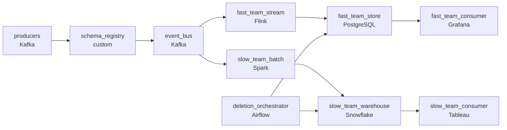

# Event System for Multiple Consumers
_One event, many hungry consumers._

- **Domain:** pipeline_architecture
- **Difficulty:** Hard
- **Est. time:** 25 min
- **URL:** https://datadriven.io/problems/event_system_for_multiple_consumers

## Problem

We're building a centralized event platform that multiple engineering teams will consume from. Design a data processing pipeline and ingestion layer for an event system to be shared across multiple applications and servers.

**Concepts tested:** `paBatchVsStreaming`, `paDataQuality`, `paDeadLetterQueue`, `paDeduplication`, `paDependencyMgmt`, `paEventDriven`, `paEventPlatforms`, `paIdempotency`, `paKappaArch`, `paLateData`, `paMicroBatchVsTrue`, `paMonitoring`, `paPartitioning`, `paRetryHandling`, `paSchemaEvolution`, `paStreamProcessing`

## Requirements

- Six different teams consume the same events at very different speeds; the platform has to serve all of them without forcing the slowest pace on everyone.
- When one team's consumer is down for hours, none of the other five should be affected; today shared infrastructure makes outages spread.
- Producing teams deploy independently and a schema change has been silently breaking downstream consumers.
- When a customer asks to be deleted, every team's storage has to forget them, not just the central event bus.

## Must-have components

- A centralized event platform shared across teams is by definition an event bus. Without a message queue / log tier there's no fan-out point. Add Kafka, Kinesis, or Pub/Sub with explicit partitioning.
- Six teams consume at very different speeds, from sub-5-second fraud to 5-minute billing. Forcing all six onto one freshness tier either over-spends or under-serves. Show at least one streaming path and one batch path.

**Expected stages:** `event_producers` → `event_bus` → `schema_registry` → `consumer_groups` → `dead_letter`

## Solution walkthrough

### The trap beneath the platform

This is a multi-tenant isolation problem wearing an event-platform costume. Six teams read the same events at six speeds, deploy independently, and one producer's schema change can silently break another team's consumer. Anyone can draw one Kafka topic; the skill is per-team consumer groups, a publish-time schema contract, and two freshness tiers off one bus. Get the shared consumer group wrong and one team's dead consumer stalls all six.

> **Isolation is the whole product**
>
> Serve all six teams from one bus, but give each its own consumer group and offsets so no team's lag touches another. Enforce the contract at publish so a breaking change is rejected, not discovered at midnight. Run two freshness tiers off the same bus, streaming for fraud/ops and batch for billing/BI. Make deletion an event that fans out the same path the data took, and collect a confirmation from every store.

---

### Walk the requirements

**Step 1: One bus, six groups, six budgets**

All six teams read the same bus, each through its own consumer group with its own offsets. Fast teams run `Flink` streaming for sub-minute freshness; slow teams run `Spark` batch into a warehouse on their own cadence. One source, six paths, nobody forced onto another team's clock.

**Step 2: Per-team isolation keeps an outage local**

Independent consumer groups mean a dead consumer just parks its offsets; the bus retains messages and the other five teams never notice. On recovery the team replays from where it stopped. A shared group is the version where one team's restart blocks everyone.

**Step 3: Schema contract enforced at publish**

Producers publish through the registry, which holds a contract per topic and rejects an incompatible change (dropped required field, type change) at publish time. The producing team sees the error immediately instead of three consumers crashing downstream at midnight.

**Step 4: Deletion travels the same fan-out**

A delete request enters as an event on the same bus; each consumer applies it to its store and writes a confirmation, and `deletion_orchestrator` collects them all before closing the request. That turns a right-to-be-forgotten audit into a query, not a manual hunt across six stores.

---

### The shape that fits

| node | type | tech | details |
|---|---|---|---|
| producers | source | Kafka |  |
| schema_registry | quality_gate | custom | errorAction: alert; monitorAlert: Producer rejected on contract |
| event_bus | queue | Kafka | parallelism: 16 partitions |
| fast_team_stream | transform | Flink | slaFreshness: real-time; idempotencyStrategy: upsert |
| slow_team_batch | transform | Spark | slaFreshness: < 1h; idempotencyStrategy: upsert |
| fast_team_store | storage | PostgreSQL | slaFreshness: real-time |
| slow_team_warehouse | storage | Snowflake | slaFreshness: < 1h |
| deletion_orchestrator | transform | Airflow | errorAction: alert; monitorAlert: Deletion confirmations missing past SLA |
| fast_team_consumer | consumer | Grafana | slaFreshness: real-time |
| slow_team_consumer | consumer | Tableau | slaFreshness: < 1h |

> **What this design gives up**
>
> The contract is a publish-time hop producers must integrate; the deletion fan-out is a control plane tracking confirmations per store; per-team groups mean per-team monitoring. 'Just put it on Kafka' is simpler. The win: failures stay inside a team, breaking changes are caught at the boundary, and a privacy audit has proof.

> **What reviewers check first**
>
> Two things: an event bus between producers and per-team consumer groups so failures stay local, and two freshness tiers off the same bus so fast and slow teams aren't forced onto one cadence. Miss either and the design collapses back to a shared topic.

> **The first cut that ships broken**
>
> One topic, one shared consumer group, ad-hoc schema discipline, deletion 'handled later.' Then a slow consumer piles lag on everyone, a producer ships a breaking change that crashes three consumers at midnight, and a GDPR request becomes a manual hunt across six stores. By the time the platform team retrofits the registry and deletion fan-out, teams have local workarounds to tear down.

---

- **A new team wants to consume events from a year ago, not just current. What here supports that, and what doesn't?**
  - _Tests whether they see bus retention as the limit; the fix is longer retention or a cold-storage archive the batch loader replays from._
- **A producer adds an optional field but one consumer's deserializer still breaks. Where did this design fail?**
  - _Tests that compatibility is two-sided: the registry's rule plus consumers parsing unknown fields tolerantly._
