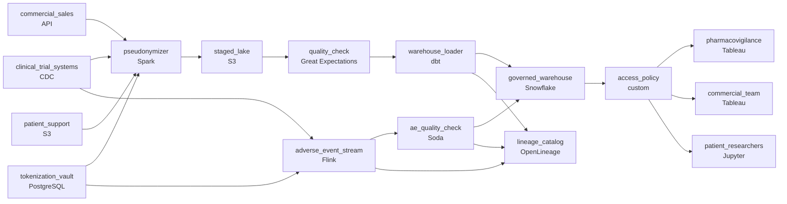

# Every Dataset Needs a Paper Trail
_The FDA has opinions about your data pipeline._

- **Domain:** pipeline_architecture
- **Difficulty:** Hard
- **Est. time:** 25 min
- **URL:** https://datadriven.io/problems/every_dataset_needs_a_paper_trail

## Problem

We're a pharmaceutical company ingesting data from clinical trial systems, commercial sales databases, and patient support program feeds. The data governance team has mandated that every dataset entering the warehouse must have a documented data quality check, a lineage trace, and an access control policy before it goes live. Design the ingestion pipeline and governance framework.

**Concepts tested:** `paBatchProcessing`, `paDagOrchestration`, `paDataQuality`, `paEltVsEtl`, `paFileIngestion`, `paIdempotency`, `paMedallion`, `paMonitoring`, `paPartitioning`, `paRetryHandling`, `paSchemaEvolution`

## Requirements

- Every dataset entering the warehouse needs a lineage trace before it goes live, recorded by the pipeline rather than reconstructed from code.
- Every dataset entering the warehouse needs a documented data quality check before it goes live.
- Every dataset entering the warehouse needs an access control policy, enforced by the platform, before it goes live.

## Must-have components

- The datasets have to land in a governed warehouse where quality, lineage and access controls apply before data goes live. Add a warehouse stage such as Snowflake, BigQuery, Redshift, or Databricks.
- Every dataset entering the warehouse needs a documented quality check before it goes live. Add a quality-check stage (Great Expectations, dbt tests, Soda, Monte Carlo) on the path into the warehouse.

**Expected stages:** `source_ingestion` → `data_quality_gate` → `lineage_metadata_store` → `access_policy_layer` → `governed_warehouse`

## Solution walkthrough

### The trap

This is a governance problem dressed as an ingestion pipeline. Anyone can draw three sources flowing into Snowflake. What separates candidates is **where each control sits**, and whether it holds on every path into the warehouse. The statement only says quality check, lineage trace and access policy. A pharma reader hears more: trial and patient-program records are PHI, and adverse events carry a safety window of hours. Bolt the controls on downstream and each one has a gap. Raw PHI sits in a staging table, an inspector's question turns into a code search, and a serious adverse event waits for tomorrow's batch.

> **Each control sits upstream of what it protects**
>
> For every requirement, ask where it can be enforced earliest. Masking goes before storage. Lineage is emitted by whatever writes the warehouse. Access lives in the warehouse, not the BI tool. The reviewer checks where a control sits and whether every lane passes through it.

### Walk the requirements

**Step 1: Pseudonymize PHI before anything is stored**

Trial and patient-support records pass through `pseudonymizer` before `staged_lake`, so no stored copy holds a raw identifier. Deterministic tokens keep joins across trials working. The mapping must be unreachable from the lake, the warehouse and every consumer. Here it sits in `tokenization_vault`; a keyed hash with the key in a managed service works too. Commercial sales carries no PHI, so routing it through the same transform is harmless, not required.

**Step 2: Emit lineage from every writer**

`warehouse_loader` stamps each row with a source record id, ingestion time and transform version, and publishes run lineage to `lineage_catalog`. The Flink lane does the same. If only the batch path reports lineage, the adverse-event numbers are the ones you cannot trace, and they are the ones inspectors ask about.

**Step 3: Gate every path into the warehouse**

Batch rows pass `quality_check` before dbt promotes them; the stream has its own `ae_quality_check`. What matters is that failing rows stop before landing: quarantine to a review queue, dead-letter, or halt promotion. A fast path that skips validation breaks the mandate.

**Step 4: Enforce tiers in the warehouse, not the dashboard**

`access_policy` binds row and column policies to roles, so public summaries, sales reps, finance and researchers query the same tables and see different slices. Filtering in Tableau leaves you one forgotten clause away from a sales rep exporting patient-level rows.

**Step 5: Give adverse events their own lane**

`adverse_event_stream` tails the trial system, tokenizes against the same mapping, and lands rows within hours for pharmacovigilance. Sales stays on the daily batch. One shared nightly cadence surfaces a serious event the next morning.

### The reference design

| node | type | tech | details |
|---|---|---|---|
| clinical_trial_systems | source | CDC |  |
| commercial_sales | source | API |  |
| patient_support | source | S3 |  |
| tokenization_vault | storage | PostgreSQL |  |
| pseudonymizer | transform | Spark | errorAction: alert |
| staged_lake | storage | S3 | backfillStrategy: partition_overwrite |
| quality_check | quality_gate | Great Expectations | errorAction: alert |
| warehouse_loader | transform | dbt | idempotencyStrategy: upsert |
| adverse_event_stream | transform | Flink | slaFreshness: real-time; idempotencyStrategy: upsert |
| ae_quality_check | quality_gate | Soda | errorAction: alert |
| governed_warehouse | storage | Snowflake | slaFreshness: < 24h |
| lineage_catalog | consumer | OpenLineage |  |
| access_policy | quality_gate | custom | errorAction: alert |
| pharmacovigilance | consumer | Tableau | slaFreshness: < 1h |
| commercial_team | consumer | Tableau | slaFreshness: < 24h |
| patient_researchers | consumer | Jupyter | slaFreshness: < 24h |

> **The fast lane that skips the controls**
>
> A common draft gets the streaming path right, then wires it from source straight to the warehouse. That lane now carries raw PHI, unvalidated rows and no lineage, through the one path built for speed. Every lane needs the same controls, even in a different engine.

> **Name the window where each control fails**
>
> Strong candidates say out loud when a control arrives late. Masking after load leaves raw rows on disk for a whole run. Lineage in a wiki drifts from the code. Filtering in the BI tool trusts every query author. Naming the gap shows you designed for the audit.

- **FDA asks for the lineage of a number computed from three source records across two trials. What do you run?**
  - _Tests whether lineage is data: a query over the row's lineage columns and the catalog, not a forensic search._
- **An external regulator portal needs read access to a subset of rows. What changes?**
  - _Tests whether `access_policy` is seen as the extension point: a new role and policy, with no change to ingestion._
- **Would you replace the mapping store with a keyed hash?**
  - _Tests whether the candidate knows the real requirement is an unreachable mapping, not a particular store._
