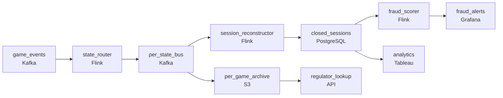

# Every Deal Is a Financial Transaction
_Real money on the table. Reconstruct every hand._

- **Domain:** pipeline_architecture
- **Difficulty:** Hard
- **Est. time:** 10 min
- **URL:** https://datadriven.io/problems/every_deal_is_a_financial_transaction

## Problem

Our platform hosts millions of real-money rummy and poker games daily, and every card deal, bet, and fold is a regulated financial transaction under India's gaming laws. Our fraud team needs to analyze complete game sessions, but right now we only have raw event streams with no session context. Design a pipeline that reconstructs full game sessions and feeds our fraud and analytics systems.

**Concepts tested:** `paDataQuality`, `paDeadLetterQueue`, `paDeduplication`, `paEventDriven`, `paIdempotency`, `paLateData`, `paMonitoring`, `paPartitioning`, `paRetryHandling`, `paStreamProcessing`

## Requirements

- Chips clear within seconds of game end; fraud has to flag suspicious sessions before that happens, not after the money has moved.
- Indian gaming law treats each state's residents under different rules; data has to be partitioned by player state, not pooled globally.
- Each game produces hundreds of micro-events and analysts need them assembled into one session record; disconnected players still need their session to close.
- State regulators may request the complete record of any specific game within days of asking; missing records have cost the platform compliance fines.

## Must-have components

- Sessions reconstruct via keyed state on a continuous event stream and fraud has to flag suspicious sessions before chips clear. Without a streaming tier sessions never close in time. Add a streaming layer on the event path or set SLA Freshness to real-time / < 1min on the processor.
- Indian gaming law treats each state's data differently and complete game records have to be retained per state for years. Without a durable archive tier (S3, GCS, ADLS) there's nowhere to apply per-state partitioning and retention.

**Expected stages:** `game_sessions` → `session_events` → `player_fraud_signals`

## Solution walkthrough

### The real problem under the costume

This is stateful stream reconstruction wearing a compliance costume. The skill probed: can you assemble a session from a keyed event stream and close it on a timer, instead of rebuilding it in a nightly batch? Anyone can log events and reconstruct sessions later. The trap is timing and boundaries: chips clear in seconds, so a batch flag arrives after the money moved; a player who disconnects never sends a final event, so timer-less sessions never close; and per-state law has to be applied where the data lands, not filtered at query time.

> **Close on a timer, partition at ingestion**
>
> A streaming processor keyed by `game_id` holds the event sequence per game and emits a closed session on the final event OR an inactivity timer. Player-state is the partition key at ingestion, so per-state topics and per-state archives apply retention independently. The full ordered event record writes to an immutable per-game store retrievable by `game_id`. Fraud reads closed sessions in tens of seconds; chips clear after fraud has had its window.

---

### Walk the requirements

**Step 1: Flag fraud before chips clear**

The `session_reconstructor` keyed by `game_id` consumes micro-events in order and emits the closed session; `fraud_scorer` subscribes and scores within tens of seconds, and chip clearing is gated on that signal. A batch design is the version where the money has already moved before fraud has a session to look at.

**Step 2: Partition by player state at ingestion**

Events route into `per_state_bus` keyed by state at ingestion and land in per-state archive paths, so retention and access rules run per state. Pooling globally and filtering at query time lets one state's rules bleed into another's records.

**Step 3: Close disconnected sessions on a timer**

The per-game state holds an inactivity timer; if no event arrives in its window, the session closes with a 'disconnected' flag and emits downstream. Without it, those sessions never close and the keyed state grows unbounded.

**Step 4: Keep an immutable per-game record**

Each game's full ordered event sequence writes to `per_game_archive` in cold storage, keyed by `game_id`. A regulator request becomes a lookup by `game_id`. A flat archive that takes hours to grep is how missed records turn into fines.

---

### The shape that fits

| node | type | tech | details |
|---|---|---|---|
| game_events | source | Kafka | parallelism: 16 partitions |
| state_router | transform | Flink | slaFreshness: real-time |
| per_state_bus | queue | Kafka | parallelism: 16 partitions |
| session_reconstructor | transform | Flink | slaFreshness: real-time; idempotencyStrategy: upsert |
| per_game_archive | storage | S3 | backfillStrategy: incremental |
| closed_sessions | storage | PostgreSQL | slaFreshness: < 1min |
| fraud_scorer | transform | Flink | slaFreshness: real-time |
| fraud_alerts | consumer | Grafana | slaFreshness: real-time |
| analytics | consumer | Tableau | slaFreshness: < 1h |
| regulator_lookup | consumer | API | slaFreshness: < 24h |

> **The four properties a reviewer looks for**
>
> A processor keyed by `game_id` emitting closed sessions within tens of seconds; player-state partitioning enforced at ingestion and retained per state; disconnected sessions closed on an inactivity timer; every game's record retained immutably and retrievable per `game_id`.

> **The batch design that ships and fails**
>
> Logging raw events and reconstructing sessions nightly clears chips before fraud has a session; disconnected sessions never close so the reconstruction state grows until operators kill it; state data pools globally; and a regulator request becomes hours of grepping a flat archive. The rewrite is exactly this diagram.

- **An event arrives an hour late, after the inactivity timer already closed the session. What happens, and what does fraud see?**
  - _Tests whether they commit the closed session, append the late event to the immutable `per_game_archive`, and reissue a corrected session downstream only if it materially changes; fraud's original signal stands._
- **A new state introduces a stricter retention rule than the others. What changes, and where?**
  - _Tests whether they see the per-state archive as the boundary: only that state's archive changes; `session_reconstructor` and `regulator_lookup` don't._
