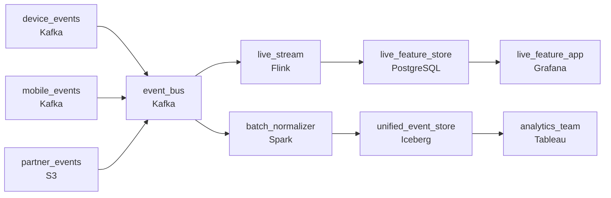

# Every Device Has Its Own Dialect
_Three sources. Three formats. Same workout._

- **Domain:** pipeline_architecture
- **Difficulty:** Medium
- **Est. time:** 25 min
- **URL:** https://datadriven.io/problems/every_device_has_its_own_dialect

## Problem

Our fitness platform receives workout and health events from connected devices, a mobile app, and third-party integrations. Events arrive in multiple formats at different cadences, with different schema versions across device firmware generations. Design the ingestion pipeline that normalizes these into a unified event store.

**Concepts tested:** `paApiIngestion`, `paBatchVsStreaming`, `paDataQuality`, `paDeadLetterQueue`, `paDeduplication`, `paEltVsEtl`, `paEventDriven`, `paEventPlatforms`, `paIdempotency`, `paLateData`, `paMedallion`, `paRetryHandling`, `paSchemaEvolution`, `paStreamProcessing`

## Requirements

- During a live workout, real-time feedback features need device events almost immediately; mobile and partner sources can wait longer.
- Some users are on older firmware that doesn't have the newer fields; rolling out new devices can't break anything for the older ones.
- Users complete workouts in airplane mode and the events upload hours later; the workout has to be reported under when they actually did it.

## Must-have components

- Devices, mobile apps, and partner integrations push events at different cadences and formats; a queue/log tier between producers and the unified store is required to decouple them. Add Kafka, Kinesis, Pub/Sub, or equivalent.
- All three formats converge into a unified event store that downstream consumers read; without a durable storage tier the canonical events have nowhere to live. Add S3, GCS, ADLS, or a lakehouse format.

**Expected stages:** `Device Sources` → `Multi-Format Ingestion` → `Schema Normalization` → `Event Store` → `Serving Layer`

## Solution walkthrough

### Why this problem exists in real interviews

Three sources, multiple firmware versions, and events that can arrive hours after they happened. The trap is treating it as 'normalize on the way in' and discovering that 'normalize' has hidden three contracts: real-time for live workouts, schema tolerance for old firmware, and event-time semantics for offline workouts. Any solution that ignores one of those is shipping with a known bug.

The default shape is one ingest path that converts every event to a single canonical schema, stamps it with the arrival time, and writes to a unified store. Live workout features feel laggy because the canonical conversion runs on a slow batch path. An older device sends an event missing a new field and the canonical converter throws because the schema is required. A user who worked out in airplane mode uploads the next day; the workout shows up reported as today, not yesterday, and their streak is wrong.

> **Trick to Solving**
>
> Two paths off one event bus, additive schema for old and new firmware, `event_time` on every event so airplane-mode workouts land on the right day.
>
> 1. Two cadences off one bus: a streaming path for device events that feed live features, and a batch path for mobile and partner sources that don't need sub-minute.
> 2. Schema is additive: new fields are optional, old fields persist. The unified table absorbs both old and new firmware in the same row layout, with new fields null for old firmware.
> 3. Every event carries `event_time` stamped at the device. The unified store partitions and queries on `event_time`, never on landing time.

---

### Walk the requirements

**Step 1: Two cadences off one bus, sized for the consumer**

Live workout feedback needs device events within a minute; mobile and partner sources tolerate longer. Both flow through the same event bus, but consumed by two different paths: a streaming path for device events that updates the live-online lookup tier, and a batch path for mobile and partner that lands in the unified store on a slower cadence. One bus, two paths. Without the bus there's no fan-out point; without two paths either live features are slow or batch consumers pay streaming compute they don't need.

**Step 2: Additive schema absorbs both firmware versions**

Old firmware doesn't emit new fields; new firmware does. The unified table treats new fields as optional, default-null for events that don't carry them. The canonical converter handles both shapes: missing-field events get nulls, present-field events get values. The trap is splitting old and new into separate tables, which doubles the ETL surface every firmware rollout. Additive evolution is what keeps the table singular while the firmware fleet evolves.

**Step 3: `Event_time` at the device, preserved end-to-end**

A user works out in airplane mode and uploads later. The workout has to be reported under the time they actually did it. Each event carries `event_time` stamped at the device; the unified store partitions and queries on `event_time`, never on landing time. Late uploads land in the right day's partition and trigger a rebuild of just that day's downstream aggregates, not the whole table. Replacing `event_time` with arrival time is the version where every airplane-mode workout shows up on the wrong day.

---

### The shape that fits

| node | type | tech | details |
|---|---|---|---|
| device_events | source | Kafka | parallelism: 16 partitions |
| mobile_events | source | Kafka |  |
| partner_events | source | S3 |  |
| event_bus | queue | Kafka | parallelism: 16 partitions |
| live_stream | transform | Flink | slaFreshness: real-time; idempotencyStrategy: upsert |
| live_feature_store | storage | PostgreSQL | slaFreshness: < 1min |
| batch_normalizer | transform | Spark | errorAction: dlq; slaFreshness: < 1h; backfillStrategy: partition_overwrite |
| unified_event_store | storage | Iceberg | backfillStrategy: partition_overwrite |
| live_feature_app | consumer | Grafana | slaFreshness: < 1min |
| analytics_team | consumer | Tableau | slaFreshness: < 1h |

> **What this design gives up**
>
> Two consumer paths off one bus is more pieces than one big ingest. Additive schema means the unified table grows columns over time and old firmware columns stay present even after the firmware is retired. Event-time partitioning means late uploads trigger small rebuilds. Some complexity is the cost; the win is live features that feel live, old devices that keep working, and workout times users will trust.

> **What reviewers check**
>
> A reviewer looks at the canvas for these properties:
> - An event bus sits between producers and consumers, fanning out to a streaming path for live features and a batch path for the unified store.
> - All formats converge into a unified event store in cold storage; raw events stay around for re-parse.

> **The mistake that ships**
>
> What goes out the door first normalizes everything in one ingest path with the canonical schema as required-field, stamps `arrival_time` as the canonical timestamp, and writes to one unified store. Live workout features feel slow because the path is sized for batch. An older device emits an event missing a new field and the converter rejects it; the team adds an exception for that field and adds another every firmware rollout. Airplane-mode workouts land under the upload day, users complain that their streak is broken, and support spends a week explaining why. The team rebuilds with two paths, additive schema, and `event_time`. The fix is structural; until it lands, every firmware rollout costs another week of patching and another wave of streak-broken support tickets.

---

- **A new firmware adds a new event type that older firmware never sends. What changes in the design, and what doesn't?**
  - _Tests whether the candidate sees that a new event type can ride the same bus and is handled by the normalizer the same way: a new partition or table downstream if the type is meaningfully different, with the additive contract intact. Older firmware just doesn't emit it, which is fine._
- **A partner integration sends events with their own internal timestamp that's slightly off from the user's actual workout. What does this design do?**
  - _Tests whether the candidate sees `event_time` validation: when the partner timestamp differs from a sanity-check (e.g. workout's start vs end), the normalizer can flag the row to a quality-check table and proceed, or use the device's timestamp where available. Trusting the partner's timestamp blindly is the version where partner data corrupts daily aggregates._
