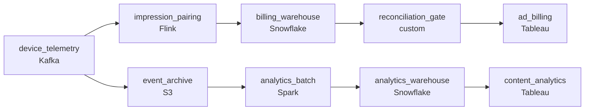

# Every Device, Every Impression
_Every ad seen. Every second watched. Real-time._

- **Domain:** pipeline_architecture
- **Difficulty:** Hard
- **Est. time:** 10 min
- **URL:** https://datadriven.io/problems/every_device_every_impression

## Problem

Our platform streams content to millions of devices and our business depends on accurate ad impression data for billing and reliable viewing event data for content performance analytics. These two consumers have different latency requirements and tolerance for approximation. Design the end-to-end pipeline for device telemetry ingestion and the data model that serves both.

**Concepts tested:** `paBatchVsStreaming`, `paDagOrchestration`, `paDataQuality`, `paDeduplication`, `paEltVsEtl`, `paEventDriven`, `paEventPlatforms`, `paFullVsIncremental`, `paIdempotency`, `paLambdaArch`, `paLateData`, `paMicroBatchVsTrue`, `paMonitoring`, `paPartitioning`, `paRetryHandling`, `paSchemaEvolution`, `paStreamProcessing`, `paTableFormats`

## Requirements

- Ad billing partners reconcile against our impression counts; if we don't match within tolerance, payment is blocked.
- Some events arrive twice from device retries; ad billing can't count the same impression twice, and a missed one is lost revenue.
- An ad that doesn't run to completion within the threshold counts as a partial impression billed at half credit; this happens often enough that we can't apply the rule by hand.
- Devices in low-connectivity locations buffer events for hours; both billing and analytics have to credit those events to the period they happened in.

## Must-have components

- Ad billing requires exactly-once with same-day reconciliation while content analytics tolerates late data and approximate counts. One path can't satisfy both. Show at least one streaming path and at least one batch path.
- Reconciliation against ad server logs and late-impression adjustments require a durable archive; without a cold-storage tier there's nothing to anchor billing reconciliation. Add S3, GCS, or ADLS.

**Expected stages:** `raw_device_events` → `ad_impression_log` → `content_session_events` → `billing_fact` → `content_analytics_mart`

## Solution walkthrough

### The trap

This is an exactly-once ledger hiding inside a telemetry firehose. Billing and analytics read the same device events with opposite correctness budgets. Billing needs every impression counted once, starts paired with completes, and a total that matches the ad server. Analytics can tolerate late, approximate counts. Anyone can draw Kafka into a warehouse. What separates candidates is refusing to let one streaming aggregator serve both. Count raw events and the first daily reconciliation misses tolerance: retries inflate the total, partial credit never gets applied, and **the partner blocks payment**.

> **Billing is a ledger, analytics is a trend**
>
> Split by correctness budget, not by data source. Billing gets a stateful streaming path that dedups and pairs per `impression_id` and is reconciled before publish. Analytics gets a cheaper batch path over the archive. Both bucket by event time.

### Walk the requirements

**Step 1: Dedup on `impression_id` before anything counts**

Key the Flink job on `impression_id` and keep seen ids in state for the lateness window. A device retry with a known id is dropped, and the 'upsert' into the billing warehouse makes a replayed write land on the same row. Counting raw events bills every retry twice.

**Step 2: Pair start and complete in keyed state**

Hold the start until its complete arrives. A complete inside the threshold emits full credit. A start whose timer fires past the threshold emits half credit. The rule lives in one place in code, so every impression gets the same treatment.

**Step 3: Bucket by event time, not arrival time**

Buffered devices deliver hours late. Both paths partition on when the event happened. A late event inside the agreed window reopens its day through '`partition_overwrite`', and the next reconciliation sees it. Arrival-time bucketing inflates today and starves the day the event actually happened.

**Step 4: Gate the billing publish on reconciliation**

Before the daily window, diff the billing fact against the ad server's record. Inside tolerance, publish. Outside, hold and alert. The S3 archive of raw events is what you replay to explain a gap or rebuild a day.

### The shape that fits

| node | type | tech | details |
|---|---|---|---|
| device_telemetry | source | Kafka | parallelism: 16 partitions |
| event_archive | storage | S3 | backfillStrategy: partition_overwrite |
| impression_pairing | transform | Flink | slaFreshness: real-time; idempotencyStrategy: upsert |
| billing_warehouse | storage | Snowflake | slaFreshness: < 24h; backfillStrategy: partition_overwrite |
| reconciliation_gate | quality_gate | custom | errorAction: alert; monitorAlert: Billing total disagrees with ad-server record past tolerance |
| analytics_batch | transform | Spark | slaFreshness: < 24h; idempotencyStrategy: staging_table |
| analytics_warehouse | storage | Snowflake | slaFreshness: < 24h |
| ad_billing | consumer | Tableau | slaFreshness: < 24h |
| content_analytics | consumer | Tableau | slaFreshness: < 24h |

| One stream for both | Two paths, two budgets |
|---|---|
| A running count of raw events serves billing and analytics. Retries double-count, partial credit is never applied, and late events land on arrival day. Reconciliation fails on day one. | Billing dedups and pairs per `impression_id`, then passes a reconciliation gate. Analytics batches from the archive. Each path pays only for the correctness it needs. |

> **Dedup without pairing still overbills**
>
> Candidates add dedup and stop there. A unique start with no complete is still billed at full credit unless state holds it and a timer downgrades it to half.

> **Where the gate sits gives it away**
>
> Seniors put reconciliation before the billing consumer, so a bad day never reaches the partner. Juniors put it after, as a dashboard that reports the damage once it is done.

> **State is bounded by in-flight impressions**
>
> Pairing state holds only open impressions plus seen ids for the lateness window, so memory tracks concurrency, not history. Analytics stays on cheap daily batch instead of paying streaming prices for a trend line.

- **A complete arrives just past the qualifying threshold. What does billing show?**
  - _The timer already emitted half credit; a late complete must not promote it._
- **Reconciliation flags a gap with the ad server. How do you triage it?**
  - _Per-period diff of missing and extra ids, replayed from the S3 archive._
- **A device buffers past the lateness window. Where does that event go?**
  - _Bounded reopen windows versus an explicit adjustment record._
