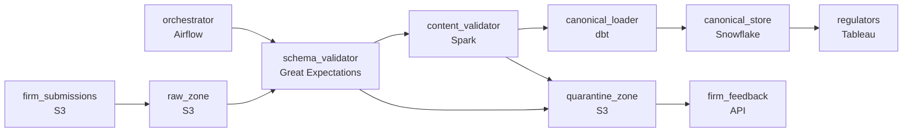

# Every Firm Formats It Differently
_The regulator changed the format. Again. Handle it._

- **Domain:** pipeline_architecture
- **Difficulty:** Medium
- **Est. time:** 10 min
- **URL:** https://datadriven.io/problems/every_firm_formats_it_differently

## Problem

We receive transaction reporting data from tens of thousands of regulated firms under MiFID II, and every firm formats their submission slightly differently. We need a pipeline that can ingest these files, normalize them to a canonical schema, validate them against regulatory rules, and produce an immutable record that auditors can query years later. Build it end-to-end and explain how you handle files whose structure changes without advance notice.

**Concepts tested:** `paBackfill`, `paBatchProcessing`, `paDagOrchestration`, `paDataLake`, `paDataQuality`, `paDeadLetterQueue`, `paEltVsEtl`, `paFileIngestion`, `paIdempotency`, `paMedallion`, `paMonitoring`, `paPartitioning`, `paRetryHandling`, `paSchemaEvolution`, `paSmallFiles`, `paTableFormats`

## Requirements

- Regulators read the canonical store at the start of business the next day; submissions received in the evening have to be validated and loaded by then.
- When a firm's submission fails validation, they need to know which fields failed within hours so they can resubmit before the deadline.
- Any firm can change their column names or layout without notice; an unrecognized format has to be caught on arrival, not after corrupting the canonical store.

## Must-have components

- Regulators read the canonical store at the start of business; without a warehouse / lakehouse tier there's nowhere for the canonical mart. Add Snowflake, BigQuery, Redshift, Databricks, or a lakehouse table format.
- Original submissions stay unchanged for the regulatory retention window, validation failures land in a quarantine zone, and corrections write new versions. Without a cold storage / object-storage tier there's nowhere to host raw, quarantine, and canonical zones. Add S3, GCS, or ADLS.

**Expected stages:** `transaction_reports_canonical` → `validation_failures` → `submission_audit_log`

## Solution walkthrough

### Why this problem exists in real interviews

Tens of thousands of firms submitting under MiFID II, every one in their own format, with regulators reading the canonical store the next morning. The trap is treating schema drift as a parser problem; what's actually needed is a per-firm registered schema, an arrival-time structure check, and feedback to the firm fast enough that they can resubmit before the deadline.

The default reach is one ingester that infers the schema from each file and loads what it can parse. The first format change at any firm corrupts the canonical store with mis-mapped columns; regulators read mismatched data in the morning. Validation failures pile up in a log somewhere and the submitting firm finds out at end-of-day that their submission was rejected , too late to resubmit.

> **Trick to Solving**
>
> Per-firm registered schema enforced at arrival, validation failures back to the firm within hours, raw / quarantine / canonical zones each with their own retention.
>
> 1. Each firm has a registered schema; arrival validates the file against the registered structure before content validation. An unrecognized structure routes to quarantine and pages the firm.
> 2. Validation produces field-level results: the canonical loader writes accepted rows, the failure log captures rejected rows with field-level reasons routed back to the submitting firm within hours.
> 3. Three zones in cold storage: raw (originals unchanged for retention), quarantine (failed-validation files for review and resubmit), canonical (the validated record auditors query for years).
> 4. An orchestrator gates the overnight deadline so every same-day submission lands or is alerted on before regulators open in the morning.

---

### Walk the requirements

**Step 1: Land validated submissions before regulators open the next morning**

An orchestrator schedules per-firm validation as files arrive, with the canonical load gating on validation passing. Sensors fire before the overnight deadline if any firm's submission is at risk. Without orchestration there's nothing watching the deadline; without a canonical warehouse / lakehouse the validated records have nowhere to land for the regulator to query.

**Step 2: Surface field-level validation failures back to firms within hours**

When a submission fails validation, the failure record contains the firm id, the file id, and the field-level reasons. A notification path returns the failure to the submitting firm within hours so they can resubmit before the regulator's deadline. Logging the failure to an internal queue is the version where the firm finds out at end-of-day, by which point their resubmission is too late.

**Step 3: Compare each file to the firm's registered schema; quarantine drifts**

Firms change formats without notice. Each firm has a registered schema (column names, types, order) in the pipeline config; arrival compares the incoming file's structure to the registered schema and quarantines the file if drift is detected. The team triages: update the registered schema, ask the firm to revert, or escalate. Loading a drifted file into the canonical store is the version where mis-mapped columns corrupt the regulator's view; the structure check is the gate that prevents it.

---

### The shape that fits

| node | type | tech | details |
|---|---|---|---|
| firm_submissions | source | S3 |  |
| orchestrator | transform | Airflow | errorAction: alert; monitorAlert: Submission at risk vs overnight deadline |
| raw_zone | storage | S3 | backfillStrategy: incremental |
| schema_validator | quality_gate | Great Expectations | errorAction: alert; monitorAlert: Firm structure drift detected |
| content_validator | transform | Spark | errorAction: dlq |
| quarantine_zone | storage | S3 | backfillStrategy: incremental |
| canonical_loader | transform | dbt | backfillStrategy: partition_overwrite; idempotencyStrategy: staging_table |
| canonical_store | storage | Snowflake | slaFreshness: < 24h |
| firm_feedback | consumer | API | slaFreshness: < 1h |
| regulators | consumer | Tableau | slaFreshness: < 24h |

> **What this design gives up**
>
> Per-firm registered schemas are configuration that has to be maintained for every firm; the three zones cost more storage than a single landing area; field-level validation feedback adds a notification path that has to integrate with each firm's intake; the structure check halts on drift, which means more triage work for the operations team. Implementation cost is the price; the win is the canonical store regulators can trust, firms that get hours of resubmission time, and a quarantine that holds anything suspicious before it corrupts downstream.

> **What reviewers check**
>
> A reviewer looks at the canvas for these properties:
> - Each firm's submission validates against its registered schema at arrival; structural mismatches route to quarantine.
> - Field-level validation results return to the submitting firm within hours so they can resubmit before the deadline.
> - Three zones in cold storage hold raw originals, quarantined failures, and canonical validated records each with appropriate retention.
> - An orchestration layer gates the overnight load against the regulators' next-day-open deadline.

> **The mistake that ships**
>
> What gets shipped infers each file's schema and loads what it can parse. The first format change at a firm causes mis-mapped columns to land in the canonical store; regulators query a corrupted view in the morning. Field-level validation failures pile up in an internal log and firms find out at end-of-day they were rejected; resubmissions miss the deadline. The eventual rebuild is per-firm registered schemas, structure-check on arrival, and field-level feedback within hours.

---

- **A firm legitimately updates their submission format and registers it with the platform first. What in this design lets the new format flow through smoothly?**
  - _Tests whether the candidate sees the registered schema as configuration: the firm registers the new schema, the platform validates files against the new schema starting on the agreed date, and the canonical loader's mapping updates accordingly. The structure-check gate accepts the new shape because it's now the registered one._
- **A firm's submission passes structure validation but contains values that fail content validation in many fields. What does the firm see, and how soon?**
  - _Tests whether the candidate sees field-level feedback: the firm receives the rejected rows with per-field reasons within hours and can correct. The canonical store gets the rows that passed; the rejected rows live in quarantine until the firm resubmits. The deadline contract incentivizes early submission so resubmission has time to land._
