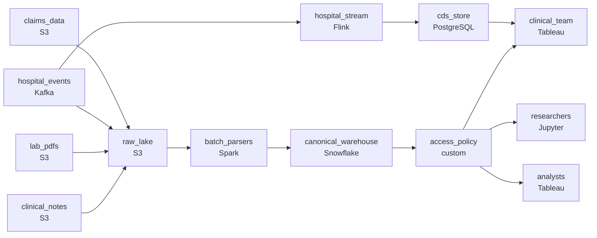

# Every Format Imaginable
_PDFs, HL7, JSON. All of it lands in the same lake._

- **Domain:** pipeline_architecture
- **Difficulty:** Hard
- **Est. time:** 30 min
- **URL:** https://datadriven.io/problems/every_format_imaginable

## Problem

We run a health data platform that aggregates patient records from hospitals, clinics, and labs, and they arrive in every format imaginable: structured insurance claims, semi-structured HL7 hospital messages, PDF lab reports, and free-text clinical notes. Analysts need to query all of it as one canonical patient-event shape, but the raw records carry PHI, so population-health researchers must work from a de-identified view while only the clinical team can reach the raw identifiers. Hospital events feed clinical decision support and must reach it within minutes on their own low-latency serving path, separate from the shared analytical store where claims, lab PDFs, and notes can be up to a day stale. Design the data lake pipeline.

**Concepts tested:** `paApiIngestion`, `paBackfill`, `paCdc`, `paCiCd`, `paColumnarVsRow`, `paCompression`, `paDagOrchestration`, `paDataLake`, `paDataQuality`, `paDeduplication`, `paEltVsEtl`, `paEnvironmentMgmt`, `paFileIngestion`, `paFullVsIncremental`, `paIdempotency`, `paMedallion`, `paMonitoring`, `paPartitioning`, `paRetryHandling`, `paSchemaEvolution`, `paSmallFiles`, `paTableFormats`

## Requirements

- Analysts need to ask questions across claims, hospital records, lab reports, and clinical notes; today they have to work with each format separately.
- Population health research has to use de-identified data; raw PHI is reserved for the clinical team only.
- Hospital events feed clinical decision support and have to be queryable within minutes on their own serving path; the other three sources tolerate up to a day.

## Must-have components

- Raw HL7, PDFs, and free-text notes have to be preserved unchanged for re-parsing and audit; without a cold-storage / data-lake layer there's nowhere to keep them. Add S3, GCS, ADLS, or a lakehouse format on top of one.
- Analysts ask questions across all four sources from a unified analytics layer; without a warehouse / lakehouse tier the canonical patient-event records have nowhere to be queried. Add Snowflake, BigQuery, Redshift, Databricks, or a lakehouse table format.

**Expected stages:** `multi_format_ingestion` → `raw_landing_zone` → `format_parsers` → `normalized_layer` → `queryable_store`

## Solution walkthrough

### Why this problem exists in real interviews

Four sources in four formats with two consumer types and a privacy boundary that has to hold against everyone but the clinical team. The trap is treating the format problem as the hard problem: 'parse them all, write to a table' is the easy half. The hard half is making the canonical record cheap to query for analysts, fast enough for clinical decision support, and de-identified for research without ever exposing PHI.

The default draw is one ETL pipeline per format that lands rows in one big table. Analysts can query, but clinical decision support is reading the same table on the same hourly cadence and missing minutes-fresh hospital events. Researchers query the same table and the access policy is 'we'll trust them not to look at PHI columns,' which is the access posture that fails the next privacy review.

> **Trick to Solving**
>
> Per-format parsing into a canonical record, two paths sized for two consumers, PHI on a restricted column with researchers reading a separate de-identified view.
>
> 1. Each source format gets its own parser; all of them produce the same canonical patient-event schema. Analysts query the canonical view, not four shapes.
> 2. Raw files (HL7, PDF, free-text notes) stay in the data lake unchanged for re-parse and audit. Reprocessing a parser change runs against the raw, not against a derived table.
> 3. Hospital events ride a streaming path to a clinical-decision-support store; the other three formats land in batch on a slower cadence into the warehouse.
> 4. PHI is on a restricted column, with researchers reading a separate de-identified view; the platform enforces access regardless of how the query is written.

---

### Walk the requirements

**Step 1: Canonical patient-event record across four formats**

Each source has its own parser: claims into structured rows, HL7 into structured rows, PDF lab reports into OCR'd structured rows, clinical notes into structured + free-text fields. All four parsers emit the same canonical patient-event schema. Analysts query the canonical view; the four-format problem is upstream. Without a warehouse/lakehouse tier the canonical view has nowhere to live; without keeping raw files in cold storage you can't re-parse when a parser improves.

**Step 2: Restricted PHI column with researchers on a de-identified view**

Raw PHI is on a restricted column accessible only to the clinical team. A separate de-identified view feeds research consumers, with hashed identifiers and any fields that can re-identify either masked or coarsened. The platform enforces who can read which view; researchers can't reach the restricted column regardless of how they write the query. A 'trust people to filter PHI in their query' approach is what fails a privacy review.

**Step 3: Hospital events on a streaming path; the rest batch**

Clinical decision support reads hospital events within minutes; other sources tolerate a day. Hospital events flow through a streaming consumer that updates a CDS store within a minute; claims, PDFs, and notes flow through batch loaders into the warehouse on a slower cadence. Two paths off four sources, sized to the consumer. Forcing all four onto the streaming path is over-engineering; forcing CDS to read from the fully-merged warehouse misses the freshness it needs.

---

### The shape that fits

| node | type | tech | details |
|---|---|---|---|
| claims_data | source | S3 |  |
| hospital_events | source | Kafka |  |
| lab_pdfs | source | S3 |  |
| clinical_notes | source | S3 |  |
| raw_lake | storage | S3 | backfillStrategy: incremental |
| hospital_stream | transform | Flink | errorAction: dlq; slaFreshness: real-time |
| cds_store | storage | PostgreSQL | slaFreshness: < 1min |
| batch_parsers | transform | Spark | errorAction: dlq; slaFreshness: < 24h |
| canonical_warehouse | storage | Snowflake | slaFreshness: < 24h; backfillStrategy: partition_overwrite |
| access_policy | quality_gate | custom | errorAction: alert |
| clinical_team | consumer | Tableau | slaFreshness: < 1min |
| researchers | consumer | Jupyter | slaFreshness: < 24h |
| analysts | consumer | Tableau | slaFreshness: < 24h |

> **What this design gives up**
>
> Four parsers plus a streaming path plus restricted-column access plus a de-identified view is more pieces than 'one ETL.' The canonical schema has to be designed and maintained as the formats evolve. Pipeline simplicity is what gets sacrificed; in return, analysts can ask one question across four sources, CDS lands within minutes, and the privacy boundary holds.

> **What reviewers check**
>
> A reviewer looks at the canvas for these properties:
> - Raw files stay in cold storage so reprocessing a parser improvement doesn't require a re-export from sources.
> - A streaming path serves clinical decision support within minutes; the unified canonical record is queried in a warehouse with column-level access policies.

> **The mistake that ships**
>
> The first version out the door uses one ETL per format into one warehouse table, runs everything on the same hourly cadence, and 'masks' PHI by trusting researchers not to query the columns. CDS misses minutes-fresh hospital events because it's reading the hourly batch table. A privacy review finds a researcher's query that pulled raw identifiers and the team takes a finding. A parser bug means re-parsing a year of files, and the team realizes nothing kept the raw originals. The eventual rebuild is per-format parsers, two paths, restricted columns, and a raw-lake archive. The privacy review and the unparseable backlog hit at the same time, and CDS is offline for hours during the worst of it.

---

- **A new parser improves PDF extraction quality. What in this design lets you reprocess past files, and what doesn't?**
  - _Tests whether the candidate sees the raw lake as the reprocessing source: the new parser runs over the raw files and overwrites the PDF-derived rows in the canonical warehouse. The streaming CDS path doesn't apply (it's only for hospital events)._
- **Researchers ask for a cohort across claims and clinical notes that requires joining on a quasi-identifier (e.g. provider id + date of service). Where does this design draw the line?**
  - _Tests whether the candidate sees that quasi-identifiers can re-identify in small cohorts, even on a 'de-identified' view: the access policy or a stricter export gate has to enforce minimum cohort sizes or apply additional generalisation. The view alone isn't enough._
