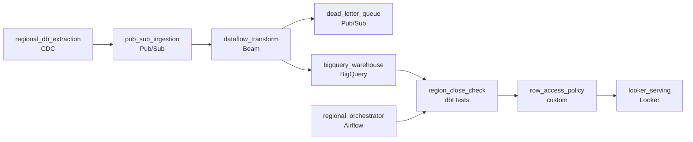

# Every Region Exports Its Own Way
_Sales data, BigQuery, Dataflow. Make it all sing._

- **Domain:** pipeline_architecture
- **Difficulty:** Medium
- **Est. time:** 20 min
- **URL:** https://datadriven.io/problems/every_region_exports_its_own_way

## Problem

Our sales organization runs entirely on GCP and needs an end-to-end data pipeline to move transactional sales data from multiple regional databases into a centralized analytics layer. Right now every regional team runs its own ad-hoc exports. Design a unified pipeline that handles ingestion, transformation, and storage and delivers query performance that meets business SLAs.

**Concepts tested:** `paBackfill`, `paBatchProcessing`, `paBatchVsStreaming`, `paColumnarVsRow`, `paDagOrchestration`, `paDataLake`, `paDataQuality`, `paDeadLetterQueue`, `paDeduplication`, `paDependencyMgmt`, `paEltVsEtl`, `paEnvironmentMgmt`, `paEventPlatforms`, `paFullVsIncremental`, `paIdempotency`, `paLateData`, `paMedallion`, `paMonitoring`, `paPartitioning`, `paRetryHandling`, `paScdPipeline`, `paSchemaEvolution`, `paStreamProcessing`

## Requirements

- Regional sales managers expect same-day actuals on their dashboard each morning; the global executive view has to include all regions.
- The CFO has set a target to bring the warehouse bill down without slowing reports.
- Deal-level sales data is commercially sensitive; sales reps see only their own region while finance sees everything.

## Must-have components

- Regional sales managers and the global executive view both query a centralized analytics warehouse. Without a warehouse tier there's nowhere to land the unified data. Add BigQuery, Snowflake, Redshift, or Databricks.
- Each region has to land before its 9am local-time deadline and one slow region can't block the others; without an orchestration layer there's nothing to express per-region scheduling and isolation. Add Composer, Airflow, Dagster, or Prefect.

**Expected stages:** `regional_db_extraction` → `pub_sub_ingestion` → `dataflow_transform` → `bigquery_warehouse` → `looker_serving`

## Solution walkthrough

### What this really is

This is multi-tenant warehouse consolidation presented as an ingestion project. Anyone can draw regional databases flowing into BigQuery. The real question is whether three asks from three rooms survive one pipe: morning actuals per region, a smaller bill, and region isolation on deals. The trap is a single nightly job that pulls every region into one flat table. **The slowest region then sets everyone's deadline.** Every dashboard scans the whole table. Region filtering lives in the BI tool, one forgotten clause away from a sales rep seeing another region's deals.

The stage list (`pub_sub_ingestion`, `dataflow_transform`) looks like streaming, yet nobody acts on intraday numbers. That is not a contradiction. Transport can be continuous while the contract with consumers stays daily. Change events trickle in all day, and each region-day is declared final once, before that region's morning.

> **Stream the transport, close the day in batch**
>
> Continuous CDC into Pub/Sub removes the 2am export crunch, so data is already in BigQuery when the day ends. The orchestrator only has to verify and publish each region-day. It no longer races a giant extract against the clock.

### Walk the requirements

**Step 1: Replace ad-hoc exports with CDC into Pub/Sub**

`regional_db_extraction` reads each regional database's change log and publishes to `pub_sub_ingestion`, keyed by region. Each region now ships the same way, and a stalled region only grows its own backlog.

**Step 2: Clean and upsert in `dataflow_transform`**

Beam normalizes each region's schema, dedups on `deal_id`, and upserts into the `sale_date` partition. Redelivered messages and replays overwrite rows instead of doubling revenue. Rows that fail parsing go to `dead_letter_queue` so one bad region payload cannot stall the job.

**Step 3: Close each region-day independently**

`regional_orchestrator` (Airflow on Composer) runs one task per region on that region's local clock. `region_close_check` confirms row counts against the source before publishing the day. A late region pages on-call hours before its deadline and blocks no one else. The global executive view refreshes once all regions have closed.

**Step 4: Partition by `sale_date`, cluster by `region`**

This layout is the CFO answer. A regional manager's 'last 7 days' query prunes to 7 partitions and, inside them, to one region's blocks. Bytes billed track the question asked, not the table size.

**Step 5: Put a row access policy on the deal table**

BigQuery row-level security filters `region` by the caller's group. Finance gets a policy that grants all rows. The boundary lives on the table, so Looker, a notebook, or a CSV export all return the same rows.

### The reference design

| node | type | tech | details |
|---|---|---|---|
| regional_db_extraction | source | CDC |  |
| pub_sub_ingestion | queue | Pub/Sub |  |
| dataflow_transform | transform | Beam | errorAction: alert; idempotencyStrategy: upsert |
| dead_letter_queue | queue | Pub/Sub |  |
| bigquery_warehouse | storage | BigQuery | slaFreshness: < 24h; backfillStrategy: partition_overwrite |
| regional_orchestrator | transform | Airflow | errorAction: alert; monitorAlert: Region-day not closed 2h before local morning deadline |
| region_close_check | quality_gate | dbt tests |  |
| row_access_policy | quality_gate | custom |  |
| looker_serving | consumer | Looker | slaFreshness: < 24h |

| One nightly global job | Per-region close |
|---|---|
| Extracts every region in one run. One slow region delays the whole run, and a rerun reloads the world, often appending duplicates. | Data arrives all day. Each region closes on its own clock. A rerun overwrites one `sale_date` partition for one region. |

> **A Looker filter is not access control**
>
> Candidates add a `region` filter to the Explore and call isolation done. The first analyst with direct BigQuery access, or a scheduled export, bypasses it. Enforcement belongs where the rows live.

> **Pruning turns terabytes into gigabytes**
>
> Take three years of deals at about 2 TB across six regions. A weekly regional query on a flat table bills 2 TB. With `sale_date` partitions and `region` clustering it reads roughly 7 of 1,095 days and a sixth of those blocks, about 2 GB. Repeat that across every morning dashboard and the CFO target is met.

> **Replays replace, never append**
>
> Strong candidates volunteer this unprompted: reprocessing a past region-day overwrites that partition, and the `deal_id` upsert absorbs Pub/Sub redelivery. Ask 'what happens if you rerun Tuesday for EMEA?' and the answer should be 'nothing doubles'.

- **A dashboard filters by date but still reads too many bytes. What do you check?**
  - _Whether the filter hits `sale_date` directly or through a function that defeats pruning, and whether `region` is in the predicate so clustering applies._
- **APAC's source schema adds a column mid-quarter. What breaks?**
  - _Schema evolution in `dataflow_transform`: absorb additive columns, and route unknown shapes to `dead_letter_queue` instead of failing the region._
- **A finance analyst moves into a regional role. What changes?**
  - _Only their group membership. The row access policy re-scopes every query with no report edits._
