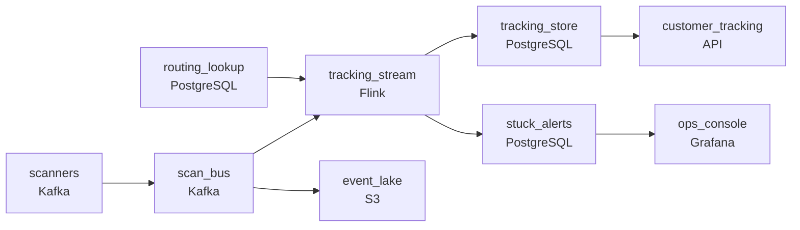

# Every Scan, Every Parcel, Every Pin Code
_Out for delivery. Delivered. Except the events arrived backwards._

- **Domain:** pipeline_architecture
- **Difficulty:** Medium
- **Est. time:** 10 min
- **URL:** https://datadriven.io/problems/every_scan_every_parcel_every_pin_code

## Problem

We're a logistics company delivering parcels across 18,000 pin codes in India, and every scan at a warehouse, vehicle, or delivery point is a tracking event. Our customers expect real-time shipment status, and our ops team needs to know when parcels are stuck or moving in the wrong direction. The problem is that scan events arrive out of order - a parcel can be scanned at delivery before we've received the confirmation it left the origin hub. Design a pipeline that maintains accurate shipment state despite these ordering issues.

**Concepts tested:** `paDataQuality`, `paDeadLetterQueue`, `paEventDriven`, `paEventPlatforms`, `paFullVsIncremental`, `paIdempotency`, `paLateData`, `paMicroBatchVsTrue`, `paMonitoring`, `paPartitioning`, `paStreamProcessing`

## Requirements

- Customers expect their tracking page to reflect a new scan within minutes; today they call support saying their package is missing.
- When a shipment hasn't moved in too long, ops needs to know quickly; today they only find out when customers complain.
- Routing decisions have to be made on every scan at high volume; the lookup can't slow down scanning.

## Must-have components

- Real-time customer tracking and quick stuck-shipment detection can't wait for batch. Add a streaming layer (Flink, Spark Streaming, Kafka Streams) keyed by AWB, or set SLA Freshness to real-time / < 1min on the stream processor.
- Tens of thousands of scans per second feed downstream consumers; without a queue/log tier between scanners and stream processor, there's no buffer for bursts and no fan-out point. Add Kafka, Kinesis, Pub/Sub, or equivalent.

**Expected stages:** `shipment_state` → `scan_events_raw` → `delivery_exceptions` → `pin_code_routing`

## Solution walkthrough

### Why this problem exists in real interviews

Out-of-order tracking scans are a stateful-streaming problem in disguise: customers want the latest state in minutes, ops wants the **absence** of state (stuck parcels), and routing wants a lookup fast enough not to slow scanning. The trap is treating each scan as it arrives without a per-parcel state machine keyed by `AWB`. Get it wrong and a delivery scan that lands before the origin scan flashes 'delivered' on a parcel that never shipped.

The first reach is a stream that upserts each scan into a tracking table by parcel id, keeping the latest by event-time. But if the delivery scan arrives first the customer page briefly contradicts itself; ops queries 'not moving' on a slow batch and learns of stuck parcels hours after customers do; and routing reads pin-code reference from the OLTP on every scan until it buckles.

> **Per-parcel state does all three jobs**
>
> Per-parcel state on a stream processor that respects event-time cracks all three requirements at once: the processor reorders an out-of-order arrival before it updates the customer state, a watermark-driven timer on that same state fires the stuck alert, and a low-latency lookup tier serves routing without touching the OLTP.

---

### Walk the requirements

**Step 1: Stream into a per-parcel state machine that respects event-time**

Scan events flow through a queue into a stream processor keyed by `AWB`. For each parcel the processor holds an event-time-ordered list of scans and emits the resulting state to the tracking store, so an out-of-order delivery scan arriving before the origin scan doesn't flash 'delivered'. Without stateful streaming the customer view is whichever scan landed last, not the parcel's real progress.

**Step 2: Stuck-shipment detection as a watermark timer on the stream**

The same per-parcel state arms a watermark-driven timer that fires when no scan arrives inside the operational window, emitting a 'stuck' event to ops. Because it's event-time driven, a delayed batch of scans doesn't trigger false alerts. A periodic batch query for 'no recent scan' lags by the batch interval and floods the store on every load.

**Step 3: Routing reference in a low-latency lookup tier, not the OLTP**

Routing lookups run on every scan at peak. The stream reads pin-code routing from a low-latency online store fed from the routing source on a slow cadence, with a tens-of-milliseconds budget, keeping that traffic off the OLTP. Reading routing from the OLTP on every scan is what slows scanning and risks the operations database at peak.

---

### The shape that fits

| node | type | tech | details |
|---|---|---|---|
| scanners | source | Kafka |  |
| scan_bus | queue | Kafka | parallelism: 16 partitions |
| tracking_stream | transform | Flink | parallelism: 16 partitions; slaFreshness: real-time; idempotencyStrategy: upsert |
| tracking_store | storage | PostgreSQL | slaFreshness: < 1min |
| routing_lookup | storage | PostgreSQL | slaFreshness: < 1min |
| stuck_alerts | storage | PostgreSQL | slaFreshness: < 1min |
| event_lake | storage | S3 | backfillStrategy: partition_overwrite |
| customer_tracking | consumer | API | slaFreshness: < 1min |
| ops_console | consumer | Grafana | slaFreshness: < 1min |

> **What this design gives up**
>
> Per-parcel state costs more memory than 'upsert latest scan', and the processor must be sized for the active-parcels working set. The watermark timer means stuck detection lags by the watermark interval, and the routing tier duplicates the reference data. The payoff: a customer view that never flashes wrong states, ops alerts that fire from the absence of scans, and scanning that stays fast.

> **What reviewers check**
>
> A reviewer scans for three properties: a queue buffers scans between scanners and a stateful stream keyed by `AWB`; the stream holds per-parcel state with event-time ordering and emits stuck alerts on a timer; routing reference sits in a low-latency lookup tier read by the stream, not the OLTP.

> **The mistake that ships**
>
> What ships first upserts each scan into a tracking table and reads it on the customer page. A delivery scan lands first after a scanner's network blip, and the page shows 'delivered' before the parcel shipped. Stuck detection runs hourly, so complaints outrun the dashboard, and OLTP routing lookups slow scanning at peak. The rebuild always re-adds the three things the first cut deferred: per-parcel state, watermark-driven stuck detection, and a routing lookup tier.

---

- **A scanner is offline for hours and dumps its buffer on reconnect. What reorders the events, and what does the customer see during the flush?**
  - _Tests event-time semantics: buffered scans are inserted in event-time order and the customer state converges to the final state rather than flickering through each buffered scan._
- **Ops wants the stuck threshold to vary by route (rural tolerates longer than urban). Where does that config live and what changes in the stream?**
  - _Tests seeing per-route thresholds as state the stream reads alongside the routing lookup, arming each parcel's timer by its route rather than a hardcoded interval._
