# Every Version of You

- **Domain:** pipeline_architecture
- **Difficulty:** Medium
- **Est. time:** 25 min
- **URL:** https://datadriven.io/problems/every_version_of_you

## Problem

A retail bank rebuilds its customer dimension every night from a 400M-row account-state extract, and analysts need every change to an account preserved as its own dated version rather than overwritten. The build has to finish before the 7am reporting window even though a few corporate accounts each generate millions of change records, and it can only start once the upstream extract job signals it has landed. Lately the run has been blowing past 7am on nights when those heavy accounts churn.

**Concepts tested:** `paBatchProcessing`, `paBatchVsStreaming`, `paDagOrchestration`, `paDataQuality`, `paDependencyMgmt`, `paFullVsIncremental`, `paMonitoring`, `paPartitioning`, `paScdPipeline`

## Requirements

- Analysts need to see what an account looked like on any past date, so every change has to become its own dated version instead of overwriting the row.
- A handful of corporate accounts generate millions of change records each, and the run drags on the nights they churn.
- The merge must not start until the upstream account-state extract has finished landing.
- The dimension has to be published before the 7am reporting window, every night.
- A failed or re-run night should not duplicate versions or corrupt the history.

## Must-have components

- This is a nightly rebuild, not a stream. Add a daily batch processing stage that runs the dimension merge once per night against the extract.
- The merge can only start after the upstream extract signals completion. Add an orchestration layer that owns the schedule, the upstream dependency, and the 7am SLA.
- The versioned customer dimension has to live somewhere analysts can query point-in-time history. Add a warehouse stage that holds the dimension with valid_from / valid_to rows.
- An SCD Type 2 merge that double-opens or fails to close a version corrupts history silently. Add a quality gate that checks for overlapping or orphaned versions before the dimension is published.
- The merged dimension must pass the version-overlap check before it is published. Connect the quality gate to the warehouse so no dimension lands for analysts until it has been validated for overlapping or orphaned versions.

**Expected stages:** `account_state_extract` → `orchestrator` → `staged_changes` → `scd2_merge` → `quality_gate` → `customer_dimension` → `reporting`

## Solution walkthrough

### Why this problem exists in real interviews

This is an SCD Type 2 merge dressed up as a nightly dimension build, and the trap is treating it as a daily overwrite. Anyone can write 'rebuild the customer dimension from the extract'; the skill being probed is whether you close the prior version and open a new one for only the rows that changed, keep the history queryable point-in-time, and do it before 7am when a few corporate accounts each dump millions of change records into one task. Overwrite the table and you delete every past version analysts need for regulatory joins. Merge naively and one hot account stretches a single task for hours while the cluster sits idle.

The default reach is a full-table compare: read all 400M rows, diff against the current dimension, and rewrite. It works on a quiet night and quietly misses the SLA on a busy one, because the join skews on the handful of accounts that generate most of the change volume. More compute doesn't help: the work is concentrated on one key, not spread thin across many.

> **Trick to Solving**
>
> An SCD2 pipeline is correct when three things hold at once: only changed rows version, the merge survives a re-run, and the hot keys don't own a single task.
>
> 1. Detect change by hashing the tracked attributes, so the merge touches the few million rows that actually changed, not all 400M.
> 2. Salt the merge key on the known hot accounts so their records spread across tasks instead of piling onto one.
> 3. Build into a staging table and publish with a partition overwrite, so a failed night re-runs to the same result with no duplicate open versions.

---

### Walk the requirements

**Step 1: Gate the merge on the extract, not the clock**

The merge can only start once the upstream account-state extract has landed, and the extract slips from 2am to 4am on bad nights. The orchestration layer waits on a completion signal (a sensor or task dependency), then runs, and raises an alert before 7am if the run is at risk. Schedule the merge on a fixed clock time instead and on slip nights it reads a half-written extract and produces a wrong dimension nobody catches until the reports are already out.

**Step 2: Version only what changed**

Hash the tracked attributes on each incoming account and compare to the hash on its current open version. Equal hash means no new version. Different hash means close the old row (set `valid_to` to the as-of date) and open a new one (`valid_from` = as-of, `valid_to` = null). This shrinks the merge from 400M rows to the few million that genuinely changed, and it is what keeps history point-in-time correct instead of stamping every account with tonight's date.

**Step 3: Spread the hot keys before they own a task**

A few corporate accounts generate millions of change records. In a plain merge those all hash to one partition and one task runs for hours while the rest finish in minutes. Salt those keys (append a small random suffix on the heavy accounts, join on the salted key, then collapse) so the work spreads across tasks. If the current-dimension side is small enough, broadcasting it avoids the shuffle entirely. Which one you pick is whatever the Spark UI's slow stage tells you.

**Step 4: Make the night re-runnable**

Build the merged result into a staging table keyed by business key and as-of date, validate it, then publish atomically with a partition overwrite. A retry of the same night overwrites the same partition and converges to the same dimension. Append directly into the live table instead and a half-completed night that gets re-run leaves two open versions on the same account, which silently double-counts in every downstream join.

---

### The shape that fits

```mermaid
flowchart LR
    account_state_extract["account_state_extract<br/>Upstream extract, 400M rows/night"]
    orchestrator["orchestrator<br/>Airflow, sensor on extract + 7am SLA alert"]
    staged_changes["staged_changes<br/>Delta Lake, hashed change detection"]
    scd2_merge["scd2_merge<br/>Spark, salted merge on hot keys"]
    quality_gate["quality_gate<br/>Great Expectations, no overlapping versions"]
    customer_dimension["customer_dimension<br/>Warehouse, valid_from / valid_to history"]
    reporting["reporting<br/>BI + regulatory, point-in-time joins"]
    account_state_extract --> orchestrator
    orchestrator --> staged_changes
    staged_changes --> scd2_merge
    scd2_merge --> quality_gate
    quality_gate --> customer_dimension
    orchestrator --> customer_dimension
    customer_dimension --> reporting
```

| node | type | tech | details |
|---|---|---|---|
| account_state_extract | source | Upstream extract, 400M rows/night |  |
| orchestrator | transform | Airflow, sensor on extract + 7am SLA alert |  |
| staged_changes | storage | Delta Lake, hashed change detection |  |
| scd2_merge | transform | Spark, salted merge on hot keys |  |
| quality_gate | quality_gate | Great Expectations, no overlapping versions |  |
| customer_dimension | storage | Warehouse, valid_from / valid_to history |  |
| reporting | consumer | BI + regulatory, point-in-time joins |  |

> **Interviewers Watch For**
>
> The tell of a senior answer is naming what to do when the run suddenly takes longer one night. The weak answer scales the cluster. The strong answer opens the Spark UI, sees one task running long while the rest finished, recognizes skew, and checks which corporate account churned that night before touching infrastructure. Diagnosis before remediation is the signal.

> **Common Pitfall**
>
> Overwriting the dimension every night because it is the simplest merge to write. It passes review, dashboards look fine, and then a regulatory report asks for an account's state as of six months ago and the history is gone. SCD Type 2 is non-negotiable here precisely because the consumers join facts to the dimension on the as-of date, not the latest state.

| Full overwrite | Hashed SCD2 merge |
|---|---|
| Reads all 400M rows, rewrites the whole dimension, loses history, and skews hard on the hot accounts because the entire table re-joins every night. | Versions only the few million changed rows, preserves point-in-time history, and confines the skew to the salted hot keys so the SLA holds on busy nights. |

---

- **A corporate account triples its daily churn permanently. The salting that worked stops being enough. What changes?**
  - _Tests whether the candidate revisits the skew remedy as data shifts: re-profile the hot keys, raise the salt factor, or pre-aggregate that account's changes separately rather than assuming a one-time fix._
- **A late correction arrives for an account's attribute that was already versioned two nights ago. How do you fix the history without breaking downstream joins?**
  - _Tests whether the candidate can do a retroactive SCD2 repair: rewrite the affected as-of partition with corrected `valid_from` / `valid_to` and re-publish, rather than opening a new version dated today that misrepresents when the change happened._
