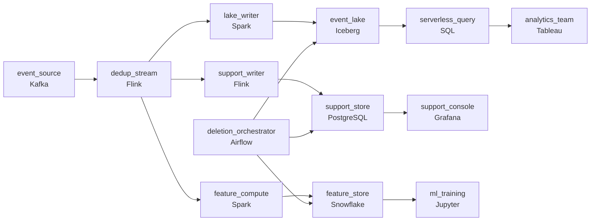

# Everyone Wants the Same Data, Differently
_How you store it decides how fast you can read it._

- **Domain:** pipeline_architecture
- **Difficulty:** Hard
- **Est. time:** 25 min
- **URL:** https://datadriven.io/problems/everyone_wants_the_same_data_differently

## Problem

Several teams at our company need the same event data but query it very differently. Design a data ingestion pipeline and consider the tradeoffs depending on how the data will be accessed.

**Concepts tested:** `paBatchProcessing`, `paBatchVsStreaming`, `paColumnarVsRow`, `paDagOrchestration`, `paDataLake`, `paDataQuality`, `paDeduplication`, `paEltVsEtl`, `paEventDriven`, `paEventPlatforms`, `paIdempotency`, `paLateData`, `paMedallion`, `paPartitioning`, `paSmallFiles`, `paStreamProcessing`, `paTableFormats`

## Requirements

- Analytics looks at weeks of trends, support pulls one customer's history, and ML scans the last week; one storage shape can't serve all three.
- We can't keep paying full price to store three years of data; older data is rarely touched but has to be retrievable when someone asks.
- When a customer asks to be deleted, every team's view has to forget them, not just the main analytics tables.
- The source delivers events more than once on retries; analytics, support, and ML all have to count each event once.

## Must-have components

- Three teams query the same data on very different cadences: analytics scans weeks, support fetches one customer, ML scans the last week. One storage shape can't serve all three. Show at least one streaming/serving path and at least one batch path.
- Three years of history can't sit on hot storage at the cost the business will accept. Without a cold storage tier, older data either stays expensive or can't be retrieved when someone asks. Add a cold storage / data lake layer.

**Expected stages:** `data_source` → `ingestion_layer` → `storage_layer` → `serving_views` → `tiered_archive`

## Solution walkthrough

### What this really is

This is a fan-out problem dressed up as a storage question. There is one event stream and three read shapes. Analytics scans weeks by date, support fetches one customer, and ML scans the last week. Everyone can draw the ingest. The trap is the **warehouse monolith**: one big table, with each team writing its own SQL. It fails three ways at once. Support waits on scans built for analysts. Three years of history bills at hot-storage prices. The first deletion request turns into a week-long hunt through derived tables nobody inventoried.

> **Fan out the data, then fan out the delete**
>
> Dedup once on a stable event id, then write three layouts from the same clean stream. Send deletion down the same paths the events took. The set of stores that must forget a customer is then exactly the set the diagram already draws.

### Walk the requirements

**Step 1: Give each read shape its own layout**

Analytics gets a date-partitioned Iceberg lake for scans. Support gets a customer-keyed PostgreSQL store for point lookups. ML gets a weekly feature table. A single shared store means at least two of the three workloads lose, because pruning partitions by date does nothing for a lookup by customer.

**Step 2: Keep old history in the lake, not offline**

Iceberg on object storage holds the three-year retention. Old partitions cost object-storage prices and are scanned on demand through the same SQL engine. That is slower, but it answers in minutes. There is no restore-from-archive ticket, which is the bar the requirement actually sets.

**Step 3: Dedup before the fan-out**

Source retries duplicate events. The Flink stage dedups on the event id once. The lake writer upserts on the same key, so a replay overwrites a row instead of appending a second one. If three teams dedup separately, you get three different event counts for one customer, and then nobody trusts any of them.

**Step 4: Route deletion through every store**

The Airflow orchestrator issues the delete to the lake, the support store and the feature store. It closes the request only when all three confirm. A confirmation still missing past the SLA fires an alert. That confirmation log is the proof an auditor asks for.

### The reference design

| node | type | tech | details |
|---|---|---|---|
| event_source | source | Kafka | parallelism: 16 partitions |
| dedup_stream | transform | Flink | slaFreshness: real-time; idempotencyStrategy: upsert |
| lake_writer | transform | Spark | slaFreshness: < 15min; backfillStrategy: partition_overwrite |
| event_lake | storage | Iceberg | backfillStrategy: partition_overwrite |
| support_writer | transform | Flink | slaFreshness: real-time; idempotencyStrategy: upsert |
| support_store | storage | PostgreSQL | slaFreshness: < 1min |
| feature_compute | transform | Spark | slaFreshness: < 1h |
| feature_store | storage | Snowflake | slaFreshness: < 1h |
| serverless_query | transform | SQL | slaFreshness: < 1h |
| deletion_orchestrator | transform | Airflow | errorAction: alert; monitorAlert: Deletion confirmations missing past SLA |
| analytics_team | consumer | Tableau | slaFreshness: < 1h |
| support_console | consumer | Grafana | slaFreshness: < 1min |
| ml_training | consumer | Jupyter | slaFreshness: < 1h |

> **Pay for scans, not for idle bytes**
>
> Analytics queries prune to a few date partitions, so a three-week trend reads a sliver of three years. Support hits an index on the customer id and returns in milliseconds. Old data costs object-storage prices plus the rare scan, instead of a warehouse tier that keeps everything hot.

> **One clustered table is not three layouts**
>
> Candidates draw one Snowflake table with clustering and call it done. Analytics is happy. Then support complains about latency and ML retraining contends with analysts. The first GDPR request shows that nobody knows which exports and derived tables hold the customer.

> **Deletion with proof is the senior tell**
>
> Most candidates mention GDPR. Few draw the control path that reaches every store and holds the request open until each one confirms. Saying 'we delete from the main table' tells the interviewer you have never answered an audit.

- **ML now wants three years of features, not one week. What changes?**
  - _Tests whether you treat the lake as the long retention. The right move computes long-window features from Iceberg in batch rather than stretching the feature store to hold them._
- **A delete arrives while the support store is down. What does the audit show?**
  - _Tests whether the orchestrator retries and keeps the request open, rather than reporting completion before every store has confirmed._
