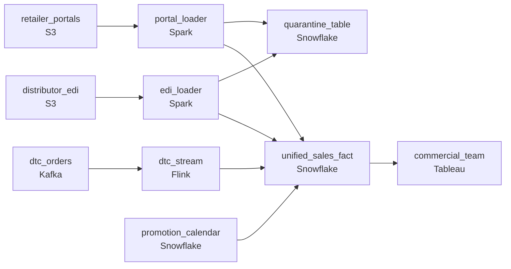

# Fifty Thousand Retailers
_Retail data at CPG scale. Every SKU, every store._

- **Domain:** pipeline_architecture
- **Difficulty:** Medium
- **Est. time:** 20 min
- **URL:** https://datadriven.io/problems/fifty_thousand_retailers

## Problem

We're a consumer packaged goods company selling through 50,000 retail partners worldwide, and sell-through data arrives three ways: distributor EDI files and retailer portal exports on daily and weekly drops, and direct-to-consumer orders that stream in continuously. Design one unified sell-through pipeline across all three channels where every row carries how fresh its source is, and where promoted units stay separable from baseline for demand planning. Retailer files routinely include duplicate and bad-code rows the data team needs to review, so route those aside for triage rather than silently dropping them.

**Concepts tested:** `paBatchProcessing`, `paBatchVsStreaming`, `paDagOrchestration`, `paDataQuality`, `paDeadLetterQueue`, `paDeduplication`, `paEventDriven`, `paFileIngestion`, `paIdempotency`, `paKappaArch`, `paLateData`, `paSchemaEvolution`, `paStreamProcessing`

## Requirements

- The commercial team wants one view across direct-to-consumer, distributor feeds, and retailer portals; today the channels are silos with different freshness.
- Retailer files contain duplicate rows and bad product codes; the commercial data team reviews them rather than have the pipeline silently drop them.

## Must-have components

- The unified sales fact across 50,000 retailers and three channels is the named target. Without a warehouse tier there's nowhere for it to live. Add Snowflake, BigQuery, Synapse, or Databricks.
- Direct-to-consumer orders flow in real time, distributor EDI lands daily, and retailer portals arrive weekly; one shared cadence either over-spends or under-serves. Show at least one streaming path and at least one batch path.

**Expected stages:** `edi_ingestion` → `portal_ingestion` → `dtc_event_stream` → `canonical_transform` → `unified_sales_fact`

## Solution walkthrough

### Why this problem exists in real interviews

Three channels with three different cadences feeding one commercial view, plus a baseline-vs-promoted attribution that has to use the right promotion at the sale's moment, plus an honest path for the bad rows retailers always send. The trap is forcing all three channels onto one schedule and treating attribution as a today's-state lookup.

The default reach is one nightly job that pulls every channel, joins to the current promotion, drops anything that fails validation, and serves the commercial team. DTC orders show up a day late so the team starts running ad-hoc queries against the OLTP, putting load right back on production. Sales from last week's promotion get attributed to this week's. The dropped rows pile up silently and the next demand-planning meeting has unexplained gaps in the channel total.

> **Trick to Solving**
>
> Per-channel cadence into one warehouse, point-in-time promotion lookup at sale-time, bad rows quarantine for review.
>
> 1. Each channel has its own ingest path: DTC streams in, EDI lands daily, retailer portals load weekly. They converge in a unified sales fact with a freshness column on each row.
> 2. The promotion calendar is a slowly-changing dimension keyed on (sku, retailer, `valid_from`, `valid_to`). Sales join on `sale_date BETWEEN valid_from AND valid_to`.
> 3. Validation routes invalid rows to a quarantine table; the rest of the file continues. The commercial data team reviews quarantine on its own cadence.

---

### Walk the requirements

**Step 1: Per-channel cadence into one unified sales fact**

DTC orders ride a streaming path into the warehouse within minutes; distributor EDI feeds land in a daily batch; retailer portals load weekly. All three converge on the same unified sales fact, with each row tagged with the channel and the freshness as of arrival. The commercial team reads the unified fact and sees both the data and how fresh each channel's slice is. One shared schedule wastes streaming compute on the weekly source and starves the fast source; per-channel cadence sizes the work to the consumer.

**Step 2: Attribute sales to the promotion that was running then**

Promotions are scoped per SKU and retailer and they change. Model the calendar as a slowly-changing dimension keyed on (sku, retailer, `valid_from`, `valid_to`) and join sales on `sale_date BETWEEN valid_from AND valid_to`. A sale on a promoted SKU during the promotion gets the promo tag; a sale outside the window stays baseline. Joining to today's active promotions silently retags last week's sales every time a new promotion kicks off, and demand planning's baseline number drifts.

**Step 3: Quarantine bad retailer rows; the good rows keep moving**

Retailer files routinely contain duplicate rows and bad product codes. Validation routes those rows to a quarantine table with the rejection reason; the rest of the file flows into the unified fact. The commercial data team queries the quarantine on its own cadence, fixes the upstream issue with the retailer, and replays. Silently dropping the bad rows is the move that hides how often this is happening, and the channel totals quietly diverge from what the retailer actually reported.

---

### The shape that fits

| node | type | tech | details |
|---|---|---|---|
| dtc_orders | source | Kafka |  |
| distributor_edi | source | S3 |  |
| retailer_portals | source | S3 |  |
| dtc_stream | transform | Flink | slaFreshness: real-time; idempotencyStrategy: upsert |
| edi_loader | transform | Spark | errorAction: dlq; slaFreshness: < 24h; idempotencyStrategy: staging_table |
| portal_loader | transform | Spark | errorAction: dlq; idempotencyStrategy: staging_table |
| quarantine_table | storage | Snowflake | monitorAlert: Quarantine row count above expected baseline |
| unified_sales_fact | storage | Snowflake | backfillStrategy: partition_overwrite; idempotencyStrategy: upsert |
| promotion_calendar | storage | Snowflake |  |
| commercial_team | consumer | Tableau | slaFreshness: < 1h |

> **What this design gives up**
>
> Per-channel cadence is three ingest paths instead of one nightly load. The point-in-time join scans a date range and is more expensive than an equi-join. A quarantine adds a triage workflow somebody actually has to run. Pipeline simplicity is the cost; in return, the commercial team sees fresh DTC alongside slower channels with the freshness visible, attribution holds across promotions, and the data team reviews bad rows instead of losing them.

> **What reviewers check**
>
> A reviewer looks at the canvas for these properties:
> - Each channel ingests on its own cadence and converges in a unified sales fact, with the row-level freshness visible to the consumer.
> - Sales join the promotion calendar as a slowly-changing dimension on the sale's date.
> - Invalid retailer rows route to a quarantine without halting the rest of the file.

> **The mistake that ships**
>
> The team's first cut runs one nightly job over all three channels, joins to today's active promotions, silently filters bad retailer rows, and tells the commercial team to query the unified fact. DTC sales lag by a day until somebody starts hitting the OLTP again. Demand planning reports a baseline-vs-promoted split that retags every time a new promotion kicks off. The next channel reconciliation against retailer-reported totals turns up unexplained gaps that trace back to silently dropped rows. The remediation comes after the data team is asked to explain why their fact and the retailers' totals don't agree.

---

- **A promotion is set up retroactively for a date that already has sales loaded. What in this design lets the historical sales pick up the new promotion, and what doesn't?**
  - _Tests whether the candidate sees that the slowly-changing dimension calendar with `valid_from` in the past triggers a re-attribution of the affected sales partition; the unified fact is partition-overwritten for the affected dates. Without that, retroactive promotions never get applied to past sales._
- **A retailer changes their portal export format mid-quarter. Which part of this design breaks, and which doesn't?**
  - _Tests whether the candidate sees the retailer loader as the format-aware boundary; a format change is a loader update with a backfill of the affected period. The unified fact, the promotion calendar, and the other channels are unaffected._
