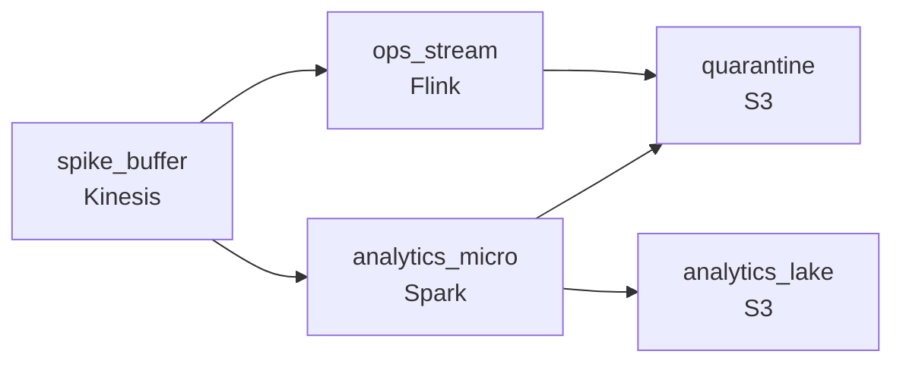

# Five Times the Traffic, Five Times the Bill
_Scale up when needed. Do not bankrupt the team._

- **Domain:** pipeline_architecture
- **Difficulty:** Hard
- **Est. time:** 30 min
- **URL:** https://datadriven.io/problems/five_times_the_traffic_five_times_the_bill

## Problem

Our platform's data volumes are unpredictable: we see 5x swings between our quietest and busiest hours, with sudden spikes during product launches. We've been running a fixed-size Spark cluster that's over-provisioned 80% of the time and still falls behind during spikes. Operations needs to act on issues within a couple minutes; analytics dashboards tolerate up to 15. A small fraction of incoming events arrive malformed and end up polluting the reports analysts read. The CFO wants the bill to stop swinging with traffic and to come down from where it is today. Design a pipeline that handles variable volume, serves both consumers on the right cadence, keeps bad events out of analytics, and keeps costs predictable.

**Concepts tested:** `paBatchProcessing`, `paBatchVsStreaming`, `paCompression`, `paDataLake`, `paDataQuality`, `paDeadLetterQueue`, `paEltVsEtl`, `paEventPlatforms`, `paFullVsIncremental`, `paLambdaArch`, `paMicroBatchVsTrue`, `paMonitoring`, `paPartitioning`, `paSmallFiles`, `paStreamProcessing`

## Requirements

- The CFO wants the bill to stop swinging with traffic and to come down from where it is today.
- When a product launches, traffic ramps up fast and we can't lose events while the system is catching up.
- Operations needs to act on issues within a couple minutes; analytics teams are fine seeing things 15 minutes later.
- A small fraction of incoming events are malformed and they can't pollute the reports analysts read.

## Must-have components

- Traffic swings 5x and product launches drive sudden ramps; a spike going straight into compute drops events. Add a buffering tier (Kinesis, MSK, SQS, Pub/Sub, Kafka) between producers and processing so spikes queue up rather than overwhelming the processor.
- Operations needs alerts within minutes; analytics dashboards tolerate 15 minutes. One shared freshness tier either over-spends on analytics or starves operations. Show at least one streaming path and one batch/analytical path so each consumer reads from the path matched to its freshness need.

**Expected stages:** `kinesis_ingestion` → `auto_scaling_processor` → `s3_data_lake` → `compaction_job` → `athena_query_layer`

## Solution walkthrough

### Why this problem exists in real interviews

The bill swings 5x with traffic. Whatever you build has to absorb spikes, serve two consumers on different clocks, and not pollute reports with a small fraction of malformed events. The CFO is on this; the design has to reason about cost, not just about throughput.

First instinct is to size the existing cluster for peak (so it doesn't drop events) and call it done. The bill stays high and steady, which is what the CFO didn't want. The other version of the same instinct is to size it for the average and 'we'll handle spikes by retrying', which means events sit in the producer's memory until they time out and get dropped, and analytics quietly under-counts during launches.

> **Trick to Solving**
>
> The bill stops swinging when capacity follows load. Buffer the spike, scale the worker pool, and stop sizing compute for peak.
>
> 1. A buffer turns 'overwhelm and drop' into 'queue and catch up.' That single layer changes both the cost shape and the failure shape.
> 2. Two clocks, two paths. Operations on minutes, analytics on quarter-hours. One shared tier sized for the faster consumer is the expensive mistake.
> 3. Bad events are not exceptional, they're routine. They have to land somewhere, but not in the reports analysts read.

---

### Walk the requirements

**Step 1: Put a buffer in front of compute so spikes queue instead of overwhelm**

Without a buffer, the only place a spike's worth of events can wait is in producer memory, and producers drop them when they time out. With a buffer in front, anything queue-shaped will do (Kafka, Kinesis, Pub/Sub, SQS), the spike sits there while consumers catch up. The cost shape is also different: the buffer is cheap to scale; the compute behind it scales on actual processing rate, not on the producer's burst rate.

**Step 2: Run two paths so each consumer gets the cadence it needs**

Operations alerts within minutes; analytics dashboards tolerate fifteen. If both consumers read from the same processor, you're either over-spending to keep analytics on the streaming tier or under-serving operations on the batch one. A streaming consumer for ops (Flink, Spark Streaming, Kafka Streams are all viable) and a micro-batch consumer for analytics share the same buffer and run independently.

**Step 3: Let elastic compute follow load instead of sitting at peak**

Spike at peak, idle the rest of the day. The bill stops swinging when the worker pool grows during the spike and shrinks afterward. Combine that with the buffer above and the worst case becomes 'queue gets deep for ten minutes' instead of 'cluster falls over and on-call comes in.'

**Step 4: Route invalid events somewhere other than the analytics tables**

A small fraction of events are malformed every hour. They can't reach the partitioned analytics tables, that's a data-quality bug analysts will chase for a week. They also can't be silently dropped, because at this volume even a small fraction is enough rows for someone downstream to eventually notice the count is off. A separate location with the original payload and the failure reason is the third option, and the only honest one. On the canvas this is an '`error_action`: dlq' on the validator.

---

### The shape that fits

| node | type | tech | details |
|---|---|---|---|
| spike_buffer | queue | Kinesis | parallelism: auto |
| ops_stream | transform | Flink | errorAction: dlq; slaFreshness: real-time |
| analytics_micro | transform | Spark | errorAction: dlq; slaFreshness: < 15min |
| quarantine | storage | S3 |  |
| analytics_lake | storage | S3 | backfillStrategy: partition_overwrite |

> **What this design gives up**
>
> Two paths means two ways to handle late events, two ways to dedup, two places a number can disagree. You pay for that with extra plumbing and a reconciliation discipline. The reason the design makes that trade is that the alternative, one tier, sized for the faster consumer, costs more in money than the extra plumbing costs in complexity.

> **What reviewers check**
>
> A reviewer looks at the canvas for these properties:
> - Traffic swings 5x and product launches drive sudden ramps; a spike going straight into compute drops events.
> - Operations needs alerts within minutes; analytics dashboards tolerate 15 minutes.

> **The mistake that ships**
>
> The version that ships removes the buffer because 'it's just a queue, why do we need it' and runs ops and analytics off the same Spark job sized for analytics' SLA. The next product launch arrives, the queue isn't there to absorb the ramp, the producer side of the wire times out and drops events, and analytics quietly under-reports launch volume. The team blames the producer, adds a metric for dropped events, and tries to push the producer team to retry. The actual fix has always been a buffer between them.

---

- **If product-launch traffic ramps to 5x over five minutes, how fast does the worker pool reach steady state and what saturates in the meantime?**
  - _Tests scaling reaction time, queue depth budget, and which downstream feels the lag first._
- **How would you estimate the savings from elastic compute over the existing fixed Spark cluster before you cut over?**
  - _Tests cost-modelling discipline: what numbers do you actually need, and what does a credible before/after estimate look like?_
